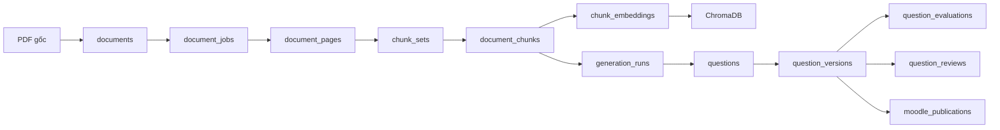
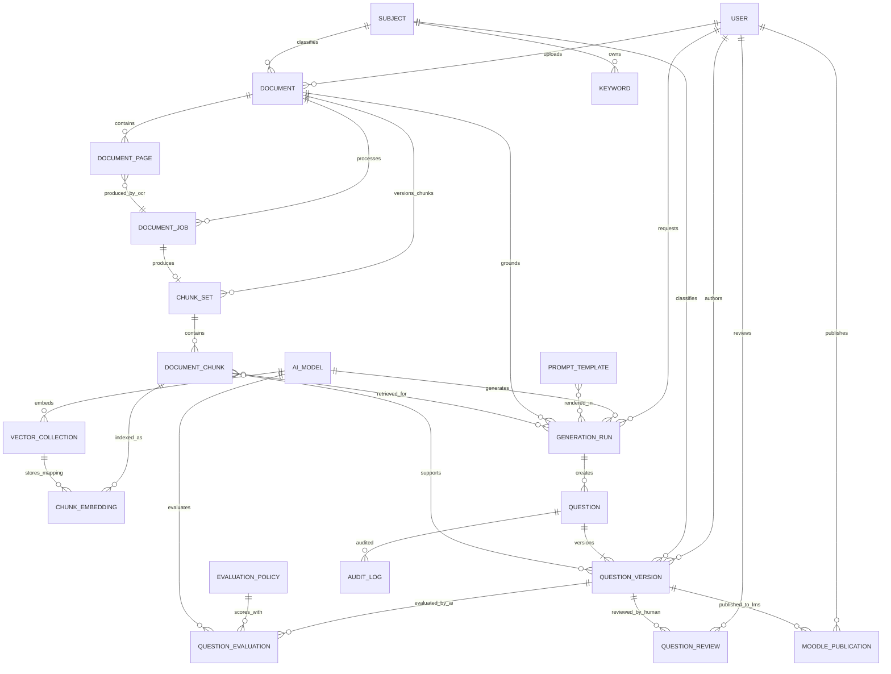
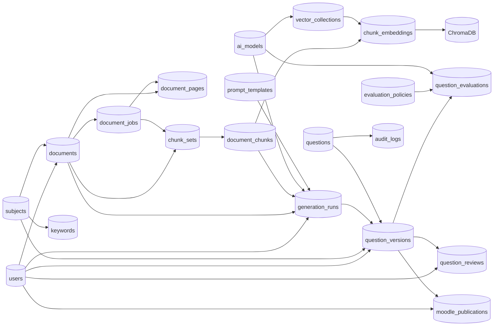
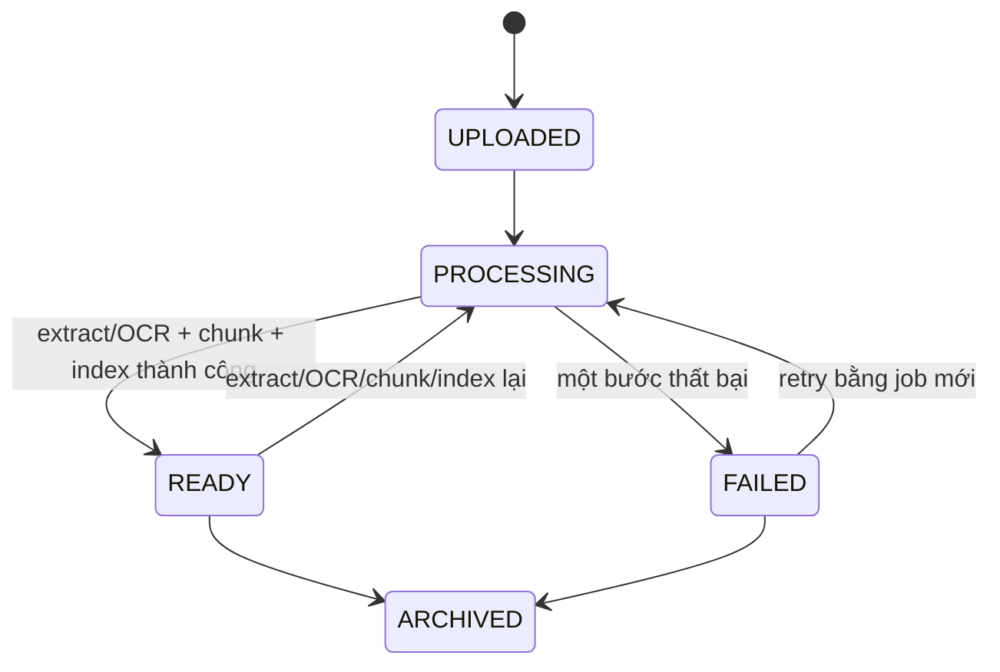
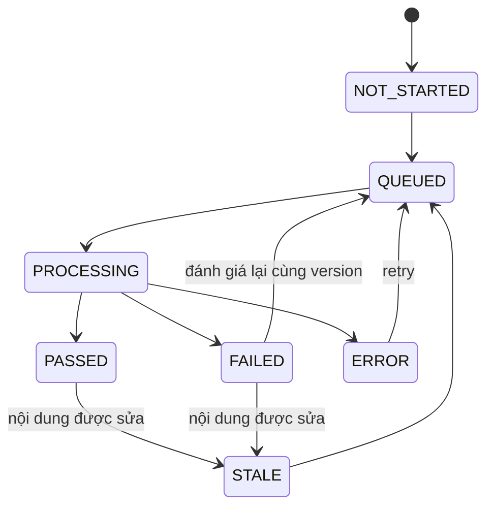
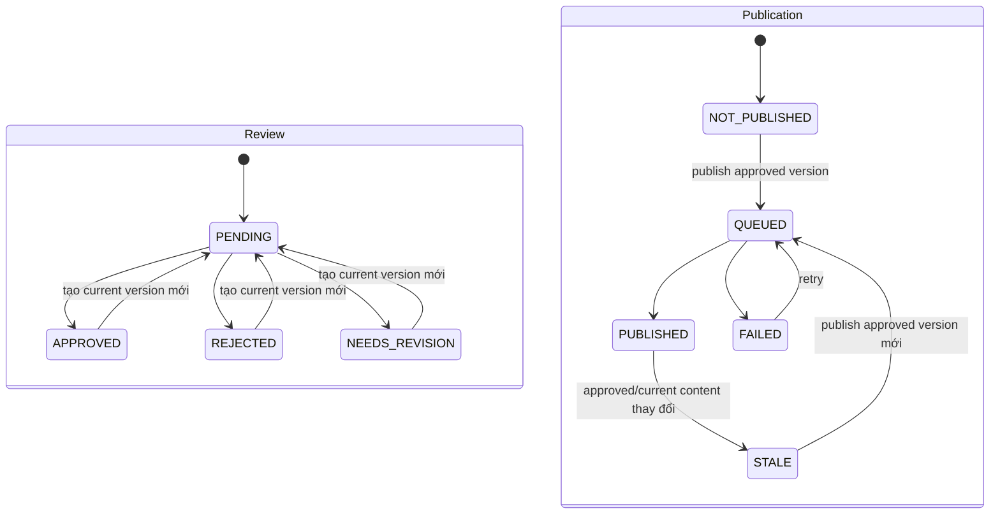

# Thiết kế cơ sở dữ liệu QBankCTU V2 — Đặc tả triển khai

Tài liệu này là **nguồn đặc tả chuẩn (canonical specification)** cho schema V2 của QBankCTU, đã được rà soát lại theo backend hiện tại ngày 2026-07-25. V2 giữ các cải tiến về versioning, workflow và khả năng rebuild vector index, đồng thời khôi phục baseline yêu cầu, CDM/LDM, ma trận truy vết và kế hoạch chuyển đổi từ prototype.

## Bản đồ tài liệu

| Lớp đặc tả | Vị trí | Nội dung |
|---|---|---|
| Baseline yêu cầu | Phần 0 | Bài toán, phạm vi, yêu cầu chức năng/phi chức năng và truy vết |
| Nguyên tắc và kiến trúc | Phần 1–3 | Source of truth, database đích, ID, version, quyền và CDM |
| LDM | Phần 4 | Collection, quan hệ logic, quy tắc nhúng/tham chiếu |
| PDM | Phần 5, 7–9 | BSON document, index, validator, transaction và nhất quán |
| Luồng nghiệp vụ | Phần 6, 10–11 | State transition, hybrid retrieval, review và publication |
| Chuyển đổi/triển khai | Phần 12–15 | Gap analysis, migration, thứ tự triển khai, vận hành và nghiệm thu |

> Khi tài liệu và code mâu thuẫn, ưu tiên **schema đang được bootstrap và ghi/đọc bởi backend hiện tại** cho báo cáo ngắn hạn. Các phần đã làm, còn thiếu hoặc chưa nên claim hoàn tất được ghi rõ trong Phần 12 và file `DATABASE_DESIGN_V2_GAP_PRIORITY.md`.

## 0. Baseline bài toán và yêu cầu

### 0.1. Bài toán và mục tiêu

QBankCTU là hệ thống quản lý ngân hàng câu hỏi theo mô hình **Human-in-the-loop**. Luồng đích:

1. Tiếp nhận tài liệu học tập do giảng viên tải lên.
2. Trích xuất văn bản/OCR, làm sạch và lưu nội dung theo trang.
3. Chunking, gắn keyword và lập chỉ mục vector để phục vụ RAG.
4. Ghép prompt có version và gọi model local để sinh câu hỏi nháp.
5. Dùng model local để đánh giá chất lượng câu hỏi trên các tiêu chí bắt buộc.
6. Cho giảng viên xem, sửa, duyệt, yêu cầu sửa hoặc từ chối.
7. Chỉ xuất bản phiên bản đã được con người duyệt sang Moodle.

AI chỉ sinh và đánh giá bản nháp. AI **không bao giờ** tự phê duyệt hoặc tự xuất bản câu hỏi.

### 0.2. Phạm vi triển khai

| Hạng mục | Phạm vi đích |
|---|---|
| Ngôn ngữ | Tiếng Việt; cho phép nội dung kỹ thuật tiếng Anh xen kẽ |
| Học phần ban đầu | Cấu trúc dữ liệu; schema không hard-code một học phần |
| Đầu vào bắt buộc | PDF text hoặc PDF scan, tối đa theo cấu hình upload |
| Đầu vào mở rộng | DOC/DOCX phải được chuyển sang artifact chuẩn trước OCR/chunking; chưa được xem là hoàn tất cho tới khi có converter và kiểm thử |
| Loại câu hỏi | Trắc nghiệm, Đúng/Sai, Điền khuyết, Ghép cột, Tình huống, Sắp xếp, Nhiều lựa chọn |
| AI | LLM và embedding model chạy local trong luồng production |
| Kho dữ liệu | MongoDB + file storage + ChromaDB |
| Đầu ra | Question Bank nội bộ và Moodle |

### 0.3. Yêu cầu chức năng — tài liệu và RAG

- `DOC-01` — Hệ thống phải lưu tài liệu PDF gốc do người dùng đăng tải; đầu vào DOC/DOCX mở rộng cũng phải giữ artifact nguồn.
- `DOC-02` — Hệ thống phải lưu kết quả sau OCR, gồm OCR Markdown và nội dung truy vấn được theo trang.
- `DOC-03` — Hệ thống phải lưu các chunk sau chunking.
- `DOC-04` — Mỗi chunk phải có mapping tới bản ghi tương ứng trong VectorDB.
- `DOC-05` — Tài liệu phải thuộc một môn học.
- `DOC-06` — Tài liệu có thể thuộc một chương; chương không bắt buộc.
- `DOC-07` — Dữ liệu ban đầu tập trung vào môn Cấu trúc dữ liệu nhưng schema không được hard-code một môn.
- `DOC-08` — Mỗi lần convert, extract/OCR, chunk hoặc index phải có job/status/lỗi riêng để retry và truy vết.
- `DOC-09` — Trích xuất/OCR lại cùng file không ghi đè page set cũ; chunk lại không ghi đè chunk set cũ.
- `DOC-10` — MongoDB lưu chunk authoritative; ChromaDB chỉ là index có thể dựng lại.
- `DOC-11` — Một chunk có thể được index bằng nhiều embedding model/version.
- `DOC-12` — File, page, chunk và embedding phải truy ngược được đúng `document_version`.
- `RAG-01` — Retrieval kết hợp vector score và keyword score đã chuẩn hóa.
- `RAG-02` — Mỗi lần sinh phải lưu cấu hình retrieval và snapshot các chunk thực sự đưa vào prompt.
- `RAG-03` — Mỗi câu hỏi do AI sinh phải có ít nhất một source chunk hợp lệ.
- `RAG-04` — Hệ thống phải rebuild được toàn bộ ChromaDB từ MongoDB mà không cần gọi lại OCR/chunking.

### 0.4. Yêu cầu chức năng — sinh và quản lý câu hỏi

- `QUE-01` — Giảng viên có thể chọn tài liệu, chương/chủ đề, Bloom, loại câu hỏi, số lượng và yêu cầu bổ sung.
- `QUE-02` — Hệ thống phải lưu prompt tương ứng với từng dạng câu hỏi.
- `QUE-03` — Prompt phải ghép được system, Bloom, question type, example và output format như luồng hiện tại.
- `QUE-04` — Retrieval phải kết hợp VectorDB và keyword.
- `QUE-05` — Phải lưu snapshot các chunk/ngữ cảnh thực sự được đưa vào prompt.
- `QUE-06` — Câu hỏi phải xác định được môn học.
- `QUE-07` — Câu hỏi có thể xác định chương; chương không bắt buộc.
- `QUE-08` — Câu hỏi phải xác định cấp Bloom.
- `QUE-09` — Câu hỏi phải liên kết được với một hoặc nhiều CLO.
- `QUE-10` — Câu hỏi phải có điểm chất lượng và màu của kết quả đánh giá hiện hành.
- `QUE-11` — Câu hỏi phải có trạng thái thể hiện vòng đời kiểm duyệt và xuất bản.
- `QUE-12` — Hệ thống hỗ trợ bảy loại câu hỏi ở Phần 0.2 và validate cấu trúc riêng theo từng loại.
- `QUE-13` — Mọi chỉnh sửa nội dung tạo `question_versions` mới; không ghi đè phiên bản cũ.
- `QUE-14` — Evaluation, review và publication luôn tham chiếu `question_version_id`, không chỉ số version.
- `QUE-15` — Trạng thái vòng đời, đánh giá, kiểm duyệt và xuất bản phải độc lập.
- `QUE-16` — Có thể tạo câu hỏi thủ công hoặc import; source bắt buộc với câu AI và có thể tùy chọn với câu thủ công/import.
- `QUE-17` — Nội dung xuất Moodle phải được chuẩn hóa và validate theo loại câu hỏi trước publication.
- `QUE-18` — Prompt, model/config, retrieval, raw response và parser của mỗi generation run phải truy vết được.

### 0.5. Yêu cầu chức năng — model AI và prompt

- `AIM-01` — Có capability/model sinh câu hỏi liên quan đến code.
- `AIM-02` — Có capability/model sinh câu hỏi nội dung không phải code.
- `AIM-03` — Có capability đánh giá lại câu hỏi.
- `AIM-04` — Một model có thể đảm nhiệm nhiều capability; không bắt buộc ba model vật lý khác nhau.
- `AIM-05` — Model dùng trong production phải chạy local; provider cloud chỉ được bật rõ ràng cho thử nghiệm, không phải cấu hình production.
- `AIM-06` — Mỗi lần sinh, embedding hoặc đánh giá phải lưu model/revision/config snapshot đủ để tái hiện.
- `AIM-07` — Có capability embedding và lưu revision/dimension/normalization đã dùng.
- `AIM-08` — Prompt đã được sử dụng là bất biến; sửa prompt tạo version mới và lưu `content_hash`.

### 0.6. Yêu cầu chức năng — đánh giá và Human-in-the-loop

AI evaluation phải chấm năm khía cạnh, mỗi điểm trong `[0.0, 1.0]`:

- `EVA-01` — **Faithfulness**: câu hỏi/đáp án được hỗ trợ bởi source hay có dấu hiệu hallucination.
- `EVA-02` — **Contextual Relevancy**: context retrieval có chứa tri thức cần thiết hay không.
- `EVA-03` — **Answer Relevancy**: đáp án đúng trọng tâm và đáp ứng câu hỏi/prompt.
- `EVA-04` — **Bloom Alignment**: câu hỏi đúng cấp Bloom yêu cầu.
- `EVA-05` — **CLO Alignment**: câu hỏi đo đúng chuẩn đầu ra đã gắn.
- `EVA-06` — Mỗi điểm thành phần và điểm tổng phải nằm trong `[0.0, 1.0]`.
- `EVA-07` — Điểm tổng phải ánh xạ thành `RED`, `YELLOW` hoặc `GREEN` theo evaluation policy có version.
- `EVA-08` — Lưu feedback và evidence để giải thích kết quả; không chỉ lưu điểm.
- `EVA-09` — AI evaluation không tự động phê duyệt hoặc xuất bản câu hỏi.
- `EVA-10` — Lưu raw response/parser version; đánh giá lại tạo document mới và không ghi đè lịch sử.

Human review phải đáp ứng:

- `REV-01` — Người kiểm duyệt xem lại câu hỏi, source và kết quả AI evaluation.
- `REV-02` — Phải biết câu hỏi đã được kiểm duyệt hay chưa.
- `REV-03` — Quyết định hợp lệ là `APPROVED`, `REJECTED` hoặc `NEEDS_REVISION`.
- `REV-04` — Override điểm/màu AI bắt buộc có lý do.
- `REV-05` — Mỗi review gắn đúng `question_version_id`, lưu bất biến; chỉ review current version cập nhật summary hiện hành.

### 0.7. Yêu cầu chức năng — người dùng, phân quyền, audit và Moodle

- `USR-01` — Lưu tài khoản được đồng bộ/tham chiếu từ Moodle; V2 đồng thời giữ `firebase_uid` trong giai đoạn dùng Firebase Auth.
- `USR-02` — Không lưu mật khẩu hoặc token Firebase/Moodle trong MongoDB.

Các yêu cầu role của V1 được giữ lại vì luồng Human-in-the-loop cần tách người tạo nội dung và người kiểm duyệt:

| ID V1 | Yêu cầu V1 | Quyết định V2 |
|---|---|---|
| `USR-03` | Phân biệt `Admin`, `Teacher`, `Reviewer` | Giữ trong V2; `Teacher` là user tạo/quản lý tài liệu và câu hỏi, `Reviewer` là người kiểm duyệt |
| `USR-04` | Một user có thể có nhiều role | Superseded: mỗi user có đúng một role để đơn giản hóa phân quyền |
| `USR-05` | Chỉ Reviewer/Admin quyết định cuối | Giữ trong V2; `Reviewer` hoặc `Admin` quyết định review cuối |

Yêu cầu hiệu lực của V2:

- `USR2-01` — Schema đích có đúng ba role `Admin`, `Teacher`, `Reviewer`; mỗi tài khoản có đúng một role.
- `USR2-02` — Admin quản trị người dùng/cấu hình; Teacher quản lý tài liệu, sinh và chỉnh sửa câu hỏi; Reviewer kiểm duyệt câu hỏi.
- `USR2-03` — Chỉ `Reviewer` hoặc `Admin` active mới được quyết định review/publish.
- `USR2-04` — Tài khoản `is_active = false` không được tạo job, review hoặc publication mới.
- `AUD-01` — Hành động quan trọng phải có audit actor, entity, action, correlation ID và hash trước/sau khi phù hợp.
- `LMS-01` — Chỉ `approved_version_id` được xuất sang Moodle.
- `LMS-02` — Publication phải idempotent, lưu đích Moodle, trạng thái, lỗi và content hash; không lưu token trong snapshot.

### 0.8. Yêu cầu phi chức năng

- `NFR-01 — Integrity`: reference chéo collection được service kiểm tra; thao tác nhiều document quan trọng dùng transaction.
- `NFR-02 — Concurrency`: chỉnh sửa/review dùng optimistic concurrency và trả `409 Conflict` khi version không khớp.
- `NFR-03 — Idempotency`: convert/extract/OCR/chunk/index retry và Moodle publication không tạo bản sao ngoài ý muốn.
- `NFR-04 — Size`: không để mảng tăng vô hạn trong aggregate; page, chunk, evaluation, review, audit và publication nằm ở collection riêng; mọi document phải dưới giới hạn BSON 16 MB.
- `NFR-05 — Security`: secret/token chỉ ở secret manager hoặc biến môi trường; log và snapshot phải redact dữ liệu nhạy cảm.
- `NFR-06 — Recovery`: backup MongoDB và file storage theo cùng recovery point; ChromaDB không cần là nguồn backup bắt buộc vì có thể rebuild.
- `NFR-07 — Observability`: job có `request_id/correlation_id`, thời gian, trạng thái, lỗi chuẩn hóa và heartbeat khi chạy lâu.
- `NFR-08 — Time`: mọi timestamp lưu BSON UTC; API chỉ chuyển timezone khi hiển thị.
- `NFR-09 — Deployment`: MongoDB production phải chạy replica set để hỗ trợ transaction; service phải chạy migration/index idempotent trước khi nhận traffic.

### 0.9. Ma trận truy vết yêu cầu → schema V2

| Nhóm yêu cầu | Collection/field hoặc cơ chế đáp ứng |
|---|---|
| `DOC-01..02` | `documents.artifacts[]`, file storage/GridFS, `document_pages` |
| `DOC-03..04` | `document_chunks`, `chunk_embeddings.external_vector_id/vector_collection_id` |
| `DOC-05..07` | `subjects`, `documents.subject_id/chapter_id`; không hard-code subject ID |
| `DOC-08..09` | `document_jobs`, `document_pages.ocr_job_id`, `chunk_sets.source_ocr_job_id` |
| `DOC-10..12` | Mongo authoritative chunks, `vector_collections`, `chunk_embeddings`, version fields ở artifact/page/chunk/job |
| `RAG-01` | `keywords`, `document_chunks.keyword_matches[]`, hybrid algorithm ở Phần 10 |
| `RAG-02..04` | `generation_runs.retrieval`, `question_versions.sources[]`, `chunk_embeddings` |
| `QUE-01` | `documents`, `generation_runs.request` |
| `QUE-02..03` | `prompt_templates.kind/scope/version/prompt_body`, `generation_runs.prompts[]` |
| `QUE-04..05` | hybrid retrieval, `generation_runs.retrieval`, `question_versions.sources[]` |
| `QUE-06..09` | `question_versions.classification/clos[]`; backend hiện tại chưa denormalize `current_classification` vào `questions` |
| `QUE-10..11` | `question_evaluations`, `questions.quality_summary` và bốn status |
| `QUE-12` | `question_versions.question_data` + Pydantic discriminator |
| `QUE-13..16` | `questions.current_version_id`, `question_versions`, version-scoped evaluation/review/publication |
| `QUE-17` | service validator và Moodle adapter |
| `QUE-18` | `generation_runs.model/prompts/retrieval/execution/raw_model_response` |
| `AIM-01..05` | `ai_models.capabilities[]/is_local`, routing rule Phần 5.11 |
| `AIM-06..07` | model snapshot trong vector/generation/evaluation, `vector_collections` |
| `AIM-08` | `prompt_templates(template_key, version, content_hash)`, run prompt snapshot |
| `EVA-01..10` | `evaluation_policies`, `question_evaluations.scores/feedback/evidence/raw_model_response` |
| `REV-01..05` | `users.role/status`, `question_reviews`, `questions.latest_review_id/review_status` |
| `USR-01..02` | `users.firebase_uid`, `users.email`; credential prohibition |
| `USR-03..05` | `users.role`, authorization check; backend hiện đã có role `Reviewer`, cần seed/migration dữ liệu reviewer |
| `USR2-01..04` | `users.role/status` và authorization check ở service |
| `AUD-01` | `audit_logs` |
| `LMS-01..02` | `questions.approved_version_id`, `moodle_publications` |
| `NFR-01..09` | Validator/index, Phần 9, job/idempotency rules, backup và runbook ở Phần 14 |

## 1. Mục tiêu cải tiến của V2

Tài liệu này mô tả schema đích cho backend ngân hàng câu hỏi sử dụng OCR, RAG, LLM và quy trình kiểm duyệt bởi con người.

Thiết kế giải quyết bốn vấn đề chính:

1. Phân biệt phiên bản nội dung tài liệu với từng lần convert, extract/OCR, chunk và index.
2. Lưu bất biến toàn bộ phiên bản câu hỏi bằng `question_versions`.
3. Tách trạng thái đánh giá AI, kiểm duyệt và xuất bản thành các workflow độc lập.
4. Cho phép một chunk được lập chỉ mục bằng nhiều embedding model hoặc nhiều phiên bản embedding.

Hệ thống sử dụng:

- MongoDB làm nguồn dữ liệu nghiệp vụ chính.
- File storage local hoặc MinIO để lưu PDF và file OCR.
- ChromaDB làm vector index có thể dựng lại.
- Ollama làm runtime chính cho model local.
- Moodle làm nguồn tham chiếu danh tính và đích xuất bản câu hỏi.

## 2. Nguyên tắc thiết kế

### 2.1. Source of truth

| Thành phần | Vai trò | Source of truth |
|---|---|---|
| MongoDB | Metadata, nội dung trích xuất/OCR, chunk, câu hỏi, version, evaluation và review | Có |
| File storage | PDF gốc, OCR Markdown và file export | Có đối với file vật lý |
| ChromaDB | Embedding và chỉ mục tìm kiếm vector | Không |
| Ollama | Sinh và đánh giá câu hỏi | Không |
| Moodle | Danh tính ngoài hệ thống và đích xuất bản | Nguồn ngoài |

Nếu ChromaDB mất dữ liệu, hệ thống phải có khả năng tạo lại embedding từ `document_chunks.content` trong MongoDB.

### 2.2. Quy tắc ID

- Mọi reference giữa các MongoDB collection sử dụng `ObjectId`.
- Chỉ chuyển `ObjectId` thành chuỗi khi ghi metadata sang ChromaDB hoặc giao tiếp qua HTTP.
- ID của vector trong ChromaDB phải xác định và idempotent theo `chunk_id` cùng `vector_collection_id`.
- Không sử dụng tên file, tiêu đề hoặc số thứ tự làm khóa quan hệ chính.

### 2.3. Quy tắc version

- `document_version` chỉ tăng khi nội dung PDF nguồn thay đổi.
- Trích xuất/OCR lại cùng PDF tạo `document_job` mới nhưng không tăng `document_version`.
- Chunk lại với cấu hình khác tạo `chunk_set` mới.
- Sửa câu hỏi luôn tạo `question_versions` mới; không ghi đè nội dung phiên bản cũ.
- Evaluation, review và publication luôn tham chiếu đúng `question_version_id`.

### 2.4. Role và quyền

Schema đích có ba role nghiệp vụ:

| Role | Quyền chính |
|---|---|
| `Admin` | Quản lý tài khoản, cấu hình hệ thống, tài liệu, câu hỏi và kiểm duyệt |
| `Teacher` | User/giảng viên thông thường: quản lý tài liệu, sinh câu hỏi, chỉnh sửa câu hỏi nháp |
| `Reviewer` | Kiểm duyệt câu hỏi sau AI evaluation; phê duyệt, từ chối hoặc yêu cầu chỉnh sửa |

Không tạo role `User` riêng; user thông thường là `Teacher`. Mỗi tài khoản có đúng một role. Backend hiện tại đã có literal `Admin`/`Teacher`/`Reviewer` trong `RoleEnum`, validator và dependency phân quyền; dữ liệu legacy cần được map/seed reviewer thủ công.

### 2.5. Quyết định database và lưu trữ vật lý

- Backend hiện tại dùng **hai MongoDB database** theo cấu hình `AUTH_DB_NAME=NCKH` và `RAG_DB_NAME=rag_database`.
- `NCKH.User` chỉ lưu liên kết phiên Firebase tối giản gồm `uid` và `token`; toàn bộ hồ sơ/nghiệp vụ nằm trong `rag_database`.
- Ý tưởng gom về một database duy nhất như `qbankctu` là phương án cutover tương lai, chưa đúng với code và test hiện tại.
- File nguồn và artifact lớn lưu trong local volume hoặc MinIO. MongoDB lưu URI, provider, checksum, kích thước và content type. Nếu chọn GridFS thì lưu `gridfs_file_id`; không đồng thời coi cả URI và GridFS là nguồn chính cho cùng artifact.
- ChromaDB lưu vector và metadata tối thiểu phục vụ filter/search. MongoDB giữ chunk text, hash và mapping authoritative.
- Tên Chroma collection gắn với một cấu hình embedding ổn định; đổi model revision, dimension, normalization hoặc distance metric phải tạo `vector_collections` mới.
- Ollama/model runtime và Moodle là hệ thống ngoài; không được dùng chúng làm nơi lưu state nghiệp vụ duy nhất.

### 2.6. Quy tắc nhúng và tham chiếu

Chỉ nhúng dữ liệu nhỏ, hữu hạn, cùng vòng đời và thường được đọc cùng aggregate cha.

| Dữ liệu | Cách lưu | Lý do |
|---|---|---|
| Chapter, CLO | Nhúng trong `subjects` | Hữu hạn và cùng vòng đời môn học |
| Artifact metadata | Nhúng trong `documents.artifacts[]` | Chỉ là metadata, có version và giới hạn |
| OCR/Chunk/Index job | Collection `document_jobs` | Có retry, heartbeat và lịch sử tăng dần |
| Page text sau extract/OCR | Collection `document_pages` | Nội dung lớn, tránh document 16 MB |
| Chunk set/chunk | Collection riêng | Version theo cấu hình, truy vấn độc lập |
| Embedding mapping | `chunk_embeddings` | Quan hệ nhiều-nhiều chunk–vector collection |
| Retrieval result | Nhúng hữu hạn trong `generation_runs` | Snapshot chính xác của một lần sinh |
| Source/CLO/keyword của version | Nhúng reference + snapshot | Tái hiện nội dung ngay cả khi catalog đổi |
| Evaluation/review/publication/audit | Collection riêng | Lịch sử bất biến và có thể tăng không giới hạn |

Mọi logical reference dùng `ObjectId` trong MongoDB. Các reference tới chapter/CLO nhúng phải được service xác nhận thuộc đúng `subject_id`.

### 2.7. Quy ước tên, enum và timestamp

- Collection và field dùng `snake_case`; enum lưu code tiếng Anh viết hoa để không phụ thuộc nhãn UI.
- `_id` dùng `ObjectId`; external ID giữ dạng string theo hệ thống nguồn.
- Timestamp bắt buộc lưu UTC bằng BSON `date`; field kết thúc bằng `_at`.
- Tiền tố `current_` là con trỏ hiện hành có thể thay đổi; document lịch sử được xem là bất biến sau khi hoàn tất.
- `content_hash`, `config_hash` và `*_snapshot_hash` dùng SHA-256 trên biểu diễn JSON/text canonical UTF-8.
- Nullable phải thể hiện bằng `null` hoặc field vắng theo một quy ước thống nhất trong service; các ví dụ trong tài liệu dùng `null`.

## 3. Kiến trúc tổng thể

### 3.1. Luồng lưu trữ



### 3.2. CDM — thực thể và quan hệ nghiệp vụ

Sơ đồ này mô tả quan hệ khái niệm. Ký hiệu quan hệ không phải foreign key vật lý; MongoDB thực thi bằng embedded document hoặc `ObjectId` reference như Phần 4–5.



## 4. Danh sách collection

| Collection | Mục đích |
|---|---|
| `users` | Tài khoản Admin, Teacher và Reviewer |
| `subjects` | Môn học, chapter và CLO |
| `documents` | Metadata tài liệu và con trỏ tới kết quả xử lý hiện hành |
| `document_jobs` | Mỗi lần convert, extract/OCR, chunk hoặc index |
| `document_pages` | Nội dung trích xuất/OCR theo trang và page-producing job |
| `chunk_sets` | Một bộ chunk được tạo từ một cấu hình cụ thể |
| `document_chunks` | Nội dung chunk authoritative |
| `vector_collections` | Cấu hình Chroma collection và embedding model |
| `chunk_embeddings` | Quan hệ nhiều-nhiều giữa chunk và vector collection |
| `keywords` | Từ khóa theo môn học |
| `ai_models` | Model sinh câu hỏi, đánh giá và embedding |
| `prompt_templates` | Prompt component có version |
| `evaluation_policies` | Trọng số và ngưỡng đánh giá |
| `generation_jobs` | Job polling frontend cho request sinh câu hỏi bất đồng bộ |
| `generation_runs` | Snapshot của một lần retrieval và sinh câu hỏi |
| `questions` | Aggregate và trạng thái hiện hành của câu hỏi |
| `question_versions` | Nội dung bất biến của từng phiên bản câu hỏi |
| `question_evaluations` | Lịch sử AI đánh giá từng phiên bản |
| `question_reviews` | Lịch sử con người kiểm duyệt từng phiên bản |
| `audit_logs` | Nhật ký hành động quan trọng |
| `moodle_publications` | Lịch sử xuất bản từng phiên bản sang Moodle |
| `schema_meta` | Metadata version schema hiện hành trong `rag_database` |
| `migration_id_map` | Mapping idempotent từ dữ liệu legacy sang V2 |
| `NCKH.User` | Collection auth tối giản ở `AUTH_DB_NAME`, không nằm trong domain RAG |

Các collection compatibility còn xuất hiện trong code và cần xử lý tiếp:

| Collection | Nguồn dùng hiện tại | Ghi chú |
|---|---|---|
| `dictionaries` | `modules/dictionary/mongodb.py` | Từ điển động dạng mảng `core_keywords/learned_keywords/pending_keywords`; chưa migrate sang `keywords` |
| `pages` | migration/e2e script legacy | Legacy page collection; auto-learning đã chuyển sang `document_pages` |

### 4.1. LDM — quan hệ giữa các collection

Trong sơ đồ dưới đây, mũi tên biểu thị logical reference. MongoDB không tự kiểm tra foreign key; service phải kiểm tra các invariant ở Phần 8.



### 4.2. Data dictionary và khóa logic

| Collection | Aggregate/nguồn chính | Khóa/unique logic | Reference chính | Quy tắc vòng đời |
|---|---|---|---|---|
| `users` | Tài khoản ứng dụng | `firebase_uid`, `email`, `moodle_user_ref_id` khi có | — | Soft lock/archive |
| `subjects` | Catalog môn học | `subject_code` | — | Chapter/CLO nhúng; soft deactivate |
| `documents` | Aggregate tài liệu | `_id`; hash artifact dùng phát hiện trùng | subject, chapter, uploader | Có `current_version`, soft archive |
| `document_jobs` | Lần chạy pipeline | stage attempt trong một document version | document, parent job | Mutable khi chạy; bất biến khi kết thúc |
| `document_pages` | Page text authoritative | `(ocr_job_id, page_number)` | document, OCR job | Bất biến theo OCR job hiện hành |
| `chunk_sets` | Bộ chunk theo config | `chunk_job_id` | document, source page job | Chỉ active sau khi complete |
| `document_chunks` | Chunk text authoritative | `(chunk_set_id, chunk_no)` | chunk set, document | Bất biến |
| `vector_collections` | Cấu hình vector index | `(provider, collection_name)` | embedding AI model | Retire, không sửa semantic config |
| `chunk_embeddings` | Mapping vector | `(chunk_id, vector_collection_id)` | chunk, vector collection | State machine, retry idempotent |
| `keywords` | Từ khóa môn học | `(subject_id, normalized)` | subject, creator/approver | Approve/deactivate |
| `ai_models` | Catalog model | `model_code` | — | Version/revision qua record/config mới |
| `prompt_templates` | Prompt component | `(template_key, version)` | creator | Bất biến sau khi được dùng |
| `evaluation_policies` | Chính sách chấm | `(policy_name, version)` | — | Bất biến sau khi được dùng |
| `generation_runs` | Một lần sinh | `_id` | user, document, chunk set, model | Lưu snapshot; bất biến sau terminal state |
| `questions` | Identity + summary hiện hành | `question_code` | current/approved version | Mutable bằng transaction |
| `question_versions` | Nội dung câu hỏi | `(question_id, version)` | run, user/model, subject/chapter/CLO/chunk | Bất biến |
| `question_evaluations` | Lịch sử AI chấm | `_id` | question version, model, policy | Bất biến |
| `question_reviews` | Lịch sử con người duyệt | `_id` | question version, reviewer | Bất biến |
| `moodle_publications` | Lần đồng bộ Moodle | `idempotency_key` | approved question version, publisher | Mutable trong attempt; bất biến khi terminal |
| `audit_logs` | Nhật ký nghiệp vụ | `_id` | actor/entity | Append-only; retention riêng |
| `schema_meta` | Metadata schema | `_id = database_schema` | — | Upsert khi bootstrap |
| `migration_id_map` | Mapping migration | `(source_collection, source_id)` | source legacy, target V2 | Idempotent |

### 4.3. Quy tắc reference và xóa dữ liệu

- Không cascade delete vật lý đối với dữ liệu đã tham gia generation/evaluation/review/publication.
- Archive `subjects`, `documents`, `users`, `ai_models` hoặc `vector_collections` bằng status/flag; reference lịch sử vẫn hợp lệ.
- Không được archive document nếu còn job đang `QUEUED | PROCESSING` trừ khi đã cancel job bằng thao tác có audit.
- Khi xóa dữ liệu theo yêu cầu quản trị, phải chạy dependency check và tạo audit; dữ liệu lịch sử dùng cho báo cáo/nghiên cứu nên được ẩn danh thay vì xóa nếu chính sách cho phép.
- Mọi denormalized snapshot (`subject`, `chapter`, `CLO`, model, prompt, policy, source excerpt) phản ánh thời điểm nghiệp vụ và không tự đồng bộ ngược khi catalog thay đổi.

## 5. Physical Document Model

Các ví dụ dưới đây sử dụng cú pháp `mongosh`.

### 5.1. `users`

```javascript
{
  _id: ObjectId(),
  email: "teacher@ctu.edu.vn",
  display_name: "Nguyễn Văn A",
  role: "Teacher", // Admin | Teacher | Reviewer
  firebase_uid: "firebase-uid",
  profile: {
    school: "CTU",
    address: "...",
    avatar: "https://..."
  },
  is_active: true,
  created_at: ISODate(),
  updated_at: ISODate()
}
```

Quy tắc:

- Không lưu mật khẩu, refresh token, Firebase token hoặc Moodle token trong `users`.
- `firebase_uid` và `email` là unique.
- Nếu bổ sung đăng nhập local trong tương lai, credential hash phải được thiết kế như một auth concern riêng; không tái sử dụng mật khẩu Moodle/Firebase.
- `role` bắt buộc và schema đích nhận `Admin`, `Teacher`, `Reviewer`.
- Tài khoản bị khóa nghiệp vụ bằng `is_active = false`, không xóa vật lý nếu đã tạo dữ liệu.
- Backend hiện tại đã có `Admin`, `Teacher`, `Reviewer`; dữ liệu legacy cần được map/seed reviewer thủ công.

### 5.2. `subjects`

```javascript
{
  _id: ObjectId(),
  subject_code: "CTDL",
  subject_name: "Cấu trúc dữ liệu",
  description: "...",
  chapters: [
    {
      _id: ObjectId(),
      chapter_code: "CH01",
      chapter_name: "Ngăn xếp và hàng đợi",
      sequence_no: 1,
      is_active: true
    }
  ],
  learning_outcomes: [
    {
      _id: ObjectId(),
      clo_code: "CLO1",
      description: "Trình bày được nguyên lý của cấu trúc dữ liệu cơ bản",
      is_active: true
    }
  ],
  is_active: true,
  created_at: ISODate(),
  updated_at: ISODate()
}
```

Chapter và CLO được nhúng vì số lượng nhỏ và cùng vòng đời với môn học. Nếu cần version chương trình đào tạo độc lập, có thể tách thành collection riêng sau này.

### 5.3. `documents`

```javascript
{
  _id: ObjectId(),
  subject_id: ObjectId("..."),
  chapter_id: ObjectId("..."), // nullable, tham chiếu chapter nhúng trong subject
  uploaded_by_user_id: ObjectId("..."),
  title: "Giáo trình Cấu trúc dữ liệu",
  original_filename: "giao-trinh-ctdl.pdf",
  status: "READY",
  current_version: 1,
  page_count: 186,
  artifacts: [
    {
      _id: ObjectId(),
      type: "ORIGINAL_PDF",
      document_version: 1,
      storage: {
        provider: "LOCAL", // LOCAL | MINIO | GRIDFS
        uri: "data/documents/<document-id>/original/v1.pdf",
        gridfs_file_id: null
      },
      mime_type: "application/pdf",
      size_bytes: NumberLong(20873412),
      sha256: "...",
      is_current: true,
      created_at: ISODate()
    },
    {
      _id: ObjectId(),
      type: "OCR_MARKDOWN",
      document_version: 1,
      source_job_id: ObjectId("..."),
      storage: {
        provider: "LOCAL",
        uri: "data/documents/<document-id>/ocr/<ocr-job-id>.md",
        gridfs_file_id: null
      },
      mime_type: "text/markdown; charset=utf-8",
      size_bytes: NumberLong(1520340),
      sha256: "...",
      is_current: true,
      created_at: ISODate()
    }
  ],
  current_processing: {
    ocr_job_id: ObjectId("..."),
    chunk_set_id: ObjectId("..."),
    vector_collection_id: ObjectId("...")
  },
  pipeline_summary: {
    ocr_status: "COMPLETED",
    chunk_status: "COMPLETED",
    index_status: "COMPLETED",
    total_chunks: 420
  },
  latest_error: null,
  created_at: ISODate(),
  updated_at: ISODate(),
  archived_at: null
}
```

`status` tổng thể:

```text
UPLOADED | PROCESSING | READY | FAILED | ARCHIVED
```

Trạng thái chi tiết nằm trong `pipeline_summary` và lịch sử chính thức nằm trong `document_jobs`.

`current_processing.vector_collection_id` là vector collection mặc định đang dùng cho generation, không có nghĩa chunk chỉ có một embedding. Các mapping khác vẫn nằm trong `chunk_embeddings`; đổi default chỉ được thực hiện sau khi mapping bắt buộc đã `INDEXED`.

`artifacts[].type` tối thiểu hỗ trợ `ORIGINAL_PDF | ORIGINAL_DOCUMENT | NORMALIZED_PDF | OCR_MARKDOWN | CHUNK_EXPORT`. Với mỗi `type` và `document_version`, chỉ một artifact được đánh dấu `is_current = true`; service phải bỏ cờ bản cũ trong cùng transaction cập nhật metadata. `ORIGINAL_DOCUMENT` áp dụng cho DOC/DOCX và phải có `NORMALIZED_PDF` hoặc output text chuẩn trước khi đi tiếp pipeline.

### 5.4. `document_jobs`

```javascript
{
  _id: ObjectId(),
  document_id: ObjectId("..."),
  document_version: 1,
  job_type: "OCR", // OCR | CHUNK trong backend hiện tại
  attempt_no: 2,
  status: "COMPLETED",
  config: {
    languages: ["vi", "en"],
    gpu: true
  },
  progress: 100,
  stats: {
    total_pages: 186,
    total_chars: 482930,
    processing_seconds: 342.5
  },
  error: null,
  queued_at: ISODate(),
  started_at: ISODate(),
  finished_at: ISODate()
}
```

`status`:

```text
QUEUED | PROCESSING | COMPLETED | FAILED | CANCELLED
```

Job được cập nhật khi đang chạy. Backend hiện tại sinh `attempt_no` tăng theo `(document_id, document_version, job_type)` và tạo unique index trên tổ hợp này. Các field như `parent_job_id`, `operation_key`, `config_hash`, `worker_id`, `heartbeat_at` là mở rộng nên bổ sung sau nếu triển khai worker queue đầy đủ.

### 5.5. `document_pages`

```javascript
{
  _id: ObjectId(),
  document_id: ObjectId("..."),
  document_version: 1,
  ocr_job_id: ObjectId("..."),
  page_number: 12,
  raw_text: "...",
  cleaned_text: "...",
  formula_blocks: [
    {
      formula_id: "f-12-1",
      raw_ocr: "x2 + y2",
      latex: "x^2 + y^2"
    }
  ],
  coordinates: null,
  created_at: ISODate()
}
```

Một OCR job có tối đa một bản ghi cho mỗi trang. Backend hiện tại chưa tách `EXTRACT` cho PDF text; mọi page đi qua OCR pipeline và được gắn với `ocr_job_id`.

### 5.6. `chunk_sets`

```javascript
{
  _id: ObjectId(),
  document_id: ObjectId("..."),
  document_version: 1,
  source_ocr_job_id: ObjectId("..."),
  chunk_job_id: ObjectId("..."),
  config: {
    strategy: "recursive",
    chunk_size: 1000,
    chunk_overlap: 150,
    buffer_max_pages: 30,
    buffer_max_chars: 200000,
    max_code_block_lines: 50
  },
  config_hash: "sha256...",
  status: "COMPLETED",
  total_chunks: 420,
  total_characters: 482930,
  created_at: ISODate(),
  completed_at: ISODate()
}
```

Mỗi lần chạy chunking tạo một `chunk_set`. `documents.current_processing.chunk_set_id` chỉ được cập nhật sau khi bộ chunk mới hoàn tất thành công.

### 5.7. `document_chunks`

```javascript
{
  _id: ObjectId(),
  chunk_set_id: ObjectId("..."),
  document_id: ObjectId("..."),
  document_version: 1,
  chunk_no: 37,
  content: "Nội dung chunk...",
  content_hash: "sha256...",
  pages: {
    start: 12,
    end: 13,
    marks: [12, 13],
    coordinates: []
  },
  heading: {
    value: "Ngăn xếp",
    path: ["Chương 2", "Ngăn xếp"],
    normalized: "ngan xep"
  },
  content_type: "TEXT", // TEXT | CODE | FORMULA | MIXED
  semantic_type: "THEORY", // THEORY | DEFINITION | EXAMPLE | EXERCISE
  token_count: 226,
  information_density: 0.0712,
  keyword_matches: [
    {
      keyword_id: ObjectId("..."),
      keyword: "stack",
      normalized: "stack",
      match_count: 4,
      weight: 0.83
    }
  ],
  created_at: ISODate()
}
```

Chunk là bất biến. Thay đổi nội dung hoặc cấu hình chunking tạo `chunk_set` và chunk mới.

### 5.8. `vector_collections`

```javascript
{
  _id: ObjectId(),
  provider: "CHROMA",
  collection_name: "chunks_minilm_v1",
  persist_uri: "data/chroma_data",
  embedding_model: {
    ai_model_id: ObjectId("..."),
    model_code: "minilm-v1",
    model_name: "all-MiniLM-L6-v2",
    revision: "revision-id",
    dimension: 384,
    normalize_embeddings: true
  },
  distance_metric: "COSINE",
  is_active: true,
  created_at: ISODate(),
  retired_at: null
}
```

Một vector collection đại diện một cấu hình embedding ổn định. Đổi model, revision, dimension hoặc distance metric phải tạo collection mới.

### 5.9. `chunk_embeddings`

```javascript
{
  _id: ObjectId(),
  chunk_id: ObjectId("..."),
  chunk_set_id: ObjectId("..."),
  vector_collection_id: ObjectId("..."),
  external_vector_id: "<chunk-id>:<vector-collection-id>",
  chunk_content_hash: "sha256...",
  embedding_content_hash: "sha256...",
  status: "INDEXED",
  indexed_at: ISODate(),
  error: null,
  created_at: ISODate(),
  updated_at: ISODate()
}
```

`status`:

```text
PENDING | INDEXING | INDEXED | FAILED | STALE
```

Chỉ dùng embedding khi:

- `status = INDEXED`.
- `chunk_content_hash` khớp với `document_chunks.content_hash`.
- Vector collection còn hợp lệ đối với generation run.

### 5.10. `keywords`

```javascript
{
  _id: ObjectId(),
  subject_id: ObjectId("..."),
  keyword: "ngăn xếp",
  normalized: "ngan xep",
  status: "CORE", // CORE | LEARNED | PENDING
  source: "MANUAL", // MANUAL | AI
  is_active: true,
  created_by_user_id: ObjectId("..."),
  approved_by_user_id: ObjectId("..."),
  created_at: ISODate(),
  updated_at: ISODate()
}
```

### 5.11. `ai_models`

```javascript
{
  _id: ObjectId(),
  model_code: "qwen-general-local",
  display_name: "Qwen General Local",
  runtime: "OLLAMA",
  model_name: "qwen2.5:7b",
  revision: "ollama-manifest-digest",
  endpoint: "http://host.docker.internal:11434",
  kind: "LLM", // LLM | EMBEDDING
  capabilities: [
    "GENERAL_GENERATION",
    "CODE_GENERATION",
    "EVALUATION"
  ],
  priority_by_capability: {
    GENERAL_GENERATION: 10,
    CODE_GENERATION: 20,
    EVALUATION: 10
  },
  context_window: 32768,
  default_config: {
    temperature: 0.2,
    top_p: 0.9
  },
  is_local: true,
  is_active: true,
  created_at: ISODate(),
  updated_at: ISODate()
}
```

Capabilities hợp lệ:

```text
GENERAL_GENERATION | CODE_GENERATION | EVALUATION | EMBEDDING
```

Model router chỉ chọn record `is_active = true`, `is_local = true` và có capability yêu cầu. Giá trị priority nhỏ hơn được ưu tiên; nếu hòa thì sắp theo `model_code` để xác định. Client thông thường không được tự chọn cloud provider; override model chỉ dành cho cấu hình/test hoặc quyền Admin và vẫn phải được snapshot vào run.

### 5.12. `prompt_templates`

```javascript
{
  _id: ObjectId(),
  template_key: "question-type-mcq",
  version: 2,
  kind: "QUESTION_TYPE",
  name: "Prompt sinh câu hỏi trắc nghiệm",
  scope: {
    assessment_type: "TRAC_NGHIEM",
    bloom_level: null,
    model_capability: "GENERAL_GENERATION"
  },
  prompt_body: "...",
  config: {
    output_format: "JSON"
  },
  content_hash: "sha256...",
  is_active: true,
  created_by_user_id: ObjectId("..."),
  created_at: ISODate()
}
```

`kind`:

```text
SYSTEM | QUESTION_TYPE | BLOOM | EXAMPLE | OUTPUT_FORMAT | EVALUATION
```

Mỗi lần sửa prompt tạo version mới. Prompt đã được sử dụng không được ghi đè. Với mỗi `template_key`, chỉ một version được `is_active = true`; activate version mới và deactivate version cũ trong cùng transaction.

### 5.13. `evaluation_policies`

```javascript
{
  _id: ObjectId(),
  policy_name: "Default question quality policy",
  version: 1,
  weights: {
    faithfulness: 0.35,
    contextual_relevancy: 0.20,
    answer_relevancy: 0.15,
    bloom_alignment: 0.15,
    clo_alignment: 0.15
  },
  thresholds: {
    yellow_min: 0.60,
    green_min: 0.80,
    pass_min: 0.80
  },
  is_default: true,
  is_active: true,
  created_at: ISODate()
}
```

Tổng các trọng số phải bằng `1.0`. Quy tắc này được kiểm tra ở service layer. Phải có `0 <= yellow_min < green_min <= 1` và `0 <= pass_min <= 1`. Màu được tính: `RED` nếu score `< yellow_min`, `YELLOW` nếu từ `yellow_min` đến `< green_min`, `GREEN` nếu `>= green_min`; `passed = overall >= pass_min`. Chỉ một policy được `is_default = true`; policy đã được evaluation tham chiếu không được sửa.

### 5.14. `generation_runs`

```javascript
{
  _id: ObjectId(),
  requested_by_user_id: ObjectId("..."),
  document_id: ObjectId("..."),
  document_version: 1,
  chunk_set_id: ObjectId("..."),
  subject: {
    id: ObjectId("..."),
    code: "CTDL",
    name: "Cấu trúc dữ liệu"
  },
  chapter: { // nullable
    id: ObjectId("..."),
    code: "CH02",
    name: "Ngăn xếp"
  },
  request: {
    question_type: "trac_nghiem",
    num_questions: 5,
    question_plan: [
      { question_type: "trac_nghiem", bloom_level: "hieu", num_questions: 3 },
      { question_type: "dung_sai", bloom_level: "phan_tich", num_questions: 2 }
    ],
    bloom_level: "hieu",
    target_heading: "Ngăn xếp",
    instruction: "Sinh câu hỏi có đoạn code ngắn"
  },
  model: {
    id: ObjectId("..."),
    model_code: "qwen-general-local",
    model_name: "qwen2.5:7b",
    runtime: "OLLAMA",
    revision: "ollama-manifest-digest",
    capability: "GENERAL_GENERATION",
    config: {
      temperature: 0.2,
      top_p: 0.9,
      seed: null
    }
  },
  prompts: [
    {
      template_id: ObjectId("..."),
      template_key: "system-question-generation",
      version: 1,
      content_hash: "sha256...",
      render_order: 1
    }
  ],
  rendered_prompt: "Prompt hoàn chỉnh đã gửi model...",
  rendered_prompt_hash: "sha256...",
  retrieval: {
    vector_collection_id: ObjectId("..."),
    embedding_model_snapshot: {
      model_name: "all-MiniLM-L6-v2",
      revision: "revision-id",
      dimension: 384
    },
    algorithm_version: "hybrid-v1",
    query: "ngăn xếp stack LIFO",
    config: {
      candidate_k: 30,
      selected_k: 8,
      vector_weight: 0.7,
      keyword_weight: 0.3,
      vector_normalization: "cosine_to_0_1",
      keyword_method: "normalized_keyword_hits"
    },
    results: [
      {
        chunk_id: ObjectId("..."),
        chunk_content_hash: "sha256...",
        rank: 1,
        vector_score: 0.89,
        keyword_score: 0.74,
        hybrid_score: 0.845,
        matched_keywords: ["stack", "LIFO"],
        context_excerpt: "...",
        selected: true
      }
    ]
  },
  execution: {
    attempt_no: 1,
    latency_ms: 18420,
    input_tokens: 3250,
    output_tokens: 1230,
    finish_reason: "stop",
    parser_version: "question-json-v1"
  },
  raw_model_response: "...",
  status: "COMPLETED",
  generated_count: 5,
  validation_errors: [],
  error: null,
  created_at: ISODate(),
  started_at: ISODate(),
  finished_at: ISODate()
}
```

`status`:

```text
QUEUED | RETRIEVING | GENERATING | VALIDATING | COMPLETED | PARTIAL | FAILED
```

`retrieval.results` là snapshot hữu hạn. Giới hạn đề xuất: `candidate_k <= 50`, `selected_k <= 20` và giới hạn độ dài `context_excerpt`.

`rendered_prompt`, `raw_model_response` và tổng `retrieval.results.context_excerpt` phải có giới hạn byte cấu hình để `generation_runs` luôn cách xa giới hạn BSON 16 MB. Nếu cần giữ payload lớn hơn cho nghiên cứu, lưu payload nén trong artifact storage và đặt URI + SHA-256 trong run; MongoDB chỉ giữ phần tóm tắt cần audit.

### 5.15. `questions`

```javascript
{
  _id: ObjectId(),
  question_code: "Q-CTDL-66F0A1B2C3D4",
  current_version: 3,
  current_version_id: ObjectId("..."),
  approved_version_id: ObjectId("..."), // nullable
  lifecycle_status: "ACTIVE",
  evaluation_status: "NOT_STARTED",
  review_status: "PENDING",
  publication_status: "STALE",
  quality_summary: {
    latest_evaluation_id: null,
    evaluated_version_id: null,
    overall_score: null,
    color: null,
    evaluated_at: null
  },
  latest_review_id: null,
  created_at: ISODate(),
  updated_at: ISODate(),
  archived_at: null
}
```

`questions` không chứa nội dung câu hỏi. Collection này chỉ giữ identity, con trỏ version và summary phục vụ truy vấn nhanh. Backend hiện tại không denormalize `owner_user_id` hoặc `current_classification`; danh sách câu hỏi lấy aggregate `questions` rồi `$lookup` sang `question_versions` theo `current_version_id`.

`question_code` là mã hiển thị ổn định, sinh từ `subject_code` và suffix duy nhất lấy từ `_id`/ULID; không dùng phép “đếm document rồi +1”. Nếu nghiệp vụ bắt buộc số thứ tự liên tục thì phải bổ sung counter atomic riêng và chấp nhận có khoảng trống khi transaction/retry thất bại.

### 5.16. `question_versions`

```javascript
{
  _id: ObjectId(),
  question_id: ObjectId("..."),
  version: 3,
  origin: "AI", // AI | MANUAL | IMPORT
  generation_run_id: ObjectId("..."), // nullable
  created_by_user_id: ObjectId("..."), // nullable nếu do AI tạo
  generated_by_model_id: ObjectId("..."), // nullable nếu tạo thủ công
  classification: {
    subject: {
      id: ObjectId("..."),
      code: "CTDL",
      name: "Cấu trúc dữ liệu"
    },
    chapter: { // nullable
      id: ObjectId("..."),
      code: "CH02",
      name: "Ngăn xếp"
    },
    assessment_type: "TRAC_NGHIEM",
    bloom: {
      level: 2,
      code: "UNDERSTAND",
      name: "Hiểu"
    }
  },
  clos: [
    {
      id: ObjectId("..."),
      code: "CLO1",
      description_snapshot: "Trình bày được nguyên lý...",
      target_weight: 1.0
    }
  ],
  content: "Nguyên tắc hoạt động của stack là gì?",
  question_data: {
    options: [
      { key: "A", text: "FIFO" },
      { key: "B", text: "LIFO" },
      { key: "C", text: "Random" },
      { key: "D", text: "Priority" }
    ],
    correct_answer: "B",
    explanation: "Stack hoạt động theo nguyên tắc vào sau ra trước."
  },
  sources: [
    {
      source_type: "CHUNK", // CHUNK | LEGACY_UNVERIFIED
      chunk_id: ObjectId("..."),
      chunk_set_id: ObjectId("..."),
      chunk_content_hash: "sha256...",
      citation_order: 1,
      is_primary: true,
      scores: {
        vector: 0.89,
        keyword: 0.74,
        hybrid: 0.845
      },
      context_excerpt: "Ngăn xếp là cấu trúc dữ liệu hoạt động theo LIFO..."
    }
  ],
  keywords: [
    {
      keyword_id: ObjectId("..."),
      keyword: "stack",
      relevance: 0.92
    }
  ],
  content_hash: "sha256...",
  change_note: "Điều chỉnh phương án nhiễu",
  created_at: ISODate()
}
```

`assessment_type`:

```text
TRAC_NGHIEM | DUNG_SAI | DIEN_KHUYET | GHEP_COT |
TINH_HUONG | SAP_XEP | NHIEU_LUA_CHON
```

Schema chi tiết của `question_data` được kiểm tra bằng Pydantic theo từng `assessment_type`.

Contract canonical tối thiểu theo từng loại:

| `assessment_type` | Cấu trúc `question_data` bắt buộc | Invariant chính |
|---|---|---|
| `TRAC_NGHIEM` | `options[{key,text}]`, `correct_answer`, `explanation` | Đúng 4 key duy nhất; đáp án thuộc options |
| `TINH_HUONG` | `options[{key,text}]`, `correct_answer`, `explanation` | Nội dung có tình huống; đúng 4 lựa chọn |
| `DUNG_SAI` | `correct_answer: boolean`, `explanation` | Không dùng chuỗi tùy ý cho giá trị đúng/sai |
| `DIEN_KHUYET` | `accepted_answers[]`, `case_sensitive`, `explanation` | `content` có ít nhất một placeholder `_____`; danh sách đáp án không rỗng |
| `GHEP_COT` | `left_items[{key,text}]`, `right_items[{key,text}]`, `matches[{left_key,right_key}]`, `explanation` | Mọi match tham chiếu key tồn tại; cho phép distractor ở cột phải |
| `SAP_XEP` | `items[{key,text}]`, `correct_order[]`, `explanation` | `correct_order` chứa đúng mỗi key một lần |
| `NHIEU_LUA_CHON` | `options[{key,text}]`, `correct_answers[]`, `explanation` | Đúng 4 key duy nhất; có ít nhất 2 đáp án đúng |

`question_versions.content` luôn chứa stem/nội dung hiển thị chính. Không tạo nhiều tên field đồng nghĩa như `question`, `question_text` và `content` trong schema đích. Adapter migration/API chịu trách nhiệm đổi cấu trúc cũ sang contract canonical này.

`clos[]` phải có ít nhất một phần tử, không trùng `id`, mọi CLO thuộc subject trong `classification`, mỗi `target_weight` nằm trong `[0, 1]` và tổng trọng số bằng `1.0` (sai số số thực tối đa theo cấu hình, đề xuất `1e-6`).

Invariant theo `origin`:

- `AI`: bắt buộc `generation_run_id`, `generated_by_model_id` và ít nhất một source có `chunk_id` hợp lệ.
- `MANUAL`: bắt buộc `created_by_user_id`; `generation_run_id` và `generated_by_model_id` là `null`.
- `IMPORT`: bắt buộc actor/import batch trong audit; source có thể rỗng hoặc `LEGACY_UNVERIFIED`, nhưng không được publish khi chưa có provenance/CLO hợp lệ theo policy.

### 5.17. `question_evaluations`

```javascript
{
  _id: ObjectId(),
  question_id: ObjectId("..."),
  question_version_id: ObjectId("..."),
  question_version: 3,
  question_snapshot_hash: "sha256...",
  generation_run_id: ObjectId("..."), // nullable với câu hỏi thủ công/import
  evaluator_model: {
    id: ObjectId("..."),
    model_code: "qwen-evaluator-local",
    model_name: "qwen2.5:7b",
    runtime: "OLLAMA",
    revision: "ollama-manifest-digest",
    config: { temperature: 0.0 }
  },
  prompt: {
    template_id: ObjectId("..."),
    version: 1,
    content_hash: "sha256...",
    rendered_prompt: "Prompt đánh giá hoàn chỉnh đã gửi model...",
    rendered_prompt_hash: "sha256..."
  },
  policy: {
    id: ObjectId("..."),
    version: 1,
    weights: {
      faithfulness: 0.35,
      contextual_relevancy: 0.20,
      answer_relevancy: 0.15,
      bloom_alignment: 0.15,
      clo_alignment: 0.15
    },
    thresholds: {
      yellow_min: 0.60,
      green_min: 0.80,
      pass_min: 0.80
    }
  },
  scores: {
    faithfulness: 0.92,
    contextual_relevancy: 0.88,
    answer_relevancy: 0.84,
    bloom_alignment: 0.78,
    clo_alignment: 0.85,
    overall: 0.8685
  },
  color: "GREEN",
  passed: true,
  feedback: {
    summary: "Câu hỏi bám sát ngữ cảnh.",
    strengths: [],
    issues: [],
    recommendation: "APPROVE"
  },
  evidence: {
    supported_claims: [],
    unsupported_claims: []
  },
  raw_model_response: "...",
  parser_version: "evaluation-json-v1",
  created_at: ISODate()
}
```

Evaluation là bất biến. Đánh giá lại tạo document mới.

`rendered_prompt` và `raw_model_response` cũng phải có giới hạn byte hoặc chuyển sang artifact storage như `generation_runs`; không cắt dữ liệu mà không lưu cờ `truncated` và hash của payload đầy đủ.

### 5.18. `question_reviews`

```javascript
{
  _id: ObjectId(),
  question_id: ObjectId("..."),
  question_version_id: ObjectId("..."),
  question_version: 3,
  reviewer_user_id: ObjectId("..."),
  decision: "APPROVED",
  note: "Câu hỏi đạt yêu cầu.",
  override: {
    applied: false,
    score: null,
    color: null,
    reason: null
  },
  supersedes_review_id: null,
  previous_status: "PENDING",
  resulting_status: "APPROVED",
  reviewed_at: ISODate()
}
```

`decision`:

```text
APPROVED | REJECTED | NEEDS_REVISION
```

Chỉ `Reviewer` hoặc `Admin` được review. Review là bất biến; quyết định mới tạo document mới và có thể tham chiếu `supersedes_review_id`.

### 5.19. `audit_logs`

```javascript
{
  _id: ObjectId(),
  actor: {
    type: "USER", // USER | AI | SYSTEM
    user_id: ObjectId("..."),
    model_id: null,
    service_name: null
  },
  entity: {
    type: "QUESTION",
    id: ObjectId("..."),
    version_id: ObjectId("...")
  },
  action: "QUESTION_APPROVED",
  changes: [
    {
      path: "review_status",
      old_value: "PENDING",
      new_value: "APPROVED"
    }
  ],
  before_hash: "sha256...",
  after_hash: "sha256...",
  metadata: {
    request_id: "...",
    correlation_id: "...",
    ip_address: "127.0.0.1"
  },
  created_at: ISODate()
}
```

Không lưu toàn bộ document lớn trong audit. Chỉ lưu diff đã được giới hạn, redact và hash trước/sau.

### 5.20. `moodle_publications`

```javascript
{
  _id: ObjectId(),
  question_id: ObjectId("..."),
  question_version_id: ObjectId("..."),
  question_version: 2,
  published_by_user_id: ObjectId("..."),
  target: {
    moodle_site_id: "ctu-main",
    course_id: "42",
    category_id: "15"
  },
  moodle_question_ref_id: "98765",
  published_content_hash: "sha256...",
  idempotency_key: "...",
  attempt_no: 1,
  status: "PUBLISHED",
  request_summary: {},
  response_summary: {},
  error: null,
  created_at: ISODate(),
  published_at: ISODate()
}
```

Chỉ `approved_version_id` được phép xuất bản. Request/response phải được giới hạn kích thước và loại bỏ token hoặc thông tin nhạy cảm.

`idempotency_key = SHA-256(moodle_site_id + course_id + category_id + question_version_id + published_content_hash)`. Retry cùng payload/đích cập nhật cùng publication job; đổi phiên bản, nội dung hoặc đích tạo key mới. Nếu Moodle hỗ trợ external ID, gửi key này để chống nhân đôi cả khi worker mất kết nối sau khi Moodle đã nhận request.

## 6. Workflow và state transition

### 6.1. Document workflow



Document chỉ chuyển `READY` sau khi:

- Artifact nguồn đã được ghi bền vững và kiểm tra lại SHA-256.
- Page job hiện hành (`EXTRACT` hoặc `OCR`) hoàn tất.
- Chunk set hiện hành hoàn tất.
- Tất cả embedding bắt buộc đã `INDEXED`.

Upload dùng trình tự: ghi file tạm → kiểm tra loại/kích thước/hash → chuyển atomic sang artifact storage → insert/update metadata MongoDB → enqueue OCR. Nếu ghi metadata thất bại, file chưa được tham chiếu phải được garbage collector có grace period thu hồi; không xóa artifact đã được MongoDB tham chiếu.

### 6.2. Question workflow

Question có bốn state độc lập:

```text
lifecycle_status:
ACTIVE | ARCHIVED

evaluation_status:
NOT_STARTED | QUEUED | PROCESSING | PASSED | FAILED | ERROR | STALE

review_status:
PENDING | APPROVED | REJECTED | NEEDS_REVISION

publication_status:
NOT_PUBLISHED | QUEUED | PUBLISHED | FAILED | STALE
```





Quy tắc:

- AI evaluation không tự phê duyệt câu hỏi.
- Human review luôn gắn với một `question_version_id`.
- Khi sửa nội dung, tạo version mới và reset summary hiện hành.
- Phiên bản đã duyệt cũ vẫn được giữ trong `approved_version_id` cho đến khi phiên bản mới được duyệt.
- Publication tham chiếu đúng phiên bản được duyệt, không mặc định lấy phiên bản hiện hành.

## 7. Index vật lý

```javascript
authDb = db.getSiblingDB("NCKH");
ragDb = db.getSiblingDB("rag_database");

authDb.User.createIndex({ uid: 1 }, { unique: true, name: "uq_user_uid" });

ragDb.users.createIndex({ firebase_uid: 1 }, { unique: true, name: "uq_users_firebase_uid" });
ragDb.users.createIndex({ email: 1 }, { unique: true, name: "uq_users_email" });
ragDb.users.createIndex({ role: 1, is_active: 1 }, { name: "ix_users_role_active" });

ragDb.subjects.createIndex({ subject_code: 1 }, { unique: true, name: "uq_subject_code" });

ragDb.documents.createIndex(
  { subject_id: 1, chapter_id: 1, status: 1, created_at: -1 },
  { name: "ix_documents_catalog" }
);
ragDb.documents.createIndex(
  { uploaded_by_user_id: 1, created_at: -1 },
  { name: "ix_documents_uploader" }
);
ragDb.documents.createIndex({ "artifacts.sha256": 1 }, { name: "ix_documents_artifact_hash" });

ragDb.document_jobs.createIndex(
  { document_id: 1, document_version: 1, job_type: 1, attempt_no: 1 },
  { unique: true, name: "uq_document_job_attempt" }
);
ragDb.document_jobs.createIndex({ status: 1, queued_at: 1 }, { name: "ix_document_jobs_queue" });

ragDb.document_pages.createIndex(
  { ocr_job_id: 1, page_number: 1 },
  { unique: true, name: "uq_ocr_job_page" }
);
ragDb.document_pages.createIndex(
  { document_id: 1, document_version: 1, page_number: 1 },
  { name: "ix_document_pages_version" }
);

ragDb.chunk_sets.createIndex({ chunk_job_id: 1 }, { unique: true, name: "uq_chunk_set_job" });
ragDb.chunk_sets.createIndex(
  { document_id: 1, document_version: 1 },
  { name: "ix_chunk_sets_document" }
);

ragDb.document_chunks.createIndex(
  { chunk_set_id: 1, chunk_no: 1 },
  { unique: true, name: "uq_chunk_set_number" }
);
ragDb.document_chunks.createIndex(
  { document_id: 1, chunk_set_id: 1 },
  { name: "ix_chunks_document_set" }
);

ragDb.vector_collections.createIndex(
  { provider: 1, collection_name: 1 },
  { unique: true, name: "uq_vector_collection" }
);

ragDb.chunk_embeddings.createIndex(
  { chunk_id: 1, vector_collection_id: 1 },
  { unique: true, name: "uq_chunk_embedding" }
);
ragDb.chunk_embeddings.createIndex(
  { vector_collection_id: 1, external_vector_id: 1 },
  { unique: true, name: "uq_external_vector" }
);

ragDb.generation_jobs.createIndex(
  { status: 1, created_at: 1 },
  { name: "ix_generation_jobs_queue" }
);
ragDb.generation_jobs.createIndex(
  { requested_by_user_id: 1, created_at: -1 },
  { name: "ix_generation_jobs_requester" }
);

ragDb.generation_runs.createIndex(
  { document_id: 1, created_at: -1 },
  { name: "ix_generation_document" }
);
ragDb.generation_runs.createIndex(
  { requested_by_user_id: 1, created_at: -1 },
  { name: "ix_generation_requester" }
);

ragDb.questions.createIndex({ question_code: 1 }, { unique: true, name: "uq_question_code" });
ragDb.questions.createIndex(
  { review_status: 1, evaluation_status: 1, updated_at: -1 },
  { name: "ix_questions_workflow" }
);

ragDb.question_versions.createIndex(
  { question_id: 1, version: 1 },
  { unique: true, name: "uq_question_version" }
);
ragDb.question_versions.createIndex({ "sources.chunk_id": 1 }, { name: "ix_question_sources" });

ragDb.question_evaluations.createIndex(
  { question_version_id: 1, created_at: -1 },
  { name: "ix_evaluations_version" }
);
ragDb.question_reviews.createIndex(
  { question_version_id: 1, reviewed_at: -1 },
  { name: "ix_reviews_version" }
);
ragDb.audit_logs.createIndex(
  { "entity.type": 1, "entity.id": 1, created_at: -1 },
  { name: "ix_audit_entity" }
);
ragDb.moodle_publications.createIndex(
  { idempotency_key: 1 },
  { unique: true, name: "uq_publication_idempotency" }
);
ragDb.migration_id_map.createIndex(
  { source_collection: 1, source_id: 1 },
  { unique: true, name: "uq_migration_source" }
);
```

## 8. Validator và toàn vẹn dữ liệu

MongoDB không kiểm tra foreign key. Service layer bắt buộc kiểm tra:

- User tồn tại, active và có role phù hợp.
- Subject, chapter và CLO tồn tại.
- OCR job thuộc đúng document/version.
- Chunk set sử dụng đúng OCR job nguồn.
- Chunk thuộc đúng chunk set được generation run chọn.
- Embedding hash khớp chunk content hash.
- `current_version_id` và `approved_version_id` thuộc đúng question.
- Question version là current version khi thực hiện review mới.
- Chỉ approved version được xuất Moodle.
- Tổng evaluation weights bằng `1.0`.
- Các score và weight nằm trong `[0, 1]`.

### 8.1. Validator mẫu cho `users`

```javascript
db.createCollection("users", {
  validator: {
    $jsonSchema: {
      bsonType: "object",
      required: [
        "schema_version",
        "firebase_uid",
        "email",
        "display_name",
        "role",
        "is_active",
        "created_at",
        "updated_at"
      ],
      properties: {
        schema_version: { bsonType: "int", minimum: 2 },
        firebase_uid: { bsonType: "string", minLength: 1 },
        email: { bsonType: "string", minLength: 3 },
        display_name: { bsonType: "string", minLength: 1 },
        role: { enum: ["Admin", "Teacher", "Reviewer"] },
        profile: { bsonType: "object" },
        is_active: { bsonType: "bool" },
        created_at: { bsonType: "date" },
        updated_at: { bsonType: "date" }
      }
    }
  },
  validationLevel: "strict",
  validationAction: "error"
});
```

### 8.2. Validator mẫu cho `question_versions`

```javascript
db.createCollection("question_versions", {
  validator: {
    $jsonSchema: {
      bsonType: "object",
      required: [
        "question_id",
        "version",
        "origin",
        "classification",
        "clos",
        "content",
        "question_data",
        "sources",
        "content_hash",
        "created_at"
      ],
      properties: {
        question_id: { bsonType: "objectId" },
        version: { bsonType: "int", minimum: 1 },
        origin: { enum: ["AI", "MANUAL", "IMPORT"] },
        content: { bsonType: "string", minLength: 1 },
        clos: { bsonType: "array", minItems: 1 },
        question_data: { bsonType: "object" },
        sources: { bsonType: "array" },
        content_hash: { bsonType: "string", minLength: 1 },
        created_at: { bsonType: "date" }
      }
    }
  },
  validationLevel: "strict",
  validationAction: "error"
});
```

Schema chi tiết của `question_data` được kiểm tra tại Pydantic/service vì thay đổi theo loại câu hỏi.

### 8.3. Ma trận validator bắt buộc

Script bootstrap phải tạo mới collection hoặc dùng `collMod` một cách idempotent. Hai validator phía trên là mẫu cú pháp; khi triển khai phải bao phủ tối thiểu ma trận sau:

| Collection | Field bắt buộc tối thiểu | Enum/range bắt buộc |
|---|---|---|
| `users` | `schema_version`, `firebase_uid`, `email`, `display_name`, `role`, `is_active`, timestamps | role theo Phần 5.1 |
| `subjects` | `subject_code`, `subject_name`, `chapters`, `learning_outcomes`, `is_active` | `sequence_no >= 1` khi có |
| `documents` | `subject_id`, `uploaded_by_user_id`, `title`, `status`, `current_version`, `artifacts`, timestamps | status; `current_version >= 1`; `page_count >= 0` |
| `document_jobs` | document/version/type, attempt/status/config/progress/times | type tối thiểu `OCR`, `CHUNK`; attempt >= 1; progress 0–100 |
| `document_pages` | document/version/OCR job/page/text/time | `page_number >= 1` |
| `chunk_sets` | document/version/source OCR job/chunk job/config/hash/status | status `PROCESSING`, `COMPLETED`, `DRY_RUN`, `FAILED`; count >= 0 |
| `document_chunks` | chunk set/document/version/no/content/hash/pages/type/time | no >= 1; content/semantic type enum |
| `vector_collections` | provider/name/model snapshot/distance/active/time | provider `CHROMA`; distance `COSINE`, `L2`, `IP`; dimension > 0 |
| `chunk_embeddings` | chunk/set/vector/external ID/hashes/status/timestamps | status ở Phần 5.9 |
| `keywords` | subject/keyword/normalized/status/source/active/timestamps | status/source theo Phần 5.10 |
| `ai_models` | code/name/runtime/revision/kind/capabilities/priorities/local/active/timestamps | kind/capability; context window > 0; priority >= 0 |
| `prompt_templates` | key/version/kind/name/body/hash/active/time | kind ở Phần 5.12; version >= 1 |
| `evaluation_policies` | name/version/weights/thresholds/default/active/time | từng giá trị 0–1; version >= 1 |
| `generation_jobs` | request/status/result/error/timestamps | status `queued`, `processing`, `completed`, `failed` |
| `generation_runs` | requester/document/version/chunk set/request/model/prompts/retrieval/status/time | status ở Phần 5.14; total requested count 1–20; mỗi item trong `question_plan` có `question_type`, `bloom_level`, `num_questions` 1–10 |
| `questions` | code/current version/current version ID, bốn status, timestamps | status ở Phần 6.2; version >= 1 |
| `question_versions` | như validator mẫu | Bloom 1–6; assessment type; source rule theo origin |
| `question_evaluations` | question/version IDs, model/prompt/policy/scores/color/passed/time | score 0–1; color `RED`, `YELLOW`, `GREEN` |
| `question_reviews` | question/version IDs/reviewer/decision/status/time | decision ở Phần 5.18; override score 0–1 |
| `audit_logs` | actor/entity/action/metadata/time | actor type `USER`, `AI`, `SYSTEM` |
| `moodle_publications` | question/version/publisher/target/hash/idempotency/status/time | status `QUEUED`, `PUBLISHING`, `PUBLISHED`, `FAILED`, `CANCELLED`; attempt >= 1 |

Các invariant liên collection, tổng trọng số bằng `1.0`, quan hệ chapter/CLO thuộc subject và discriminator của `question_data` không thể chỉ dựa vào `$jsonSchema`; chúng bắt buộc được kiểm tra trong service và test tích hợp.

### 8.4. Chiến lược bật validation khi migration

1. Tạo collection mới với `validationAction: "error"` và `validationLevel: "strict"`.
2. Nếu migrate vào collection đã có, chạy báo cáo vi phạm trước; không hạ validator để che dữ liệu lỗi.
3. Cho phép vùng staging riêng hoặc field `migration_errors[]` trong báo cáo migration, không đưa document lỗi vào collection production.
4. Sau đối chiếu, dùng `collMod` để xác nhận strict validation và lưu version bootstrap đã áp dụng.

## 9. Transaction và tính nhất quán

### 9.1. Transaction bắt buộc trong MongoDB

Các nhóm thao tác sau phải chạy trong transaction:

1. Insert question version mới và cập nhật con trỏ trong `questions`.
2. Insert evaluation và cập nhật `questions.quality_summary`.
3. Insert review, cập nhật trạng thái, `approved_version_id` và audit log.
4. Insert publication result và cập nhật `publication_status`.
5. Hoàn tất chunk set và cập nhật `documents.current_processing.chunk_set_id`.

MongoDB local phải chạy replica set, kể cả khi chỉ có một node, để sử dụng transaction.

### 9.2. MongoDB và ChromaDB

Không có transaction chung giữa MongoDB và ChromaDB. Dùng quy trình eventual consistency:

1. Ghi chunk authoritative vào MongoDB.
2. Tạo `chunk_embeddings` trạng thái `PENDING`.
3. Worker upsert vector vào ChromaDB bằng `external_vector_id` idempotent.
4. Worker cập nhật `chunk_embeddings.status = INDEXED`.
5. Retry an toàn nếu worker hoặc container bị dừng.

Không cập nhật document thành `READY` trước khi các embedding bắt buộc hoàn tất.

### 9.3. Optimistic concurrency

Khi sửa hoặc review câu hỏi, request phải gửi `expected_version`. Update chỉ thành công nếu:

```javascript
{
  _id: questionId,
  current_version: expectedVersion
}
```

Nếu không khớp, trả HTTP `409 Conflict` để tránh hai giáo viên ghi đè thay đổi của nhau.

### 9.4. Retry transaction và external side effect

- Service phải retry transaction khi MongoDB trả transient transaction error; mỗi request ghi có `request_id` hoặc idempotency key để không nhân đôi dữ liệu.
- Không gọi ChromaDB, Ollama hoặc Moodle bên trong MongoDB transaction đang mở.
- MongoDB transaction chỉ ghi intent/state. Worker thực hiện external side effect rồi cập nhật trạng thái bằng compare-and-set.
- `moodle_publications` đóng vai trò publication job/outbox: tạo `QUEUED` trước, gọi Moodle bằng `idempotency_key`, sau đó chuyển `PUBLISHED` hoặc `FAILED`.
- Worker bị mất heartbeat có thể được thu hồi; chỉ một worker được claim job bằng atomic `findOneAndUpdate`.

## 10. Hybrid retrieval

Điểm retrieval:

```text
hybrid_score = normalized_vector_score × vector_weight
             + normalized_keyword_score × keyword_weight
```

Chuẩn hóa mặc định cho `algorithm_version = "hybrid-v1"`:

```text
cosine_similarity = clamp(1 - chroma_cosine_distance, -1, 1)
normalized_vector_score = (cosine_similarity + 1) / 2

keyword_raw = sum(keyword_weight_i × min(match_count_i, 3))
normalized_keyword_score = keyword_raw / max(keyword_raw của candidate set)
```

Nếu mọi candidate có `keyword_raw = 0`, `normalized_keyword_score = 0`. Sau khi tính `hybrid_score`, sắp xếp giảm dần theo `(hybrid_score, normalized_vector_score, information_density)` và dùng `chunk_id` tăng dần làm tie-break cuối để kết quả xác định.

Yêu cầu:

- Hai score phải được chuẩn hóa về `[0, 1]`.
- `vector_weight + keyword_weight = 1.0`.
- Generation run lưu `algorithm_version` và phương pháp normalization.
- Retrieval chỉ dùng chunk thuộc `chunk_set_id` được chọn.
- Retrieval chỉ dùng `chunk_embeddings.status = INDEXED`.
- Mỗi câu hỏi AI phải có ít nhất một source chunk.
- Context thực tế đưa vào model phải được snapshot trong `generation_runs`.
- Tổng token của context phải nằm trong token budget sau khi trừ system prompt và output budget; `selected_k` là giới hạn trên, không phải cam kết luôn chọn đủ K chunk.
- Kết quả retrieval phải lưu cả raw distance/raw keyword và normalized score nếu cần audit thuật toán; không so sánh score giữa hai `algorithm_version` như cùng một thang đo.

## 11. Quy tắc chỉnh sửa, đánh giá và phê duyệt câu hỏi

### 11.1. Tạo câu hỏi

1. Tạo `questions` aggregate.
2. Tạo `question_versions` version 1.
3. Cập nhật `current_version_id` và `current_version` từ version 1.
4. Đặt evaluation `QUEUED` hoặc `NOT_STARTED` tùy cấu hình.
5. Ghi audit log.

### 11.2. Chỉnh sửa câu hỏi

Trong một transaction:

1. Đọc và kiểm tra `expected_version`.
2. Insert version mới với `version + 1`.
3. Update `questions.current_version` và `current_version_id`.
4. Đặt `evaluation_status = NOT_STARTED`.
5. Đặt `review_status = PENDING`.
6. Đặt `publication_status = STALE` nếu đã từng xuất bản.
7. Xóa `quality_summary` hiện hành.
8. Ghi audit log.

Không xóa evaluation hoặc review của phiên bản cũ.

### 11.3. AI evaluation

1. Evaluation tham chiếu đúng `question_version_id`.
2. Lưu snapshot model, prompt và policy.
3. Lưu score, feedback, evidence và raw response.
4. Update summary chỉ khi version được đánh giá vẫn là current version.
5. Không tự động đặt `review_status = APPROVED`.
6. Chỉ một worker được claim evaluation của current version tại một thời điểm; cập nhật summary bằng compare-and-set trên `current_version_id` và `evaluation_status = PROCESSING`.

### 11.4. Human review

1. Reviewer phải là user role `Reviewer` hoặc `Admin` đang active.
2. Review phải nhắm tới current version tại thời điểm quyết định.
3. `APPROVED` cập nhật `approved_version_id`.
4. Override AI score/color phải có lý do.
5. Review mới không ghi đè review cũ.

### 11.5. Moodle publication

1. Chỉ xuất `approved_version_id`.
2. Dùng `idempotency_key` để retry không tạo bản sao.
3. Lưu target Moodle site/course/category.
4. Lưu content hash của phiên bản đã xuất.
5. Không lưu access token trong request/response snapshot.

## 12. Migration từ backend hiện tại

### 12.1. Hiện trạng đã audit trên nhánh `full-dev`

Backend hiện dùng PyMongo nhưng tách dữ liệu thành hai database:

| Nguồn hiện tại | Dữ liệu/field đáng chú ý | Đích V2 | Thay đổi bắt buộc |
|---|---|---|---|
| `NCKH.UserInfo` | `uid`, `Full name`, `Email`, `Địa Chỉ`, `School`, `role`, `avatar`, `status` | `rag_database.users` | Chuẩn hóa tên field; `uid → firebase_uid`; role `Giảng viên → Teacher`; danh sách `Admin`/`Reviewer` phải được xác nhận cấu hình/thủ công |
| `rag_database.documents` | `filename`, `title`, OCR status/stats và các field chunk status | `documents` + `document_jobs` | Tách aggregate khỏi lịch sử job; thêm subject/uploader/version/artifact |
| `rag_database.pages` | `document_id` dạng string, `page_number`, `text` | `document_pages` | Đổi reference sang `ObjectId`; tạo OCR job tổng hợp và `ocr_job_id`; thêm raw/clean/version |
| Chroma collection `chunks` + file `data/chunk_outputs` | Chunk text và metadata | `chunk_sets`, `document_chunks`, `vector_collections`, `chunk_embeddings` | MongoDB trở thành source of truth; chuẩn hóa ID/mapping |
| `rag_database.dictionaries` | `core_keywords[]`, `learned_keywords[]`, `pending_keywords[]` theo `course_id` | `keywords` | Explode thành một keyword/document, map subject và trạng thái |
| `rag_database.questions` | content/options/answer/explanation/type/Bloom/source_context/status | `questions` + `question_versions` | Tạo aggregate/version; chuẩn hóa 7 discriminator; source cũ có thể chưa xác minh |
| `backend/prompts/*.txt` | system, Bloom, question type, example, output format | `prompt_templates` | Import nội dung file, version 1, hash và scope; code hiện tại không dùng prompt constant |
| LLM factory | `qwen`, `deepseek`, `gemini` do client chọn | `ai_models` + routing capability | Production chỉ bật local; Gemini là provider thử nghiệm |

Hiện backend đã có bootstrap V2, `users`, `documents`, `document_jobs`, `document_pages`, `chunk_sets`, `document_chunks`, `vector_collections`, `chunk_embeddings`, `generation_jobs`, `generation_runs`, `questions`, `question_versions`, `question_evaluations`, `question_reviews` và audit khi review. Các phần đã thực hiện, còn thiếu hoặc chưa nên claim hoàn tất được tách riêng trong file `DATABASE_DESIGN_V2_GAP_PRIORITY.md`.

### 12.2. Chênh lệch code cần xử lý trước cutover

1. `dictionaries` vẫn là compatibility collection; cần migrate hoặc đồng bộ sang `keywords`.
2. `ai_models` và `prompt_templates` đã có collection nhưng generation vẫn đọc prompt từ file và nhận provider từ request; cần đồng bộ catalog DB hoặc ghi rõ đây là cấu hình file-based trong release đầu.
3. AI evaluation hiện là endpoint nhận scores/feedback, chưa có worker tự gọi model evaluator để chấm câu hỏi.
4. Subject/chapter/CLO mới có seed subject mặc định; chưa có CRUD/catalog đầy đủ và chưa bắt buộc CLO trong câu hỏi.
5. `moodle_publications` mới có collection/index; chưa có API/worker xuất Moodle.
6. Endpoint upload hiện chỉ nhận PDF; DOC/DOCX phải thêm converter/sanitizer hoặc công bố PDF-only cho release đầu.
7. Production cần MongoDB replica set để transaction thật sự chạy; code có fallback khi standalone nên cần ghi rõ giới hạn môi trường dev.

### 12.3. Nguyên tắc migration

- Migration chạy idempotent, có `migration_run_id`, checkpoint, dry-run và báo cáo lỗi theo từng bản ghi.
- Không xóa hoặc ghi đè collection/file cũ trong lần chạy đầu.
- Không tự tạo subject/chapter/CLO/source/role nếu dữ liệu nguồn không chứng minh được; đưa vào hàng chờ mapping thủ công.
- Lưu `legacy.source_database`, `legacy.collection`, `legacy_id` trong staging report hoặc mapping collection trong thời gian chuyển đổi.
- Đối chiếu bằng số lượng, hash, orphan reference và sample nghiệp vụ trước/sau.
- Chỉ dual-write nếu có test chứng minh hai write path nhất quán; ưu tiên maintenance window ngắn với migrate → verify → cutover.

### 12.4. Các bước migration dữ liệu

1. Bật single-node replica set cho môi trường local/dev/prod; chạy `bootstrap_database()` để tạo/cập nhật `NCKH.User` và các collection V2 trong `rag_database`.
2. Seed `subjects` tối thiểu cho học phần Cấu trúc dữ liệu; seed `evaluation_policies`; nếu dùng catalog DB thì import prompt files thành `prompt_templates` version 1 và seed `ai_models`.
3. Migrate `NCKH.UserInfo` sang `users`: chuẩn hóa field, map `uid`, email và `Giảng viên → Teacher`; danh sách `Admin` và `Reviewer` phải được xác nhận cấu hình/thủ công.
4. Migrate `rag_database.documents` với `current_version = 1`. Vì prototype chưa lưu subject/uploader, `subject_id` và `uploaded_by_user_id` phải lấy từ mapping đã xác nhận hoặc các biến migration bắt buộc `MIGRATION_SUBJECT_ID`, `MIGRATION_OWNER_USER_ID`; không tự lấy record đầu tiên. Nếu PDF gốc đã bị prototype xóa thì ghi lỗi `SOURCE_ARTIFACT_MISSING` và yêu cầu re-upload; không giả lập URI.
5. Với mỗi document có page, tạo OCR `document_job` tổng hợp trạng thái terminal rồi migrate `pages` sang `document_pages` và tính `content_hash`.
6. Tạo `chunk_set` version 1 từ config hiện tại; ưu tiên import chunk từ file export/Chroma metadata. Nếu không đủ text/hash/page provenance thì chạy chunking lại từ page authoritative.
7. Tạo `vector_collections` cho embedding config hiện tại và `chunk_embeddings`. Sau đó rebuild ChromaDB từ `document_chunks`, không mặc định tin vector cũ.
8. Explode các mảng `dictionaries` thành `keywords`, deduplicate theo `(subject_id, normalized)` và giữ trạng thái `CORE | LEARNED | PENDING`, hoặc giữ `dictionaries` là compatibility collection có document rõ ràng.
9. Migrate mỗi question cũ thành một `questions` aggregate và một `question_versions` version 1. Chuẩn hóa Bloom/type và `question_data` qua adapter. CLO không có trong nguồn phải vào staging chờ mapping; không tự gán `CLO1`.
10. Với câu hỏi chỉ có `source_context` nhưng không map được chunk, dùng marker migration sau; bản ghi không được xem là câu AI đủ provenance để publish cho tới khi re-ground/review:

```javascript
{
  source_type: "LEGACY_UNVERIFIED",
  chunk_id: null,
  chunk_set_id: null,
  chunk_content_hash: null,
  context_excerpt: "..."
}
```

11. Chạy integrity report: duplicate unique key, orphan reference, hash mismatch, document/page/chunk/question count và validator failures.
12. Rebuild ChromaDB, chạy retrieval/generation smoke test, rồi giữ `AUTH_DB_NAME`/`RAG_DB_NAME` đúng với cấu hình hiện tại hoặc lập kế hoạch cutover riêng nếu muốn gom database.
13. Giữ database cũ read-only qua ít nhất một chu kỳ backup/nghiệm thu; chỉ archive sau khi rollback window kết thúc.

### 12.5. Mapping enum hiện tại

| Code hiện tại | V2 |
|---|---|
| `nho` | `{ level: 1, code: "REMEMBER", name: "Nhớ" }` |
| `hieu` | `{ level: 2, code: "UNDERSTAND", name: "Hiểu" }` |
| `van_dung` | `{ level: 3, code: "APPLY", name: "Vận dụng" }` |
| `phan_tich` | `{ level: 4, code: "ANALYZE", name: "Phân tích" }` |
| `danh_gia` | `{ level: 5, code: "EVALUATE", name: "Đánh giá" }` |
| `sang_tao` | `{ level: 6, code: "CREATE", name: "Sáng tạo" }` |

Bảy `question_type` hiện tại được map sang enum viết hoa tương ứng. Việc đổi enum chỉ xảy ra tại API/migration adapter; không trộn code cũ và V2 trong cùng collection.

## 13. Thứ tự triển khai đề xuất

### Giai đoạn 0 — Nền tảng dữ liệu

1. Giữ cấu hình hiện hành `AUTH_DB_NAME=NCKH`, `RAG_DB_NAME=rag_database`; bật MongoDB replica set ở local/dev/prod nếu cần transaction thật.
2. Hoàn thiện bootstrap/migration idempotent để tạo collection, validator, index và seed có version, bao gồm mapping dữ liệu `Reviewer` và các collection compatibility còn code dùng.
3. Thêm helper transaction, canonical JSON/hash, UTC clock, ID conversion và error mapping dùng chung.
4. Thêm health check cho MongoDB, file storage, ChromaDB và Ollama; Moodle có thể là dependency optional cho tới giai đoạn 3.

### Giai đoạn 1 — Tài liệu và RAG

1. `users`, `subjects`, `documents`.
2. `document_jobs`, `document_pages`.
3. `chunk_sets`, `document_chunks`.
4. `vector_collections`, `chunk_embeddings`.
5. `keywords` và hybrid retrieval.

### Giai đoạn 2 — Sinh và version câu hỏi

1. `ai_models`, `prompt_templates`.
2. `generation_runs`.
3. `questions`, `question_versions`.
4. API tạo, đọc và chỉnh sửa theo version.

### Giai đoạn 3 — Chất lượng và xuất bản

1. `evaluation_policies`, `question_evaluations`.
2. `question_reviews`.
3. `audit_logs`.
4. `moodle_publications`.

### Giai đoạn 4 — Migration và cutover

1. Chạy dry-run migration và xử lý toàn bộ bản ghi lỗi/blocker.
2. Backup database/file hiện tại; migrate dữ liệu và rebuild ChromaDB.
3. Chạy test contract, integration, end-to-end và đối chiếu số lượng/hash.
4. Chuyển traffic sang schema V2, quan sát worker/job/error, giữ nguồn cũ read-only trong rollback window.

## 14. Runbook triển khai và vận hành

### 14.1. Cấu hình tối thiểu

| Biến/cấu hình | Ý nghĩa | Yêu cầu production |
|---|---|---|
| `MONGO_URI` | MongoDB connection string | Có replica set, auth, timeout và TLS nếu chạy khác host |
| `AUTH_DB_NAME` | Database auth tối giản | Hiện là `NCKH`; chỉ chứa `User(uid, token)` |
| `RAG_DB_NAME` | Database nghiệp vụ/RAG | Hiện là `rag_database`; chứa schema V2 |
| `FILE_STORAGE_PROVIDER` | `LOCAL`, `MINIO` hoặc `GRIDFS` | Chọn đúng một nguồn chính |
| `UPLOAD_DIR`/MinIO bucket | File nguồn và artifact | Persistent volume/bucket, không dùng filesystem tạm của container |
| `CHROMADB_PATH` | Vector index | Persistent volume; có thể xóa/rebuild có kiểm soát |
| `OLLAMA_BASE_URL` | Local model runtime | Chỉ endpoint nội bộ; health check model bắt buộc |
| `EMBEDDING_MODEL_NAME/REVISION` | Embedding config | Phải khớp `vector_collections` |
| Moodle endpoint/credential | Publication | Credential ở secret store/env, không ghi log/database snapshot |

Startup phải fail-fast nếu `AUTH_DB_NAME == RAG_DB_NAME`, MongoDB production không hỗ trợ transaction, hoặc active vector collection không khớp embedding config.

### 14.2. Bootstrap và seed

Bootstrap phải có version và chạy lại an toàn:

1. Tạo/cập nhật validator bằng `createCollection` hoặc `collMod`.
2. Tạo index bằng tên ổn định; kiểm tra index cùng tên nhưng khác key/options và dừng với lỗi rõ ràng.
3. Seed subject/chapter/CLO bằng upsert theo code, không thay `_id` đã tồn tại.
4. Import prompt theo `template_key + version + content_hash`; không ghi đè prompt đã dùng.
5. Seed model/policy theo code/version; chỉ một record active cho mỗi capability/policy mặc định theo rule service.
6. Ghi `schema_migrations` hoặc metadata tương đương gồm version, checksum, applied_at và tool version. Collection kỹ thuật này không chứa nghiệp vụ và không tính trong 20 collection domain.

### 14.3. Contract backend cần hiện thực

- Mọi input/output HTTP dùng string ID; boundary layer chuyển và validate sang `ObjectId` trước khi gọi MongoDB.
- Router không ghi Mongo/Chroma trực tiếp. Theo cấu trúc hiện tại, logic và hàm truy cập dữ liệu đặt trong module tương ứng (`mongodb.py` khi cần), dùng helper chung từ `core`.
- Tạo thêm module theo nghiệp vụ còn thiếu: catalog/subject, AI evaluator worker, audit mở rộng và Moodle publication; router mới chỉ include tại `backend/main.py`.
- Worker convert/extract/OCR/chunk/index/evaluation/publication phải claim job nguyên tử, cập nhật heartbeat và hỗ trợ retry idempotent.
- List API của question bank phải lấy `questions` làm aggregate gốc rồi join/batch-load `current_version_id`; không suy ra current version bằng sort tự do.
- Mọi write tạo version/evaluation/review/publication phải kiểm tra quyền, status và invariant trước transaction, sau đó kiểm tra lại điều kiện compare-and-set trong transaction.

### 14.4. Test tối thiểu trước cutover

- Unit test canonical hash, enum adapter, từng discriminator `question_data`, score normalization và state transition.
- Integration test validator/index/unique constraint trên MongoDB replica set thật.
- Integration test transaction rollback và retry khi có transient error/duplicate request.
- Contract test Chroma metadata dùng string ID nhưng map ngược đúng `ObjectId` MongoDB.
- E2E: upload → OCR → chunk → index → retrieve → generate → evaluate → edit/version → review → Moodle mock publish.
- Recovery test: xóa Chroma collection, rebuild từ MongoDB và so sánh số mapping/hash/search sample.
- Migration rehearsal trên bản sao dữ liệu; báo cáo count/hash/orphan phải bằng ngưỡng nghiệm thu đã duyệt.

### 14.5. Backup, retention và giám sát

- Backup MongoDB và file storage ở cùng mốc logic; kiểm thử restore định kỳ. ChromaDB có thể backup để rút ngắn RTO nhưng MongoDB vẫn là nguồn rebuild.
- Không đặt TTL cho question version, evaluation, review hoặc publication khi chưa có chính sách lưu trữ được phê duyệt.
- Có thể áp dụng retention/archival cho raw model response và audit dung lượng lớn sau khi bảo toàn hash/metadata cần nghiên cứu, nhưng phải cấu hình rõ ràng và có audit.
- Alert tối thiểu: job `PROCESSING` mất heartbeat, queue backlog, embedding `FAILED/STALE`, transaction failure, publication retry vượt ngưỡng, artifact checksum mismatch và dung lượng storage.
- Dashboard phải tách lỗi nghiệp vụ (validation/rejected) khỏi lỗi hạ tầng (Mongo/Chroma/Ollama/Moodle unavailable).

## 15. Điều kiện nghiệm thu schema và triển khai

Schema được xem là triển khai đúng khi đáp ứng tất cả điều kiện sau:

- Extract/OCR lại cùng PDF không ghi đè page set cũ.
- Chunk lại với cấu hình khác không xung đột `chunk_no`.
- Một chunk có thể có nhiều embedding record.
- Có thể rebuild ChromaDB hoàn toàn từ MongoDB.
- Mọi câu hỏi AI có source chunk hoặc được đánh dấu legacy rõ ràng.
- Có thể khôi phục chính xác nội dung của phiên bản từng được AI đánh giá.
- Có thể xác định chính xác phiên bản từng được con người duyệt.
- Chỉnh sửa câu hỏi không làm mất review/evaluation cũ.
- AI evaluation không tự phê duyệt câu hỏi.
- Moodle chỉ nhận phiên bản đã được phê duyệt.
- Không có role `User` riêng; user thông thường là `Teacher`; schema có `Reviewer` để tách kiểm duyệt khỏi tạo nội dung.
- Mọi thao tác quan trọng đều có audit hoặc snapshot truy vết.
- Tất cả yêu cầu Phần 0 có test hoặc bằng chứng schema/service tương ứng trong ma trận truy vết.
- Bootstrap chạy hai lần liên tiếp không lỗi và không tạo dữ liệu/index trùng.
- MongoDB validator từ chối document sai enum/required/range; service từ chối reference chéo collection không hợp lệ.
- Có thể restore MongoDB + file artifact và rebuild ChromaDB trong môi trường sạch.
- Migration report không còn duplicate/orphan/hash mismatch blocker; dữ liệu legacy chưa xác minh bị chặn publication.
- Production config không bật Gemini/cloud provider và không chứa credential trong source, log hoặc snapshot.
