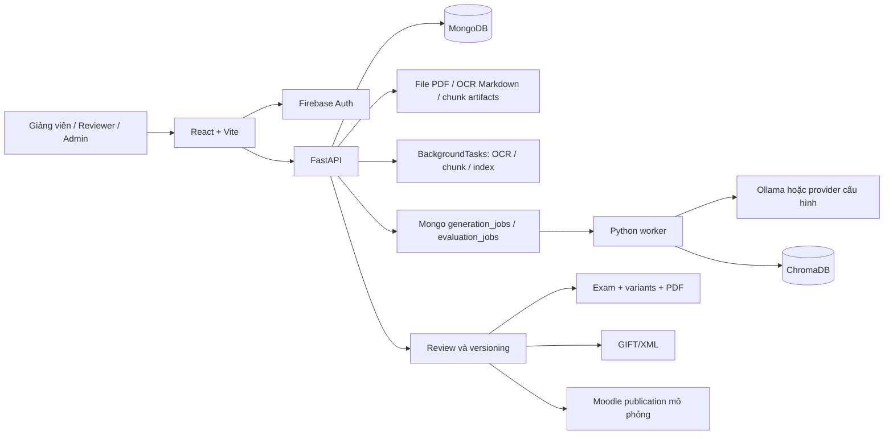
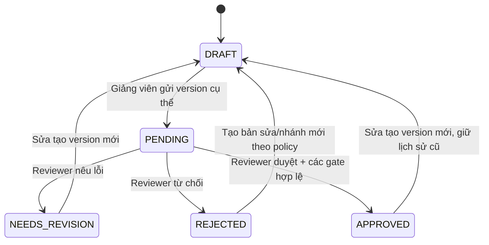
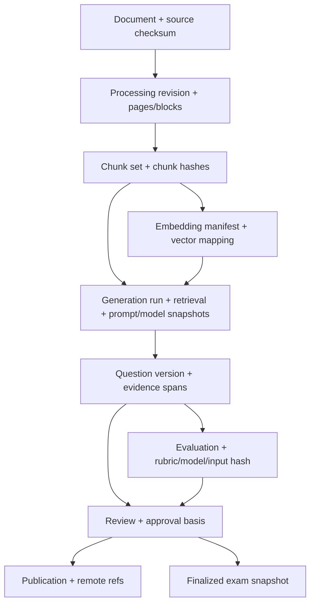
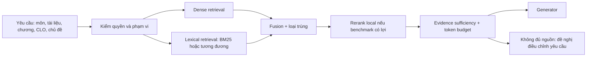
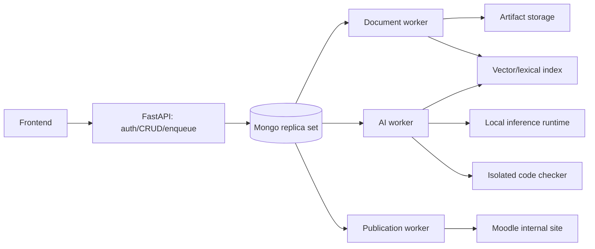
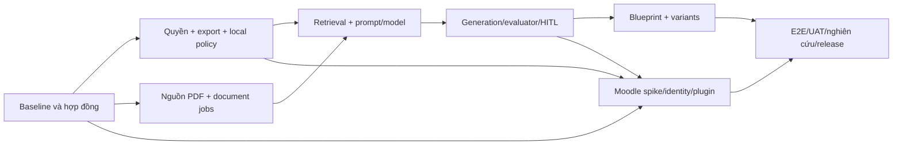

# QBankCTU — Phân tích tổng thể và kế hoạch hoàn thiện

Ngày rà soát: **05/09/2026**. Baseline mã nguồn: commit **790bc91** tại `D:/NCKH`.

Đây là kế hoạch triển khai dựa trên code hiện tại và yêu cầu mới của chủ dự án. Những thiết kế, ngưỡng và ước lượng bên dưới là **đề xuất**, không phải tính năng đã triển khai hoặc kết quả thực nghiệm. Phạm vi lần làm việc này là phân tích, kiểm tra và lập kế hoạch; chưa sửa logic sản phẩm.

## 1. Kết luận và định hướng

**Nên tiếp tục hoàn thiện trên kiến trúc hiện tại.** Dự án đã có nền tảng khá rộng: React, FastAPI modular, MongoDB schema V2, ChromaDB, Ollama, phiên bản câu hỏi, job sinh/chấm AI, reviewer workspace, ma trận đề, mã đề, GIFT/XML và quản trị. Viết lại toàn bộ hoặc chuyển sang microservices sẽ làm tăng rủi ro mà chưa giải quyết được các điểm thiếu chính.

Điểm cần hoàn thiện nằm ở **tính đúng xuyên suốt quy trình**:

1. Tài liệu và code trong PDF phải được giữ đúng trước khi yêu cầu AI bám nguồn.
2. Người dùng phải nhìn thấy, xử lý và xuất đúng dữ liệu trong phạm vi môn học của mình.
3. Điểm AI phải có ý nghĩa, có bằng chứng và không thay thế quyết định của reviewer.
4. Tất cả đường đưa câu hỏi vào đề hoặc LMS phải áp dụng cùng điều kiện phiên bản đã duyệt.
5. Moodle phải được tích hợp thật; tài khoản Moodle, quyền trong học phần và trạng thái đồng bộ phải xác thực được.
6. Cần bằng chứng thực nghiệm bằng giáo trình Cấu trúc dữ liệu, model local và người đánh giá thật.

**Không nên công bố phần trăm hoàn thành chỉ bằng số màn hình hoặc số collection.** Nhiều thành phần đã có nhưng chưa đủ bằng chứng rằng một giảng viên có thể hoàn thành toàn bộ quy trình trên hệ thống thật.

### 1.1. Phạm vi sản phẩm đề xuất

- Bắt buộc: PDF text, PDF scan và PDF hỗn hợp; nội dung tiếng Việt có thuật ngữ/code tiếng Anh.
- Môn thí điểm: Cấu trúc dữ liệu. Môn học là danh mục cấu hình, không hard-code thuật toán theo mã môn CTDL.
- Ba vai trò nghiệp vụ: giảng viên, reviewer, admin; một người có thể có nhiều nhiệm vụ theo môn.
- AI sinh câu hỏi, AI hỗ trợ chấm; reviewer quyết định duyệt/yêu cầu sửa/từ chối.
- Hai đầu ra: ngân hàng câu hỏi dùng được và bộ đề được chốt từ câu hỏi đã duyệt.
- LMS: xuất tệp chuẩn trước, đồng bộ Question Bank thật sau; **tạo Moodle Quiz** là đầu việc riêng, không được xem là tự có sau khi đồng bộ câu hỏi.
- Giữ hỗ trợ DOCX đã tồn tại; không lấy mở rộng DOC/DOCX làm đường găng của yêu cầu PDF.
- Code mode trước mắt là đọc code, truy vết, sửa lỗi, phân tích thuật toán. Bài tập yêu cầu sinh viên nộp code/chấm code trên LMS là phần mở rộng riêng.

### 1.2. Các giả định để triển khai kế hoạch

| Nội dung | Giả định làm việc | Khi nào cần chốt |
|---|---|---|
| Chạy local | OCR, embedding, generator, evaluator và reranker nếu có đều suy luận nội bộ | Trước cấu hình môi trường nghiệm thu |
| Danh tính Moodle | Trước hết đồng bộ định danh và quyền theo course; SSO là mức tích hợp riêng | Giai đoạn xác lập hợp đồng Moodle |
| Reviewer | Độc lập với người tạo câu, có phạm vi môn được phân công | Trước sửa phân quyền |
| Quyền admin | Quản trị kỹ thuật; duyệt chuyên môn cần quyền reviewer riêng hoặc ngoại lệ được ghi nhận | Trước chốt ma trận quyền |
| Chương | Không bắt buộc, có trạng thái chưa phân loại rõ ràng | Ngay khi chỉnh data contract |
| CLO | Bắt buộc trước duyệt chính thức; có thể thiếu lúc nháp | Trước thay policy chất lượng |
| Ngôn ngữ code | Bám giáo trình thực tế; C/C++ là giả định thí điểm cần xác nhận | Trước benchmark câu code |
| Cấu hình GPU | Chưa có số đo VRAM/RAM/GPU dành cho triển khai | Trước chọn model và SLA |
| Moodle | Chưa chốt phiên bản, quyền cài plugin, course/category thử nghiệm | Trước triển khai connector thật |

“AI chạy local” không tự đồng nghĩa với “cả hệ thống hoạt động hoàn toàn không Internet”. Nếu muốn cả đăng nhập cũng offline, cần thay phụ thuộc Firebase bằng cơ chế danh tính nội bộ/Moodle trong mạng nội bộ. Kế hoạch không tự suy diễn yêu cầu này thành việc bỏ Firebase ngay.

## 2. Hiện trạng đã kiểm tra trong code

### 2.1. Bản đồ kiến trúc hiện tại



MongoDB hiện là nơi lưu nghiệp vụ; ChromaDB là chỉ mục vector; file storage lưu artifacts. Cách phân chia này phù hợp. Cần làm chắc liên kết và khôi phục, chưa cần đổi cơ sở dữ liệu.

### 2.2. Đối chiếu yêu cầu

| Nhóm | Đã thấy trong code | Chưa thể coi hoàn tất | Ưu tiên |
|---|---|---|---|
| PDF và tài liệu gốc | Upload, checksum, artifact, pages, job, trang quản lý tài liệu | PDF text vẫn OCR; raw OCR có thể mất; lưu page set chưa bất biến | P0/P1 |
| OCR/chunk/vector | EasyOCR, cleaning, bảo vệ một số block khi chunk, Mongo chunks, mapping embedding, reindex | Worker bền vững chưa bao phủ OCR/index; cần kiểm tra tính đúng code/layout | P1 |
| Môn/chương/CLO | Subjects có chapters và learning_outcomes; snapshot trong câu hỏi | Chưa có membership môn chặt chẽ; CLO tự gợi ý chưa thay được xác nhận chuyên môn | P0/P1 |
| Hybrid retrieval | Vector search + lexical overlap + density | Lexical chỉ rerank tập vector; giới hạn chương có fallback âm thầm | P1 |
| Prompt | File theo loại/Bloom; catalog DB có version; lưu prompt đã render | DB fallback âm thầm; manifest từng prompt sinh chưa đầy đủ | P1 |
| Model | General/code routing; evaluator riêng; Ollama transport, registry, fallback, concurrency | Có Gemini; chưa cưỡng chế local-only; chưa benchmark model code | P0/P1 |
| Câu hỏi | CRUD, version, nguồn, duplicate filtering, format repair, auto evaluation | Schema CRUD còn linh hoạt; cần kiểm tra cùng chuẩn cho AI/manual/import | P1 |
| Đánh giá | Năm điểm 0–1, weighted score, màu, guardrail, policy, evaluator jobs, golden fixtures | Metric semantics chưa khớp hoàn toàn yêu cầu; thiếu hiệu chuẩn với reviewer thật | P0/P1 |
| Review | Queue, lock/assignment, draft, comment, biểu mẫu, override, secondary review | Cần policy chống tự duyệt và quyền theo môn; server phải giữ mọi điều kiện UI | P0 |
| Ngân hàng và đề | Lọc, chia sẻ, ma trận, snapshot, finalization, tối đa bốn mã đề, PDF | Ma trận chưa CLO/type/điểm; Bloom 5–6 không vào nhóm cao hiện tại | P1 |
| Moodle | Target admin, export GIFT/XML, mock idempotency, lịch sử | Publish thật bị chặn; chưa thấy implementation plugin trong `moodle/local` | P1 bắt buộc |
| Tài khoản Moodle | Firebase identity và hồ sơ Mongo | Chưa thấy mapping/sync Moodle identity/course membership | P1 bắt buộc |
| Kiểm thử/vận hành | CI backend/frontend, Mongo integration tests, retry/lease cho AI | Thiếu bằng chứng runtime E2E thực tế tại phiên rà soát và bộ benchmark nghiên cứu | P1/P2 |

### 2.3. Những nền tảng nên giữ lại

- `questions` làm aggregate, `question_versions` lưu nội dung theo phiên bản; evaluation/review/publication tham chiếu phiên bản.
- Sửa câu tạo draft mới, reset chất lượng và assignment; không tự quay lại duyệt. Xem [repository](D:/NCKH/backend/modules/questions/repository.py:515).
- Khi thêm câu vào đề và xuất Moodle từng câu, code kiểm tra phiên bản hiện tại đúng phiên bản đã duyệt. Xem [exam service](D:/NCKH/backend/modules/exams/service.py:134) và [export service](D:/NCKH/backend/modules/questions/workflow_service.py:2669).
- Mongo job queue, claim, lease, retry/backoff và model concurrency đã có cho generation/evaluation; nên mở rộng cùng mẫu.
- Lưu rendered prompt, raw response, model snapshot và retrieval trace đã có nền tảng; không cần xây lại logging AI từ đầu.
- Frontend đã có các trang chuyên biệt cho reviewer, admin, tài liệu và đề thi; ưu tiên sửa hành vi và tách component khi chạm tới, tránh làm thêm dashboard trùng chức năng.

## 3. Các phát hiện quan trọng và tác động

P0: điều kiện gây sai quyền, sai nội dung hoặc phá vòng duyệt. P1: chức năng bắt buộc chưa hoàn chỉnh. P2: tối ưu, vận hành và mở rộng sau khi đường chính đúng. Các phát hiện bên dưới là đọc code; chỉ những phần được nêu trong mục kiểm thử mới là đã thực thi kiểm chứng.

### F01 — Xuất GIFT/XML hàng loạt chưa có cùng cổng kiểm duyệt

**Bằng chứng:** [ManagePage](D:/NCKH/frontend/src/pages/ManagePage.jsx:1343) lấy câu được chọn hoặc toàn bộ kết quả lọc rồi gọi serializer JavaScript; không kiểm tra `review_status`, `approved_version_id` ở handler. [API xuất từng câu](D:/NCKH/backend/modules/questions/workflow_service.py:2669) có kiểm tra này.

**Hệ quả:** chọn một draft và xuất GIFT/XML có thể tạo tệp sẵn để import Moodle trước khi được duyệt. Đây là thiếu nhất quán trong luồng sản phẩm, không phải bằng chứng rằng hệ thống có thể ngăn người dùng chép thủ công nội dung họ được quyền đọc.

**Sửa P0:** tất cả export LMS chính thức đi qua backend dùng chung eligibility và serializer. CSV/XLSX dùng lưu trữ nháp có thể giữ nhưng phải có trạng thái/origin/version, ghi rõ chưa duyệt. Khi batch có câu không hợp lệ: trả lỗi từng câu, cho sửa lựa chọn; không âm thầm bỏ qua.

**Nghiệm thu:** draft, pending, rejected, phiên bản mới chưa duyệt không xuất được qua endpoint chính thức hay UI; batch approved xuất đủ; sửa câu giữa lúc chọn và xuất nhận 409 hoặc lỗi theo item.

### F02 — Chia sẻ SUBJECT chưa ràng buộc membership

**Bằng chứng:** [DocumentService](D:/NCKH/backend/modules/documents/service.py:40) và [QuestionService](D:/NCKH/backend/modules/questions/service.py:145) coi `shared_scope == SUBJECT` là đủ quyền đọc, chưa kiểm tra user thuộc môn tương ứng.

**Hệ quả:** một giảng viên không thuộc môn vẫn có thể được coi là hợp lệ với dữ liệu SUBJECT nếu đi đến service. Reviewer cũng đang được coi có quyền đọc rộng theo role.

**Sửa P0:** bổ sung membership và scope policy dùng chung; áp dụng cả list, detail, source PDF/pages, generation, exam picker, export, comments. Backfill scope từ thông tin đã xác minh; dữ liệu không rõ quyền không mặc định chia sẻ toàn hệ thống.

### F03 — PDF luôn OCR và cleaning có thể làm mất code

**Bằng chứng:** [pipeline](D:/NCKH/backend/modules/ocr/pipeline.py:155) gọi [stream_and_ocr_pdf](D:/NCKH/backend/modules/ocr/easyocr_engine.py:111) để render từng trang 300 DPI rồi OCR. [clean_text_basic](D:/NCKH/backend/modules/ocr/pipeline.py:93) strip khoảng trắng đầu dòng và bỏ dòng ngắn; ký hiệu đơn lẻ như `}` hoặc `;` có nguy cơ bị mất.

**Hệ quả:** câu hỏi bám rất sát OCR vẫn có thể sai kiến thức nếu nguồn OCR đã biến đổi code. Không được dùng điểm faithfulness cao để kết luận OCR đúng.

**Sửa P0/P1:** trích xuất text trước, OCR theo trang khi cần, giữ block code và raw layout; kiểm thử ký tự toán/code như `<=`, `!=`, `->`, `*`, `&`, dấu ngoặc và thụt dòng. Không tiếp tục dùng một regex cleaning cho mọi loại block.

### F04 — Raw OCR và lịch sử page set chưa được bảo toàn đầy đủ

**Bằng chứng:** các bước [remove_headers_footers](D:/NCKH/backend/modules/ocr/pipeline.py:15) và cleaning dựng dict mới chỉ giữ page/text, làm mất `original_text` từ OCR. [save_pages](D:/NCKH/backend/modules/documents/repository.py:560) fallback `raw_text` về text đã xử lý và xóa pages của cùng document version trước khi insert. [update_page](D:/NCKH/backend/modules/documents/repository.py:369) sửa trực tiếp `cleaned_text`.

Hiện có chặn sửa OCR sau khi chunk/index hoàn tất ở [service](D:/NCKH/backend/modules/documents/service.py:331); vì vậy không kết luận mọi chỉnh OCR đang làm hỏng index. Vấn đề chắc chắn là tính đầy đủ của raw data, lịch sử correction và page set theo lần xử lý.

**Sửa P1:** page set bất biến theo processing revision; correction tạo revision mới; Markdown, pages và chunks phải cùng revision. Không xóa dữ liệu cũ còn được câu hỏi tham chiếu.

### F05 — OCR/chunk/index chưa chạy trên durable worker chung

**Bằng chứng:** OCR, chunk và reindex dùng FastAPI `BackgroundTasks`; [worker](D:/NCKH/backend/core/job_worker.py:48) hiện chỉ lấy generation/evaluation jobs.

**Hệ quả:** restart API giữa tác vụ tài liệu có thể để lại job dở dang cần recovery/retry; không có cùng cơ chế claim/heartbeat/lease như AI worker. Semaphore OCR là trong từng process, không điều phối tổng VRAM giữa OCR và LLM.

**Sửa P1:** worker xử lý document jobs, checkpoint từng trang/batch, heartbeat, retry idempotent và fencing token. API chỉ upload/enqueue; restart API không làm mất tiến độ.

### F06 — Hybrid retrieval còn hạn chế và chương có thể bị nới ngoài ý người dùng

**Bằng chứng:** [search](D:/NCKH/backend/modules/rag/search.py:128) vector query rồi lexical rerank trên tập đó. Khi không có heading khớp, `heading_matched_chunks or candidate_chunks` vẫn lấy nội dung khác.

**Hệ quả:** từ khóa rất đặc trưng có thể không được tìm nếu vector bỏ sót; yêu cầu giới hạn chương có thể nhận câu ngoài chương. Khi không có query, seed lấy từ một nhóm đầu có thể làm nội dung tập trung vào phần đầu tài liệu.

**Sửa P1:** dense + lexical độc lập cùng phạm vi, fusion, chính sách không đủ bằng chứng; phân biệt `chapter_id` giới hạn cứng với `topic_query` ưu tiên mềm. Lưu rõ fallback nếu người dùng chủ động cho phép.

### F07 — Chưa cưỡng chế tất cả AI chạy local

**Bằng chứng:** [factory](D:/NCKH/backend/modules/generation/llm/factory.py) và [registry](D:/NCKH/backend/modules/generation/llm/model_registry.py:50) hỗ trợ Gemini; `is_local` là metadata, chưa là gate bắt buộc. Endpoint Ollama cũng có thể cấu hình tùy ý.

**Hệ quả:** mặc định local không đảm bảo mọi model/fallback được chọn đều local. Chưa có bằng chứng hệ thống đang gửi dữ liệu cloud; đây là lỗ hổng enforcement theo yêu cầu đích.

**Sửa P0:** policy `LOCAL_ONLY`, allowlist runtime/endpoint/model đã cài; kiểm tra cả model chính, code model, evaluator và fallback; môi trường nghiệm thu chặn cloud từ application lẫn hạ tầng.

### F08 — Ba tên metric chưa phản ánh đúng ba khía cạnh yêu cầu

**Bằng chứng:** [scoring_policy](D:/NCKH/backend/prompts/evaluation/scoring_policy.txt) định nghĩa contextual relevancy thiên về “ý quan trọng”, còn answer relevancy gộp cả đúng/sai, tính duy nhất và distractor. [evaluate](D:/NCKH/backend/modules/questions/workflow_service.py:953) tổng hợp weighted score với ngưỡng mặc định pass 0.65, green 0.75; có action/severity guardrail nhưng chưa có hard minimum chung cho từng metric trong hàm này.

**Hệ quả:** điểm không trực tiếp trả lời “retrieval có lấy đủ đoạn chứa căn cứ không”; điểm cao ở chiều khác có thể bù cho metric quan trọng yếu nếu guardrail không phát hiện. YELLOW và PASSED hiện có thể cùng tồn tại theo thiết kế, phải giải thích rõ cho reviewer.

**Sửa P0/P1:** tách answer correctness, answerability, source integrity, format, Bloom/CLO và relevance; các hard gate không thể được bù bằng trung bình. Đồng bộ UI/prompt/backend policy; không mô tả metric tự xây là điểm chuẩn Ragas nếu chưa dùng đúng cách tính.

### F09 — Evaluator có thể chỉ thấy một phần nguồn quan trọng

**Bằng chứng:** [QuestionService._sources](D:/NCKH/backend/modules/questions/service.py:180) giữ excerpt đầu 2.000 ký tự; evaluator lấy tối đa ba nguồn, mỗi nguồn 700 ký tự tại [workflow](D:/NCKH/backend/modules/questions/workflow_service.py:299). Generator mặc định lấy năm chunks. `model_source_context` được truyền riêng, nhưng không thay thế xác minh nguồn gốc.

**Hệ quả:** căn cứ nằm ở chunk thứ tư/năm hoặc cuối chunk có thể vắng trong phần nguồn authoritative mà evaluator thấy. Điều này có thể tạo false reject, nhận xét “không có căn cứ” sai hoặc dựa quá nhiều vào trích đoạn do generator chọn.

**Sửa P1:** chọn evidence span theo từng câu; backend xác minh span thuộc source snapshot bằng offset/hash; cấp budget theo token, không cắt đầu nguồn theo số ký tự cố định.

### F10 — Tích hợp Moodle và Moodle identity mới ở phần khung

**Bằng chứng:** [publish_to_moodle](D:/NCKH/backend/modules/questions/workflow_service.py:2690) từ chối `mock=false`; thư mục `moodle/local` chưa có file triển khai trong workspace đã kiểm tra. [dependencies](D:/NCKH/backend/core/dependencies.py:82) xác thực Firebase, user schema còn gắn với `firebase_uid`.

**Sửa P1 bắt buộc:** tách identity provisioning, SSO nếu cần, course-role sync, Question Bank publication, và Quiz delivery thành các hợp đồng riêng. Không coi target health check hoặc ghi publication local là tích hợp LMS hoàn tất.

### F11 — Ma trận đề chưa đáp ứng đủ Bloom/CLO

**Bằng chứng:** [exam schemas](D:/NCKH/backend/modules/exams/schemas.py:8) ánh xạ vận dụng cao thành đúng Bloom 4; `MatrixCell` chỉ có chapter/cognitive/difficulty/count. [selection](D:/NCKH/backend/modules/exams/service.py:372) lọc một mức Bloom, lấy tối đa 1.000 câu; [finalization validation](D:/NCKH/backend/modules/exams/service.py:152) kiểm số câu và phiên bản nhưng chưa kiểm phân bố thực tế từng ô.

**Hệ quả:** Bloom 5–6 không thuộc nhánh tự chọn vận dụng cao; thêm thủ công có thể đủ tổng số nhưng sai phân bố. Ô chồng lấn được chọn tham lam có thể báo thiếu dù tồn tại cách phân bổ khác. Phạm vi dùng bank chia sẻ cũng cần thống nhất giữa picker và auto-select.

**Sửa P1:** blueprint có Bloom set, CLO, dạng câu và điểm; kiểm định phân bố trước READY/FINALIZED; phát hiện ô chồng lấn và giải bài toán phân bổ có ràng buộc.

### F12 — Prompt và đánh giá chưa đủ khả năng tái hiện/hiệu chuẩn

**Bằng chứng:** [prompt loader](D:/NCKH/backend/modules/generation/prompt_builder.py:7) nuốt lỗi DB rồi fallback file. [generation run](D:/NCKH/backend/modules/generation/mongodb.py:108) lưu rendered prompt nhưng `prompts` còn rỗng. CLO có fallback token overlap tại [resolver](D:/NCKH/backend/modules/generation/mongodb.py:60). Test evaluator HTTP dùng fake server, golden fixture kiểm guardrail, không thay thế chấm chất lượng bằng model và chuyên gia thật.

**Sửa P1:** manifest prompt thực dùng, model digest, rubric version, retrieval settings, evaluation source snapshot; cho phép re-evaluation theo policy/model revision. CLO auto-map là gợi ý có provenance và confidence, không là kết luận chuẩn đầu ra.

### F13 — Bề mặt xác thực và review cần kiểm soát ở server

**Bằng chứng:** [session repository](D:/NCKH/backend/modules/auth/session_repository.py:20) lưu nguyên Firebase bearer token, và mỗi request xác thực gọi upsert. [review](D:/NCKH/backend/modules/questions/workflow_service.py:2075) kiểm version, evaluation, lock và reviewer thứ hai; chưa thấy cấm người tạo tự duyệt lần đầu trong hàm. Role/permission đang được pha trộn, kể cả alias cho `require_roles`.

**Sửa P0/P1:** tránh lưu raw bearer token không cần thiết; chuẩn hóa session metadata; tách capability review/publish/override; check tác giả theo lịch sử ownership và provenance; trường policy/model/prompt snapshot do server tạo, không tin payload người dùng để giả metadata evaluator.

## 4. Luồng nghiệp vụ đích và bất biến

### 4.1. Luồng của giảng viên

1. Đăng nhập; hệ thống xác định user nội bộ, identity bên ngoài và các môn được phép.
2. Chọn môn, CLO mục tiêu, chương nếu có; upload PDF hoặc dùng tài liệu được chia sẻ đúng phạm vi.
3. Hệ thống lưu file gốc và enqueue xử lý; hiển thị bước, tiến độ, lỗi có thể xử lý.
4. Xem trang PDF cạnh kết quả extraction/OCR; sửa các block bị nghi ngờ, đặc biệt code/công thức.
5. Chốt processing revision, chunk/index; chỉ revision READY mới được sinh câu.
6. Lập yêu cầu sinh: dạng câu, số lượng, Bloom, CLO, chủ đề, code/general; xem preview phạm vi truy xuất.
7. Nhận bản nháp và báo cáo số được lưu, trùng, sai format, thiếu nguồn, lỗi model; không báo “đủ câu” khi chỉ lưu một phần.
8. Chỉnh nội dung nếu cần; xem bằng chứng và kết quả AI; gửi duyệt một phiên bản cụ thể.
9. Nhận phản hồi reviewer; sửa tạo phiên bản mới và gửi lại, không sửa đè bản đã duyệt.
10. Chọn câu đã duyệt vào blueprint, kiểm coverage và điểm; chốt đề; tạo mã đề và xuất bản được phép.

### 4.2. Luồng của reviewer

1. Queue theo môn/phân công, tuổi tác vụ, màu chất lượng và trạng thái; nhận claim có thời hạn.
2. Xem ba vùng: câu hỏi/đáp án; nguồn PDF/OCR tương ứng phiên bản; điểm AI và bằng chứng từng tiêu chí.
3. Kiểm tra độc lập đáp án, nguồn, khả năng trả lời, distractor, Bloom/CLO; không chỉ bấm theo màu.
4. Duyệt, yêu cầu sửa hoặc từ chối; lỗi cần sửa có vị trí, mức độ, gợi ý cụ thể.
5. Nếu override đánh giá AI: ghi lý do, tiêu chí, evidence và người chịu trách nhiệm; policy quyết định có cần reviewer thứ hai.
6. Không sửa nội dung rồi duyệt âm thầm trên cùng phiên bản. Gợi ý sửa phải được tiếp nhận thành version mới.
7. Publish nếu có capability riêng; review hoàn tất không tự gửi Moodle.

### 4.3. Luồng của admin

- Quản lý identities, user, membership, course mapping, reviewer assignment.
- Cấu hình ba vai trò model, hạn mức GPU/job, prompt release và quality policy.
- Theo dõi job lỗi, reindex, publication lỗi/không rõ kết quả, backup và audit.
- Thực hiện thao tác kỹ thuật không mặc nhiên tạo thẩm quyền chuyên môn với mọi câu.

### 4.4. Máy trạng thái

Giữ bốn chiều trạng thái độc lập, bổ sung trạng thái khi cần bằng migration có version:

| Chiều | Trạng thái đích | Ý nghĩa |
|---|---|---|
| Lifecycle | ACTIVE / ARCHIVED | Câu còn sử dụng hay đã lưu trữ |
| Evaluation | NOT_STARTED / QUEUED / PROCESSING / PASSED / FAILED / ERROR / STALE | Chất lượng phiên bản; ERROR là lỗi chạy, không phải câu sai |
| Review | DRAFT / PENDING / NEEDS_REVISION / REJECTED / APPROVED | Quyết định của con người |
| Publication | NOT_PUBLISHED / QUEUED / PUBLISHING / PUBLISHED / FAILED / UNKNOWN / STALE / REVOKED | Theo target và version; UNKNOWN cần đối soát |



Evaluation có thể chạy trước khi gửi duyệt để giảng viên sửa sớm; reviewer vẫn xem được câu FAILED để phản biện. Chỉ approval/publication bị chặn bởi gate, không khóa toàn bộ khả năng xử lý câu chưa đạt.

### 4.5. Bất biến bắt buộc ở backend

1. Mỗi version AI có ít nhất một nguồn hợp lệ, liên kết đúng document/processing revision/chunk set.
2. Một evaluation chỉ có hiệu lực cho đúng question version và input hash.
3. Một approval phải lưu version, review record, policy và evaluation hoặc ngoại lệ đã xác nhận.
4. Ghi kết quả job cũ không được thay đổi summary của phiên bản mới.
5. `GREEN` không đồng nghĩa `APPROVED`; `APPROVED` không đồng nghĩa đã gửi LMS.
6. Xuất bản hoặc thêm vào đề phải đi qua cùng eligibility service, kiểm quyền và approval version.
7. Retry cùng thao tác không tạo câu, embedding hay publication trùng.
8. Mọi nguồn hiển thị khi review phải là nguồn đã dùng ở phiên bản đó; nếu xem revision mới phải ghi rõ.
9. File gốc, page set/chunk set đã có tham chiếu không bị xóa hoặc ghi đè bởi retry/correction.
10. Dữ liệu đề đã FINALIZED bất biến; sửa ngân hàng không làm thay đổi nội dung hay đáp án của đề cũ.
11. Quyền SUBJECT phải có membership; đổi quyền/khóa user có hiệu lực ở request tiếp theo, không chỉ lúc login.
12. Không có model/fallback cloud trong profile LOCAL_ONLY; thiếu model phải báo lỗi rõ.

## 5. Thiết kế dữ liệu cần hoàn thiện

### 5.1. Nguyên tắc thay đổi schema

Giữ MongoDB V2 làm nền. Ưu tiên bổ sung field, index và validator vào collection hiện có. Chỉ tạo collection mới khi có vòng đời, cardinality hoặc yêu cầu truy vấn độc lập; không cần tách mọi subdocument thành collection.

- `questions` chứa identity và trạng thái hiện hành; nội dung nằm ở `question_versions`.
- `subjects` có thể tiếp tục nhúng chapters/CLO khi quy mô học phần nhỏ; bổ sung revision cho curriculum và lưu snapshot lúc dùng.
- Mongo lưu chunk authoritative; Chroma chỉ lưu vector/index có thể dựng lại.
- Phân biệt document version — file nguồn thay đổi; processing revision — chạy lại extraction/OCR/correction trên cùng file.
- Đổi OCR/chunk không sửa câu đã sinh. Câu giữ snapshot cũ, có cảnh báo nguồn mới nếu cần đánh giá lại.
- Không thêm trạng thái boolean `is_reviewed` làm nguồn chuẩn thứ hai; có thể suy ra để hiển thị từ review record đúng version.

### 5.2. Thực thể và field đề xuất

| Thực thể | Giữ lại | Bổ sung/chuẩn hóa | Ràng buộc quan trọng |
|---|---|---|---|
| `users` | Hồ sơ, trạng thái, role/permissions | Identity trung lập nhà cung cấp; role assignment có scope; không bắt buộc Firebase với mọi user | User nội bộ có ID ổn định khi đổi nhà cung cấp login |
| `external_identities` mới nếu hỗ trợ nhiều LMS | — | user_id, provider, issuer/site_id, external_user_id, username, email_verified, last_synced_at, status | Unique `(provider, issuer, external_user_id)`; email không phải khóa gộp tài khoản |
| `subject_memberships` mới | — | user_id, subject_id, roles/capabilities, status, origin, external_course_id, effective_from/to, sync_revision | Unique membership theo user/môn/nguồn; quyền tổng hợp có policy rõ |
| `subjects` | Code/name, chapters, learning_outcomes | curriculum_revision, owner, language, code_language; snapshot CLO version | CLO/chapter phải thuộc đúng môn; deactivate không phá lịch sử |
| `documents` | Owner, môn/chương, artifacts, current_processing | Source version, active processing revision, access policy, source checksum | READY chỉ sau khi active index được xác nhận đầy đủ |
| `document_jobs` | Loại/status/config/stats | lease_owner, fencing_token, attempts, next_attempt_at, checkpoint, cancel_requested_at, processing_revision | Một attempt hết lease không được cập nhật active pointer |
| `document_pages` | Page number, raw/cleaned text | processing_revision, extraction_method, blocks, bbox, OCR confidence, quality_flags, hashes, correction provenance | Không ghi đè revision đã dùng; page number trỏ đúng trang PDF |
| `chunk_sets` | Document/version, config, trạng thái | processing_revision, parser/chunker version, tokenizer revision, manifest_hash, activated_at | Chỉ set hoàn tất mới được truy xuất |
| `document_chunks` | Content, heading/page metadata, keywords | block_type, language, source spans, token counts, code metadata, content_hash | Chunk ID bất biến; không tái dùng ID cho text khác |
| `vector_collections` | Collection, embedding model | runtime, model digest/revision, dimension, distance, normalization, index version | Đổi model/revision/dimension tạo namespace tương thích mới |
| `chunk_embeddings` | Chunk/vector mapping | vector_record_id, status, indexed_hash, indexed_at, error | Unique `(chunk_id, vector_collection_id)`; hash khớp content |
| `prompt_templates` | Key/version/body/active | status DRAFT/RELEASED/RETIRED, variables_schema, checksum, tested_on, approved_by | Version đã release bất biến; một release active theo key/profile |
| `ai_models` | Runtime/name/capability/config | artifact_digest, quantization, context limit, local endpoint profile, benchmark_ref | Ba vai trò cấu hình độc lập; không cần ba bộ weights khác nhau |
| `generation_jobs/runs` | Request/model/prompt/raw response | prompt manifest, retrieval query/config/ranks, seed nếu hỗ trợ, input_hash, output_schema_version, candidate diagnostics | Lưu actual model và fallback thực dùng; checkpoint theo plan item |
| `question_versions` | Content/data/classification/clos/sources | Typed payload, evidence spans, derivation metadata, code_validation, provenance | Version mới khi nội dung, đáp án, nguồn hoặc classification có ý nghĩa thay đổi |
| `question_evaluations` | Scores/evidence/policy/model | metric definitions revision, hard_checks, uncertainty, evaluated_input_hash, candidate decision | Phân biệt AI, heuristic và human assessment; không cho client tự giả nguồn chấm |
| `question_reviews` | Reviewer/decision/form/override | approval_basis, evaluation_id, conflict_of_interest_check, reviewer scope snapshot | Review history bất biến; hủy duyệt tạo record mới |
| `moodle_publications` | Target/version/hash/idempotency | remote refs, plugin contract version, attempt history, remote_verified_at, reconciliation state | PUBLISHED cần xác nhận remote; retry không tạo duplicate |
| `exams/exam_variants` | Blueprint, refs, snapshots, đáp án | Blueprint version, điểm, CLO/type constraints, seed/permutation, eligibility manifest | Finalized snapshot bất biến; variant có mapping đáp án đúng |

Với một LMS duy nhất có thể bắt đầu bằng `users.external_identities[]`, nhưng khi sync hàng loạt, uniqueness theo issuer và quản trị nhiều site cần độc lập, collection riêng dễ kiểm soát hơn. Không đổi representation giữa chừng mà không có migration.

### 5.3. Chuỗi truy vết bắt buộc



Ví dụ một nguồn câu hỏi cần đủ: document ID, source version, processing revision, chunk set ID, chunk ID, content hash, page/bbox hoặc text offsets, trích đoạn đã kiểm chứng và loại căn cứ. Không chỉ lưu `vector_id` hoặc đường dẫn `OCR.md` hiện hành vì chúng không diễn đạt đầy đủ phiên bản nguồn.

### 5.4. Nhất quán MongoDB — file — ChromaDB

Không có transaction chung cho ba kho. Dùng quy trình có trạng thái và cơ chế bù:

1. Ghi artifact vào vị trí tạm; tính checksum; chuyển sang vị trí cố định khi hoàn tất.
2. Ghi chunk set mới trạng thái BUILDING; insert chunks bất biến.
3. Enqueue embedding/index; upsert theo stable vector ID; xác nhận số lượng và hash.
4. Trong transaction Mongo, chuyển set sang COMPLETED và cập nhật active pointer với expected revision/fencing token.
5. Retrieval chỉ nhìn active set đã hoàn tất; nếu index thiếu thì báo chưa sẵn sàng hoặc rollback pointer về bản cũ hợp lệ.
6. Job reconciliation tìm orphan artifact, vector thiếu, hash lệch; không xóa nguồn có reference đang tồn tại.
7. Retention job chỉ dọn revision cũ sau khi chứng minh không còn tham chiếu và hết thời hạn lưu.

**Nghiệm thu:** crash ở từng bước, chạy lại không tạo duplicate; active pointer không trỏ tới set thiếu vector; câu/đề cũ vẫn mở đúng nguồn sau reindex.

### 5.5. Migration an toàn

Mỗi thay đổi schema có migration ID, dry-run, thống kê dữ liệu lỗi và khả năng chạy lại. Thứ tự: thêm field nullable → backfill → đọc tương thích → chuyển write path → kiểm dữ liệu → siết validator/index. Unique index phải kiểm duplicate trước khi tạo.

Không suy ra Moodle identity chỉ từ email trùng; không tự biến toàn bộ SUBJECT hiện tại thành membership toàn trường. Những record không thể suy ra đáng tin cậy vào danh sách cần admin xác nhận. Backup phải bao gồm Mongo, artifacts và manifest model/prompt; Chroma có thể khôi phục bằng rebuild từ chunks nhưng cần đo thời gian.

## 6. PDF, OCR, chunking và retrieval

### 6.1. Pipeline tài liệu đích

1. **Upload:** kiểm đuôi, MIME và file signature; giới hạn dung lượng, số trang, kích thước ảnh render; xử lý PDF lỗi/mật khẩu; tên file storage do server sinh.
2. **Phân loại từng trang:** thử extraction text; kiểm tỷ lệ ký tự hợp lệ, thứ tự đọc, coverage. PDF hỗn hợp được chọn extraction/OCR theo trang, không chọn một lần cho cả file.
3. **Extraction/OCR:** giữ raw text, block coordinates, confidence nếu engine cung cấp; lưu trang gốc phục vụ đối chiếu.
4. **Phân loại block:** prose, heading, code, table, formula, figure/caption. Block nghi ngờ cần reviewer nguồn xác nhận.
5. **Cleaning:** giữ raw bất biến; cleaning theo block; code không strip indent hoặc xóa dòng ngắn; bảng/đồ thị không biến thành câu chữ đoán.
6. **Quality check:** đánh dấu ký hiệu lạ, câu cụt, code không cân ngoặc, thiếu trang, cột bị trộn; tài liệu chất lượng thấp không tự READY.
7. **Correction:** giảng viên sửa bản dẫn xuất; lưu người sửa, trước/sau, lý do; xuất lại Markdown đồng nhất với page revision.
8. **Chunk/index:** giữ cấu trúc chương, heading, đoạn giải thích gắn với code; chạy index rồi kích hoạt revision.

Trước khi thêm thư viện extraction, benchmark trên một tập PDF thực tế; thêm dependency khi nó giải quyết được PDF text/layout đã đo. Không nâng cấp toàn bộ OCR stack trong cùng thay đổi với job queue.

### 6.2. Quy tắc riêng cho Cấu trúc dữ liệu

- Giữ dấu `*`, `&`, `->`, `<=`, `>=`, `!=`, ngoặc, chỉ số, dấu âm và indentation.
- Không coi dòng chứa một số là số trang nếu nó thuộc ví dụ/code/bảng kết quả.
- Độ phức tạp cần giữ điều kiện: tốt nhất/trung bình/xấu nhất, kiểu cấu trúc và phép toán đang xét.
- Cây/đồ thị có hình: nếu chưa trích được quan hệ nút/cạnh đáng tin, cho phép gắn ảnh làm nguồn hoặc yêu cầu nhập biểu diễn có cấu trúc. Không sinh câu hỏi duyệt cây từ một caption không chứa cấu trúc cây.
- Bảng tracing thuật toán cần giữ thứ tự bước và các cột; không chia đôi header và dữ liệu.
- Pseudocode phải ghi là pseudocode; không ép compile C/C++ rồi coi thất bại là câu sai.
- Code trích từ PDF có thể không phải chương trình hoàn chỉnh; xác định fragment/program trước khi kiểm tra cú pháp.

### 6.3. Chunking đề xuất

Giữ chunker hiện có và bổ sung tests/metadata thay vì thay toàn bộ ngay. Điểm bắt đầu để benchmark: 300–600 token văn bản, overlap 50–100 token; code block theo hàm/đơn vị ý nghĩa; các con số này là cấu hình thử nghiệm, không là chuẩn cố định.

- Token budget dựa tokenizer của embedding và generator, không lấy số ký tự làm token.
- Chunk không vượt giới hạn encoder; phát hiện truncation thay vì âm thầm mất đuôi.
- Header path giữ ngữ cảnh, nhưng không được dùng heading đơn lẻ làm bằng chứng cho đáp án.
- Code block dài: chia theo cấu trúc có context cần thiết; lưu parent block để mở rộng khi truy xuất.
- Chunk một tài liệu có nhiều chương phải có chapter mapping theo span; `document.chapter_id` không thay thế chương của từng chunk.
- Tài liệu không có chương vẫn dùng được qua `chapter_id=null`, topics và heading; người dùng có thể sửa mapping.

### 6.4. Hybrid retrieval đúng nghĩa



Triển khai theo hai bước để hạn chế dependency:

1. Tạo lexical index nội bộ cho snapshot chunks, có cache/version và lọc scope; không quét toàn bộ nội dung trong Mongo ở mỗi query.
2. Fusion theo rank, thí dụ Reciprocal Rank Fusion: `sum(1 / (k + rank_branch))`; `k` và số ứng viên được hiệu chỉnh trên benchmark. Không cộng trực tiếp cosine distance với điểm BM25 chưa chuẩn hóa.

Với corpus thí điểm nhỏ có thể dùng chỉ mục lexical local. Khi nhiều worker/tài liệu lớn, chuyển index service qua interface sẵn có. Chưa cần thêm Elasticsearch chỉ vì dùng BM25.

Metadata filter phải áp dụng ở cả hai nhánh: quyền, document version, active chunk set, subject và chapter nếu là ràng buộc cứng. Không có kết quả thuộc chương thì trả `INSUFFICIENT_EVIDENCE`, không âm thầm chọn chương khác.

Mỗi retrieval run lưu query gốc/query chuẩn hóa, filters, version lexical/embedding, candidate IDs/ranks, fusion/rerank scores, chunks được đưa vào prompt và lý do loại. Sinh một batch nhiều chủ đề nên retrieve theo từng plan item để tránh 20 câu xoay quanh cùng năm chunks.

### 6.5. Chọn embedding

Giữ `all-MiniLM-L6-v2` hiện tại làm baseline đo, không khẳng định nó đạt yêu cầu tiếng Việt chỉ vì pipeline chạy. Đưa một model đa ngôn ngữ như BGE-M3 vào thử nghiệm; model card xác nhận hỗ trợ đa ngôn ngữ và nhiều phương thức retrieval. Đây là ứng viên so sánh, không phải kết luận tốt nhất cho giáo trình này. [BGE-M3 model card](https://huggingface.co/BAAI/bge-m3).

So sánh retrieval recall, nDCG, latency, RAM/VRAM, dung lượng index và chất lượng câu ở downstream. Đổi model phải tạo collection mới với dimension/revision riêng, rebuild, kiểm chứng rồi chuyển active pointer; không ghi vector mới vào namespace cũ chỉ vì cùng số chiều.

## 7. Sinh câu hỏi và quản lý ba vai trò model

### 7.1. Cấu hình model theo vai trò

| Vai trò | Input/output | Cách chọn |
|---|---|---|
| `GENERAL_GENERATOR` | Nguồn, yêu cầu, Bloom/CLO → câu kiến thức/tình huống | Baseline Qwen local hiện có; đo tiếng Việt, JSON, grounding |
| `CODE_GENERATOR` | Code/thuật toán có căn cứ → tracing/debugging/complexity question | So sánh model hiện tại với model chuyên code; không suy ra năng lực chỉ từ tên DeepSeek |
| `QUESTION_EVALUATOR` | Câu, đáp án, rubric, evidence authoritative → điểm/checks/evidence | Có thể dùng chung weights với generator nhưng prompt/session tách biệt; đo thiên lệch tự chấm |

Ứng viên baseline cho vai trò code: Qwen2.5-Coder-7B-Instruct, vì model card xác định đây là model instruction-tuned cho tác vụ code. Chọn bản quantization và số tham số sau khi đo thiết bị, không coi 7B là đủ cho mọi mức Bloom. [Model card chính thức](https://huggingface.co/Qwen/Qwen2.5-Coder-7B-Instruct).

Ba vai trò logic không bắt buộc nạp ba model cùng lúc. Với GPU hạn chế, lập lịch tuần tự và giữ một model đang hoạt động; theo dõi thời gian load/unload. Embedding, OCR và code sandbox là những workload bổ sung, không nằm trong “ba LLM” nhưng cũng phải chạy nội bộ theo phạm vi yêu cầu.

### 7.2. Enforce local-only

- Profile deployment có `AI_EXECUTION_POLICY=LOCAL_ONLY` hoặc tên tương đương do dự án thống nhất.
- Khi enqueue và thực thi, resolve model từ catalog được phê duyệt; kiểm runtime, endpoint, digest và capability.
- Cấm cloud fallback; lỗi local phải rõ và retry đúng loại lỗi, không đổi nhà cung cấp âm thầm.
- Allowlist host nội bộ do admin cấu hình; URL localhost đơn thuần không chứng minh weights chạy local nếu runtime có cơ chế cloud.
- Với phiên bản Ollama hỗ trợ, tắt cloud bằng cấu hình chính thức như `OLLAMA_NO_CLOUD=1`; kiểm phiên bản runtime và log cấu hình lúc triển khai. [Ollama FAQ](https://docs.ollama.com/faq).
- Tải/copy model artifacts trong bước chuẩn bị; pin checksum. Bài nghiệm thu inference chạy khi chặn outbound tới dịch vụ model cloud, vẫn cho phép kết nối Moodle nội bộ đã xác định.
- Ghi endpoint đã che thông tin nhạy cảm và actual model digest trong run; không dựa hoàn toàn vào cờ `is_local` do người nhập catalog đặt.

### 7.3. Prompt release và output contract

Prompt gồm: system rules, học phần/CLO, Bloom, dạng câu, code/general mode, difficulty guidance, evidence rules, request của giảng viên, context và JSON schema. Có thể dùng examples hiện có nếu thử nghiệm chứng minh ích lợi; không nhét mọi example làm mất budget nguồn.

Mỗi release lưu key/version/hash cho từng thành phần và bản rendered prompt thực dùng. Chế độ DB lỗi phải báo lỗi cấu hình hoặc dùng release fallback được chỉ định và ghi audit; không nuốt lỗi rồi thay prompt không quan sát được.

Nâng adapter từ `format="json"` sang JSON schema theo dạng câu, kết hợp validation Pydantic ở backend. Ollama hỗ trợ cung cấp schema cho structured outputs; điều này giúp ràng buộc cấu trúc, không chứng minh nội dung đúng. [Ollama structured outputs](https://docs.ollama.com/capabilities/structured-outputs).

Input từ PDF và trường yêu cầu của giảng viên đều là dữ liệu không tin cậy: delimit rõ, không cho chỉ dẫn trong nguồn ghi đè policy, không cấp tool execution cho generator/evaluator. Không đưa secret, bearer token hoặc quyền hệ thống vào prompt.

### 7.4. Contract dạng câu

| Dạng | Validation bắt buộc trước lưu/sử dụng | Lưu ý |
|---|---|---|
| MCQ một đáp án | Đủ phương án theo policy; đúng một answer ID; không trùng nội dung lựa chọn | Answer ID ổn định, label A/B/C/D là presentation |
| Nhiều lựa chọn | Answer IDs là tập con hợp lệ; scoring policy; số phương án đúng hợp lệ | Đáp án không lưu bằng chuỗi khó phân tích ở domain mới |
| Đúng/Sai | Một mệnh đề rõ; boolean đáp án; chứng minh đúng hoặc phản bác sai | Không xem mệnh đề cố ý sai là hallucination của lời giải |
| Điền khuyết | Slot IDs, vị trí blank, accepted answers, normalize policy | Phân biệt một blank shortanswer với nhiều blank/cloze |
| Ghép cặp | Left/right stable IDs, mapping, distractors, policy reuse | Không serialize như MCQ chỉ vì `options` là object |
| Sắp xếp | Stable step IDs, permutation hợp lệ, policy nhiều thứ tự đúng nếu có | Kiểm tính duy nhất của đáp án; export phụ thuộc target |
| Tình huống | Case + câu hỏi + response format cụ thể | Có MCQ thì dùng đầy đủ MCQ checks; có essay thì dùng rubric |

CRUD/manual/import/generation đều gọi validator domain dùng chung. Giữ adapter đọc cấu trúc cũ; chuẩn hóa khi tạo version mới. Không viết migration tự đoán đáp án phức tạp nếu dữ liệu cũ mơ hồ.

### 7.5. Pipeline sinh có kiểm soát

1. Validate quyền, revision nguồn READY và blueprint request.
2. Resolve/pin model, prompt release, retrieval settings và curriculum revision.
3. Retrieve theo từng phần yêu cầu; kiểm nguồn đủ để hỏi loại/Bloom đó.
4. Gọi model với token budget hợp lý; batch nhỏ thay vì một response 20 câu dài nếu vượt budget.
5. Parse và validate typed schema; repair có giới hạn, ghi cả response gốc và bản sửa.
6. Kiểm citations/offset/hash; câu không có evidence hợp lệ không được tạo nhãn “đã kiểm chứng”.
7. Kiểm trùng exact hash và near duplicate trong phạm vi bank user được quyền dùng; không làm lộ câu ngoài scope qua phản hồi dedupe.
8. Kiểm code tự động khi phù hợp; lưu kết quả theo version.
9. Persist draft + enqueue evaluation bằng transaction/outbox hoặc cơ chế reconcile đã kiểm chứng.
10. Job có kết quả tổng thể COMPLETED/PARTIAL/FAILED rõ ràng với số requested/accepted/rejected; người dùng có thể yêu cầu sinh bù phần thiếu mà không nhân đôi phần đã lưu.

### 7.6. Kiểm tra câu liên quan code

- Lưu ngôn ngữ/chuẩn, snippet, giả định input, expected output và version toolchain nếu có.
- Với câu tracing: chạy ví dụ trong sandbox và so đáp án; với complexity: runtime output không đủ chứng minh Big-O, cần lập luận và review.
- Với C/C++: kiểm overflow, out-of-bounds, undefined/unspecified behavior, đánh giá thứ tự biểu thức, tiền điều kiện của con trỏ; không chọn output cố định khi code không xác định.
- Với code fragment: dùng harness đã kiểm soát hoặc đánh dấu cần người đánh giá, tránh báo compile fail giả.
- Sandbox là service/process cô lập: không network, không secrets, non-root, read-only base filesystem, CPU/RAM/PID/time/output limits, hủy process tree khi timeout. Không `exec` code model ngay trong FastAPI/worker nghiệp vụ.
- Test sandbox phải bao gồm vòng lặp vô hạn, cấp phát quá mức và truy cập file/network; bài kiểm tra chạy thành công chỉ chứng minh các test cases, không chứng minh đúng với mọi input.
- Giai đoạn đầu có thể chỉ cho phát hành loại code question đã có phương pháp kiểm chứng; phần không hỗ trợ hiển thị cần review chuyên môn, không giả trạng thái PASS.

## 8. Thiết kế đánh giá AI và quyết định của con người

### 8.1. Tách ba câu hỏi đánh giá

**Nguồn có đúng không?** Đây là kiểm chất lượng extraction/OCR so với PDF, phải thực hiện ở pipeline tài liệu.

**Câu hỏi và đáp án có đúng, có căn cứ không?** Đây là đánh giá question version với evidence và rubric.

**Câu có đủ điều kiện sử dụng không?** Đây là decision policy kết hợp checks, AI assessment và reviewer approval.

Ba tầng liên quan nhau nhưng không thay thế nhau. Một đáp án có thể bám nguồn OCR bị lỗi; một câu bám nguồn nhưng quá dễ cho CLO; một câu đúng về khoa học nhưng không có căn cứ trong tài liệu được phép sử dụng.

### 8.2. Operational definition cho ba metric bắt buộc

| Metric | Đối tượng đánh giá | Cách chấm đề xuất | Không được đánh đồng |
|---|---|---|---|
| Faithfulness | Các khẳng định kiến thức trong đáp án/lời giải và các tiền đề mà đề coi là đúng | Tách claim, đánh dấu supported/contradicted/insufficient và evidence span; score theo tỷ lệ supported trên claims cần kiểm | Trùng từ với OCR không chứng minh claim đúng |
| Contextual relevancy | Tập chunks đã truy xuất với yêu cầu sinh và câu được sinh | Chấm relevance từng chunk, ghi evidence chứa căn cứ cho đáp án và sufficiency | Nói chung cùng chủ đề chưa chắc chứa đáp án |
| Answer relevancy | Đáp án/lời giải đối với câu hỏi và yêu cầu của người dùng | Chấm trực tiếp, đầy đủ, không lạc đề; giữ answer correctness thành check riêng | Trả lời ngắn không chắc đúng; đúng kiến thức không chắc đúng câu hỏi |

Cách kiểm faithfulness theo các claim có thể suy ra từ context dựa trên mô tả metric của Ragas; phần áp dụng cho sinh câu hỏi ở đây là thiết kế tùy biến của dự án. Không gọi điểm tự xây là Ragas score nếu chưa triển khai đúng evaluator đó. [Ragas Faithfulness](https://docs.ragas.io/en/v0.2.5/concepts/metrics/available_metrics/faithfulness/).

Hai góc nhìn contextual relevancy phải được lưu riêng: relevance với **generation request ban đầu** và relevance với **câu đã sinh**. Nếu chỉ chấm câu do AI tự chọn sau khi nhìn context, kết quả có thể cao một cách vòng tròn nhưng vẫn bỏ qua yêu cầu của giảng viên. Khi đo retriever, dùng bộ query và evidence chuẩn do người tạo độc lập trước generation.

Không có claim kiểm được hoặc evaluator thiếu nguồn: ghi `UNASSESSABLE/INSUFFICIENT_EVIDENCE` với score null hoặc trạng thái tương đương, không tự gán 1.0. UI hiện cần số 0–1 phải được mở rộng cho thiếu dữ liệu; đừng dùng 0 thay lỗi chạy.

### 8.3. Quy tắc với distractor, phủ định và kiến thức suy diễn

- MCQ có distractor sai là bình thường. Faithfulness tập trung vào điều đề khẳng định là đúng và lời giải; kiểm distractor bằng answer correctness/uniqueness, không yêu cầu mọi phương án được nguồn xác nhận là đúng.
- Câu “phát biểu nào không đúng” phải đánh giá từng phương án theo nội dung nguồn, rồi áp dụng polarity của câu hỏi. Không đồng nhất “không tìm thấy trong nguồn” với “sai”.
- Câu Đúng/Sai có đáp án Sai: nguồn phải cho phép phản bác mệnh đề; lời giải giải thích điểm sai. Việc mệnh đề cố ý sai không tự làm câu không faithful.
- Với Bloom cao, có thể tạo dữ liệu ví dụ mới từ nguyên lý nguồn: lưu `evidence_type=DERIVED`, tiền đề nguồn, input tạo mới, giả định, phép suy diễn và kết quả kiểm chứng. Không bắt đáp án tính toán mới phải xuất hiện nguyên văn trong PDF.
- Ví dụ đề xuất: nguồn mô tả stack LIFO; đề cho một chuỗi push/pop mới. Các số trong chuỗi là dữ liệu bài toán mới, còn nguyên lý LIFO phải có nguồn; đáp án được kiểm bằng tracing. Nhờ vậy có thể sinh câu vận dụng mà vẫn truy vết được căn cứ.
- Nếu giáo trình và tri thức chuyên môn mâu thuẫn: đánh dấu SOURCE_ISSUE, chuyển người phụ trách sửa/đính chính nguồn; evaluator không tự chữa giáo trình âm thầm.

### 8.4. Bloom và CLO

Lưu `requested_bloom`, `assessed_bloom`, `approved_bloom` hoặc representation tương đương theo version. Reviewer xem lệch cấp và lý do. Không phân Bloom chỉ bằng động từ “phân tích” hoặc “đánh giá”.

Ví dụ rubric tham khảo cần giảng viên CTDL xác nhận:

| Bloom | Bằng chứng về thao tác tư duy |
|---|---|
| 1 — Nhớ | Nhận diện định nghĩa, thuật ngữ, thao tác |
| 2 — Hiểu | Giải thích cơ chế, đối chiếu biểu diễn, lý giải ví dụ đơn giản |
| 3 — Vận dụng | Áp dụng thuật toán vào input cụ thể, tracing có căn cứ |
| 4 — Phân tích | Phân tích invariant/lỗi/cấu trúc và mối quan hệ nguyên nhân |
| 5 — Đánh giá | Chọn/đánh giá phương án với tiêu chí và trade-off cụ thể |
| 6 — Sáng tạo | Thiết kế cấu trúc/thuật toán đáp ứng ràng buộc, trình bày và bảo vệ phương án |

Bloom 6 thường cần response mở hoặc sản phẩm thiết kế; không gắn Bloom 6 cho MCQ nhận diện đơn giản để làm đẹp coverage. Tình huống không mặc nhiên là Bloom cao. Độ khó `de/trung_binh/kho` là trục khác; độ khó thực nghiệm cần dữ liệu làm bài sinh viên, không suy trực tiếp từ Bloom.

CLO phải có ID/code/description/curriculum version; sinh câu theo CLO giảng viên đã chọn, gợi ý thêm chỉ khi có căn cứ. Reviewer có thể sửa CLO tạo version mới. Không ép một câu đo cả CLO quá rộng nếu chỉ kiểm một kỹ năng nhỏ; có thể thêm sub-outcome/indicator khi rubric môn cần.

### 8.5. Điểm tổng, hard gate và màu

Có thể giữ trọng số hiện tại làm baseline: `S = 0.35F + 0.20C + 0.15A + 0.15B + 0.15L`. Đây là quy tắc tổng hợp của sản phẩm, **không phải xác suất câu đạt chuẩn**. Chỉ tính S khi đủ điểm hợp lệ.

Policy thử nghiệm đề xuất để hiệu chuẩn, chưa dùng thay ngay cấu hình đang chạy:

- Hard checks: nguồn hợp lệ; đáp án đúng/chấm được; số đáp án hợp lệ; cấu trúc hợp lệ; môn/CLO có thật; code không có lỗi nghiêm trọng đã xác nhận.
- Khi một hard check FAIL chắc chắn → RED và không tự đủ điều kiện duyệt; sửa hoặc ngoại lệ theo policy cụ thể.
- Khi hard check UNKNOWN hoặc thiếu dữ liệu → YELLOW/“cần xác minh”, không coi là PASS.
- Có thể thử GREEN khi `S >= 0.80`, `F >= 0.85`, `C/A >= 0.75`, `B/L >= 0.70`, mọi hard check PASS.
- Có thể thử RED khi `S < 0.60`; vùng còn lại YELLOW. Chốt lại các ngưỡng trên tập calibration do người chấm, ưu tiên giảm lỗi nghiêm trọng được gắn GREEN.
- Không có kết quả/chạy lỗi → màu trung tính và trạng thái rõ; RED chỉ phản ánh đánh giá chất lượng thất bại, không phản ánh Ollama mất kết nối.

Không cho điểm trung bình che đáp án sai. `ai_recommendation` chỉ là đề xuất; reviewer vẫn là người quyết định. Nếu reviewer override YELLOW/RED, giữ nguyên điểm AI và tạo `human_assessment/override` riêng; không đổi dữ liệu chấm gốc thành GREEN để che lịch sử.

Phân loại ngoại lệ: evaluator sai hoặc thiếu context có thể được override bằng evidence và reviewer độc lập; format không nhập được LMS, thiếu quyền hay version mismatch không được override để export. Mọi nội dung reviewer sửa phải thành version mới.

### 8.6. Contract kết quả đánh giá

```json
{
  "question_version_id": "...",
  "evaluated_input_hash": "...",
  "evaluation_method": "LOCAL_LLM",
  "metric_definition_version": "qbank-eval-vNext",
  "scores": {
    "faithfulness": 0.9,
    "contextual_relevancy": 0.85,
    "answer_relevancy": 0.9,
    "bloom_alignment": 0.75,
    "clo_alignment": 0.8
  },
  "hard_checks": [
    {"key": "answer_correctness", "status": "PASS", "evidence_ids": ["e1"]}
  ],
  "claims": [
    {"id": "c1", "verdict": "SUPPORTED", "evidence_ids": ["e1"]}
  ],
  "uncertainty": [],
  "recommendation": "READY_FOR_HUMAN_REVIEW"
}
```

Đây là minh họa contract, không phải evaluation của một câu thật. Backend tính overall/color theo policy, xác minh evidence IDs và metadata model/prompt; không tin model tự đặt final status. Lưu raw response đủ cho audit nhưng giới hạn kích thước, quyền truy cập và retention.

### 8.7. Re-evaluation và tính mới của kết quả

Khóa dedupe đánh giá nên gồm version ID/input hash + evaluator digest + prompt hash + policy version + evidence hash. Đổi policy hoặc model có thể tạo đánh giá mới cho cùng question version; không chặn mọi đánh giá lại chỉ vì trước đó PASSED.

Policy quyết định đánh giá mới có làm mất eligibility của câu đã duyệt không. Mặc định: tạo cảnh báo cần tái duyệt khi phát hiện lỗi nghiêm trọng, không tự thay nội dung đề đã chốt. Trạng thái approval và evaluation mới phải có quan hệ rõ, tránh người dùng nhìn một approval cũ bên cạnh score mới rồi hiểu nhầm cùng một lần duyệt.

## 9. Phân quyền và UX theo vai trò

### 9.1. Ma trận quyền đích

Đây là policy đề xuất. `Có` luôn kèm phạm vi được giao; không hiểu là quyền toàn trường.

| Hành động | Giảng viên | Reviewer | Admin |
|---|---|---|---|
| Xem môn/CLO | Môn đang tham gia | Môn được phân công | Toàn bộ danh mục |
| Tạo/sửa cấu trúc môn | Khi là chủ môn/được cấp quyền | Không mặc định | Có |
| Upload và sửa nguồn | Tài liệu sở hữu | Chỉ đọc nguồn phục vụ review | Quản trị; sửa phải có lịch sử |
| Dùng nguồn được chia sẻ | Có nếu membership/share hợp lệ | Theo review scope | Theo nhiệm vụ quản trị |
| Sinh câu hỏi | Có | Cần thêm quyền giảng viên | Cần capability sinh nếu sử dụng |
| Sửa câu | Câu sở hữu và version draft mới | Góp ý; sửa qua version có provenance | Có nhưng không bỏ qua vòng duyệt |
| Gửi duyệt | Chủ câu/được ủy quyền | Không mặc định | Có capability riêng nếu cần |
| Chấm AI lại | Câu được quyền quản lý, trong quota | Câu được phân công | Vận hành/re-evaluation có audit |
| Duyệt/từ chối | Không mặc định | Có; không tự duyệt câu mình tạo | Chỉ khi có thẩm quyền review đã cấp |
| Override AI | Không | Có theo policy, cần evidence/lý do | Không tự bỏ qua kiểm tra kỹ thuật |
| Phân công reviewer | Không | Trưởng nhóm nếu có quyền | Có |
| Dùng approved bank tạo đề | Có trong môn và scope | Cần quyền soạn đề riêng | Theo capability nghiệp vụ |
| Export LMS chính thức | Câu/đề đã duyệt, nếu được cấp | Có nếu có quyền export | Có theo scope |
| Publish trực tiếp Moodle | Quyền riêng theo target/course | Quyền riêng theo target/course | Cấu hình và vận hành, không mặc nhiên bypass approval |
| Quản trị user/model/prompt/policy | Không | Đề xuất rubric nếu được giao | Có; release cấu hình phải qua validation |

Role là gói quyền mặc định; authorization dùng `capability + scope + resource state`. Tránh cả hai tình trạng: chỉ nhìn role mà bỏ quyền tùy biến; hoặc có một permission alias thì được xem như có toàn bộ role.

### 9.2. Danh tính Moodle

- Dùng `(moodle_site_id, moodle_user_id)` làm external identity, không dùng email làm khóa liên kết duy nhất.
- Lưu thông tin tối thiểu: username/display_name/email khi cần, trạng thái tài khoản, last_synced_at, nguồn cập nhật; không lưu password Moodle.
- Moodle role theo course/context được map sang membership/capability ứng dụng bằng cấu hình rõ ràng. Reviewer thường là trách nhiệm riêng của QBank, không tự gán cho mọi giáo viên Moodle.
- Người dùng có thể dạy môn A nhưng review môn B; admin cấp quyền reviewer độc lập. Thu hồi enrollment không tự xóa lịch sử tác giả/reviewer.
- Khóa/xóa user bên Moodle dẫn tới cập nhật trạng thái membership/session theo policy; sync lỗi không được giả rằng quyền vẫn chắc chắn hợp lệ vô thời hạn.
- Email/username thay đổi không tạo tài khoản mới khi external ID không đổi; trùng email hai site không tự merge.
- Có admin khôi phục trong phạm vi triển khai khi connector lỗi, nhưng không mở quyền mặc định cho người đăng ký mới.

### 9.3. UX ưu tiên trên các trang hiện có

**GeneratePage:** chọn môn và nguồn sẵn sàng; chương/topic/CLO tách rõ; hiển thị số câu theo loại/Bloom; code mode và ngôn ngữ; tiến độ theo bước; kết quả từng plan item; “sinh bù” không lặp phần đã lưu. Không bắt giảng viên nhập model endpoint hoặc collection name vào luồng thông thường.

**ManagePage:** một dòng hiển thị version, Bloom/CLO, quality state, review state, publication state; giữ source panel và version history; mass edit tạo versions có thông báo; export từ cùng backend gate. Saved filters theo user đã có, tiếp tục sử dụng.

**ReviewQueuePage:** bảng ba vùng câu/nguồn/đánh giá; hiện đúng trang và revision nguồn; lý do RED/YELLOW cụ thể; loại NO_DATA khác FAIL; claim hết hạn hiển thị rõ; unsaved review draft không bị mất khi đổi câu; evidence click mở đúng span.

**ExamBuilderPage:** blueprint theo Bloom/CLO/type/điểm; cảnh báo thiếu coverage; giải thích “không đủ câu” theo ô và số lượng; preview đề/đáp án tách biệt; khóa finalized, tạo bản sao để sửa.

**AdminMoodlePage:** phân biệt export file, simulation, queued, remote verified; target capabilities và quyền course; retry/đối soát theo từng item; không hiển thị “đã lên Moodle” khi chỉ ghi local.

**AdminAiReview/Catalog:** release prompt và rubric có version, model local health, benchmark trước/sau; không trộn màn hình giám sát lỗi job với màn hình chỉnh policy.

Màu luôn kèm chữ/icon và lý do; không dùng màu làm tín hiệu duy nhất. Tất cả nút và route frontend phục vụ UX, backend vẫn là nơi cưỡng chế quyền.

## 10. Hoàn thiện tạo bộ đề

### 10.1. Blueprint

Mỗi ô có thể gồm subject, chapter tùy chọn, CLO set, Bloom level/set, dạng câu, difficulty, số câu, điểm/câu hoặc tổng điểm, code/general và tags cần thiết. Chương/CLO dùng nhiều-nhiều phải có quy tắc đếm rõ để tránh một câu làm đủ nhiều ô cùng lúc ngoài ý muốn.

Đề xuất lưu `blueprint_version`, `constraints`, `selection_seed`, `selected_version_refs`, `coverage_report`, `total_marks`, `duration`, `eligibility_manifest`. Difficulty do chuyên gia ước lượng ban đầu; thông số thống kê học tập sau này là field khác.

### 10.2. Thuật toán chọn câu

1. Lấy eligible pool qua cùng policy quyền và approved version; filter server-side.
2. Kiểm tổng câu/tổng điểm và phát hiện ô mâu thuẫn.
3. Xây tập ứng viên cho từng ô; thống kê đủ/thiếu dựa trên toàn bộ pool, không cắt 1.000 rồi coi là tổng.
4. Nếu các ô rời nhau, lấy mẫu có seed; nếu chồng lấn, phân bổ theo ô ít ứng viên trước và backtracking/matching giới hạn, hoặc solver khi độ phức tạp thực sự cần.
5. Mỗi câu chỉ dùng một lần trong một đề trừ khi blueprint cho phép rõ ràng; không tự đổi Bloom/CLO để đủ số.
6. Tính coverage thực tế sau lựa chọn; giải thích shortages/conflicts.
7. Trước READY/FINALIZED, kiểm lại mỗi ref/version/quyền/approval và constraints của từng ô, không chỉ tổng số câu.
8. Snapshot hoàn chỉnh trong transaction với optimistic lock; thay đổi đồng thời trả 409.

Với giao diện bốn mức nhận thức có thể map “vận dụng cao” sang tập Bloom `{4,5,6}` được cấu hình, nhưng lưu Bloom 1–6 gốc và quy tắc mapping. Không gộp vĩnh viễn dữ liệu học thuật về 4.

### 10.3. Mã đề và xuất

- Giữ giới hạn bốn mã đề hiện tại làm default cấu hình, không coi bốn là giới hạn học thuật.
- Lưu permutation/seed và mapping answer IDs; mọi dạng câu có shuffler riêng.
- Không shuffle phương án có phụ thuộc vị trí như “cả A và B”, “tất cả phương án trên” nếu chưa chuyển đổi an toàn.
- Matching/ordering không dùng shuffler MCQ chung. True/False có policy cố định; multi-answer remap toàn bộ tập đáp án.
- Tách bản đề sinh viên với đáp án/lời giải/rubric; endpoint xuất đề sinh viên không mang hidden answer key.
- In code bằng font monospace, giữ indent; tránh ngắt trang giữa stem và lựa chọn; giữ ảnh/bảng/công thức và tiếng Việt.
- Export phải có exam version, variant code, checksum; nếu sửa ngân hàng sau FINALIZED, file đề cũ giữ nguyên.
- Cần nghiệm thu rendering PDF thực tế ở giai đoạn triển khai, không chỉ parse HTML template hoặc kiểm API trả 200.

### 10.4. Từ Question Bank sang Moodle Quiz

Gửi câu vào Question Bank và tạo bài Quiz là hai use case:

- `Publish question versions`: tạo/cập nhật entry theo mapping và revision đã duyệt.
- `Deliver exam`: tạo Quiz, đặt slots theo thứ tự/mã đề, marks, time limit, visibility, shuffle policy và reference tới câu/version phù hợp khả năng target.

Giai đoạn bắt buộc theo mô tả là dữ liệu câu hỏi chuẩn sang Moodle. Nếu nghiệm thu yêu cầu cả bộ đề hoạt động trên Moodle, phải thêm gate Quiz end-to-end; không ghi “tạo bộ đề tích hợp LMS hoàn tất” chỉ dựa trên file XML ngân hàng câu hỏi.

## 11. Tích hợp Moodle thật

### 11.1. Tách các hợp đồng

| Hợp đồng | Dữ liệu chính | Tiêu chí hoàn tất |
|---|---|---|
| Identity provisioning | Site/user ID và hồ sơ tối thiểu | Sync chạy lại không tạo user trùng |
| Course membership | Course/context, user, role/capability mapping | Thu hồi/quyền mới phản ánh đúng scope |
| Authentication/SSO nếu cần | Login assertion hoặc launch flow được xác minh | Không nhận user ID từ trình duyệt làm bằng chứng danh tính |
| Question publication | Approved version + payload chuẩn | Câu thật xuất hiện ở đúng bank/category, đáp án đúng |
| Reconciliation | Idempotency key/remote refs/hash | Timeout không tạo duplicate hoặc báo thành công giả |
| Exam delivery nếu trong phạm vi | Quiz settings + slots/marks/version refs | Làm thử Quiz được và chấm đúng |

Trước khi viết connector, ghi rõ phiên bản Moodle và chức năng thực có trên site. Moodle cung cấp API documentation theo cấu hình site ở phần quản trị web services; không giả định một REST function import question tồn tại trên mọi bản cài. [Moodle External Services](https://moodledev.io/docs/4.5/apis/subsystems/external).

### 11.2. Lộ trình tích hợp

**M1 — Export có kiểm chứng:** thống nhất serializer backend và round-trip: tạo câu mẫu trong Moodle → export fixture → QBank export → import lại Moodle → so type/answer/fractions/feedback/Unicode. XML well-formed là điều kiện cần, chưa đủ đúng semantics. Moodle XML hỗ trợ category và các cấu trúc theo loại câu; dùng tài liệu đúng phiên bản target. [Moodle XML format](https://docs.moodle.org/en/Moodle_XML_format).

**M2 — Plugin/adapter:** sau khi kiểm khả năng site, dùng chức năng sẵn có nếu đáp ứng; nếu thiếu thì triển khai local plugin trong `moodle/local` theo hợp đồng versioned. Plugin khai báo external services, validate input/context/capability và gọi API Moodle phù hợp, không ghi trực tiếp bảng question từ FastAPI. Cấu trúc external service theo hướng dẫn chính thức. [Writing a new service](https://moodledev.io/docs/4.5/apis/subsystems/external/writing-a-service).

**M3 — Provisioning và quyền:** đồng bộ user/course membership bằng service account tối thiểu quyền; checkpoint, pagination, dry-run, log thay đổi. SSO triển khai riêng khi mục tiêu đăng nhập qua Moodle đã chốt. Nếu giữ Firebase giai đoạn đầu, liên kết danh tính phải có bằng chứng ownership chứ không chỉ email giống nhau.

**M4 — Publication worker:** enqueue các version đã đủ điều kiện; outbox/attempt log; idempotent remote write; đối soát khi timeout; UI từng item và thao tác retry phù hợp.

**M5 — Exam/Quiz:** chỉ sau M1–M4 ổn định và khi thuộc phạm vi nghiệm thu; kiểm loại câu/plugin và khả năng pin version thực tế của Moodle.

### 11.3. Tương thích dạng câu

| Dạng trong QBank | Hướng mapping | Điều phải kiểm chứng |
|---|---|---|
| MCQ / scenario MCQ | Multichoice, single answer | Fractions, feedback, HTML/code, shuffle |
| Nhiều lựa chọn | Multichoice, multiple answers | Tổng điểm và điểm âm theo policy |
| Đúng/Sai | Truefalse | Mapping boolean và feedback |
| Một blank đơn giản | Shortanswer khi semantics phù hợp | Accepted variants, case sensitivity, vị trí blank |
| Nhiều blank | Cloze hoặc qtype phù hợp | Syntax và cách chấm từng blank |
| Ghép cặp | Matching | Cặp đúng, distractors, shuffle và giới hạn feedback |
| Sắp xếp | Qtype hỗ trợ trên target hoặc conversion được xác nhận | Không giả định mọi Moodle có cùng ordering support |
| Tình huống mở | Essay + rubric/hướng dẫn chấm | Chấm tay hay grade integration |
| Sinh viên nộp code | Plugin chấm code riêng khi có | Sandbox, test cases, ngôn ngữ; ngoài scope code-reading MCQ |

Target lưu capability matrix. Dạng chưa hỗ trợ trả lỗi rõ; không đổi sang shortanswer/MCQ âm thầm vì có thể thay đổi năng lực được đánh giá.

### 11.4. Idempotency và trạng thái remote

Khóa publication tối thiểu: site + destination bank/category/context + question version + payload/serializer hash. Retry cùng nội dung dùng cùng key; thay nội dung hoặc serializer có semantics khác tạo revision/operation mới.

Plugin/adapter có mapping external key → Moodle reference. Response lưu question bank entry/version/question ID theo mô hình của bản Moodle đích, không giả định chỉ cần một ID. Không tạo version mới trên Moodle mỗi lần retry.

Nếu network timeout sau khi remote đã ghi: trạng thái `UNKNOWN`, truy vấn idempotency key/remote mapping trước retry write. `PUBLISHED` chỉ khi nhận kết quả remote xác nhận. Simulation và export file giữ trạng thái riêng, không nâng aggregate question thành remote PUBLISHED.

Nhiều target có thể khác trạng thái cùng lúc; `questions.publication_status` chỉ là summary, lịch sử theo target/version mới là authoritative. Update một target không che thất bại ở target khác.

## 12. Kiến trúc triển khai, an toàn và vận hành

### 12.1. Giữ modular monolith, tách tiến trình theo workload



Đây là các process trong cùng codebase; không cần triển khai microservice cho mỗi module. Tách queue theo workload để OCR dài không chặn review hoặc publication. Worker AI và document worker dùng lịch GPU chung hoặc quota đã kiểm thử.

Chroma PersistentClient hiện dùng thư mục local. Trước khi chạy nhiều process/host truy cập chung phải kiểm chứng chế độ đồng thời của phiên bản đã pin; phương án vận hành rõ hơn là một process sở hữu index hoặc Chroma service riêng qua adapter. Không cho nhiều host cùng ghi một thư mục dữ liệu chỉ vì volume có thể mount.

### 12.2. Các kiểm soát sát với rủi ro thực tế của dự án

- Source PDFs/code/prompts là dữ liệu không tin cậy: giới hạn xử lý và không cho thực thi ngoài sandbox.
- API download/source-pdf kiểm quyền theo câu/tài liệu và đường dẫn nằm trong storage root; không nhận path tùy ý từ request.
- HTML/Markdown/code từ model phải escape/sanitize khi hiển thị và export; xử lý CDATA, ký tự GIFT, Unicode; kiểm CSV formula injection khi xuất nội dung không tin cậy.
- Không lưu nguyên Firebase ID token không cần thiết; không đưa token/secret vào audit hoặc raw request logging.
- Moodle secret lưu server-side bằng secret reference/cơ chế mã hóa của môi trường; API/admin UI chỉ trả masked value.
- Quota upload, số job đang chạy, request generation và retry theo user; rate limit login và expensive endpoints.
- Reviewer self-approval, thay ownership để né kiểm tra, assignment race và privilege escalation qua permission alias phải có test.
- Mongo/Ollama/Chroma chỉ mở trong mạng triển khai phù hợp; compose dev hiện có port Mongo công khai trên host cần profile production riêng.
- `/health` hiện trả trạng thái sống; bổ sung readiness cho DB/schema/worker/inference/index, không báo “toàn hệ thống sẵn sàng” chỉ vì FastAPI chạy.

### 12.3. Job correctness

- Claim atomic, lease và heartbeat; fencing token tăng theo attempt, mọi write cuối phải kiểm token.
- Khi mất lease, cancel attempt và không commit output muộn; semaphore không thay được fencing.
- Checkpoint theo page/chunk batch/generation plan item, không phải chỉ lưu progress phần trăm.
- Dedupe candidate có khóa run/plan/candidate/input hash; retry sau partial success không tạo thêm bản câu giống nhau.
- Cancellation có trạng thái requested/acknowledged; không hứa hủy lập tức nếu inference/rendering chưa hỗ trợ interrupt.
- Dead-letter queue hoặc trạng thái tương đương sau số lần thử; admin xem nguyên nhân, sửa input/config rồi retry có audit.
- Lỗi cấu hình/không đủ evidence không retry như lỗi network; phân loại retryable vs permanent.

### 12.4. Metrics cần theo dõi

| Nhóm | Chỉ số |
|---|---|
| Tài liệu | Trang/phút theo phương pháp, OCR confidence/flags, lỗi extraction, thời gian chờ GPU |
| Retrieval | Latency p50/p95, empty retrieval, evidence insufficiency, recall/nDCG trên benchmark |
| Generation | Requested/accepted/duplicate/format failure/grounding failure, tokens, actual model, latency |
| Evaluation | Queue age, error vs failed quality, score distribution, false GREEN theo human labels |
| Review | Thời gian/câu, tỷ lệ duyệt lần đầu, số vòng sửa, override, disagreement |
| Đề | Coverage failures, stale version, export failures, answer mapping errors |
| Moodle | Thành công remote, UNKNOWN, retries, duplicate prevented, sync lag |
| Vận hành | VRAM/RAM/CPU, backlog, lease loss, artifact/index consistency, backup/restore duration |

SLA lấy từ phần cứng và workload được đo. Mốc thử ban đầu: API CRUD p95 dưới 1 giây ở tải thí điểm, enqueue dưới 2 giây; không áp dụng giới hạn này cho thời gian OCR/LLM. Ngưỡng AI xác lập sau baseline theo loại câu, token budget và mức concurrency; không cam kết vài giây cho model chưa benchmark.

## 13. Kiểm thử, thực nghiệm nghiên cứu và tiêu chí hoàn thành

### 13.1. Kết quả đã thực thi trong lần rà soát

| Kiểm tra | Kết quả | Giới hạn |
|---|---|---|
| Frontend `npm test` | **46 passed** | Chủ yếu permission/utility tests, chưa là browser E2E |
| Frontend `npm run lint` | Đạt | Theo cấu hình ESLint hiện tại |
| Frontend `npm run build` | Đạt | Build không xác minh luồng người dùng thật |
| Backend pytest bằng Anaconda | **175 passed, 4 skipped**, 50,18 giây | Bốn bài Mongo replica set integration bị skip |
| Backend Ruff | Đạt | Config đang loại `modules/ocr`, `modules/rag`, rule set còn hẹp |
| Docker runtime | Daemon không kết nối được | Chưa chạy integration stack/Moodle trong phiên này |
| Local model/OCR end-to-end | Chưa chạy trong phiên này | Test Ollama HTTP sử dụng fake server; không phải benchmark model thật |

Python launcher trên PATH trỏ Python 3.14 thiếu pytest; sau đó đã tìm được môi trường `C:/Users/granji/anaconda3/python.exe` và chạy bộ test thành công. Không cài dependency hoặc thay môi trường của dự án trong lần phân tích.

Các kết quả test đạt không phủ nhận phát hiện từ code: test hiện có có thể chưa bao phủ export bulk, membership hay bảo toàn code OCR. Chưa có số đo chất lượng AI thực nghiệm để khẳng định đạt chuẩn chuyên môn.

### 13.2. Bộ dữ liệu nghiệm thu

Tạo manifest dataset có nguồn sử dụng hợp lệ, checksum, phiên bản, mục đích và split. Mục tiêu khởi đầu đề xuất:

- 20–30 PDF hoặc các phần giáo trình tương đương: text, scan, hỗn hợp; nhiều kiểu layout; đủ thuật ngữ/code/bảng/cây/đồ thị.
- 100–150 trang có bản đối chiếu extraction/OCR, trong đó đủ trang code/công thức.
- 150–250 retrieval queries gắn evidence chuẩn, gồm từ viết tắt, thuật ngữ Việt/Anh và truy vấn không có đáp án.
- 200–300 câu được ít nhất hai người có chuyên môn gán nhãn hoặc chấm độc lập trên phần đủ đại diện; có câu cố ý sai để đo false acceptance.
- Tập case âm: không có evidence, sai đáp án, nhiều đáp án đúng, distractor vô lý, sai Bloom/CLO, code undefined behavior, prompt injection trong tài liệu.

Quy mô trên là mục tiêu thực hành, cần cân đối thời gian giảng viên; nếu giảm quy mô phải báo khoảng tin cậy và giới hạn đại diện. Chia development/calibration/test theo **tài liệu hoặc cụm chủ đề**, tránh các chunks gần trùng nằm ở cả hai tập. Không dùng tập test để liên tục điều chỉnh prompt/ngưỡng.

### 13.3. Thiết kế thực nghiệm

| Câu hỏi nghiên cứu | So sánh | Chỉ số chính |
|---|---|---|
| OCR chọn lọc có lợi không? | OCR toàn trang hiện tại vs extraction trước/OCR chọn lọc | CER/WER, bảo toàn code, latency, manual correction time |
| Hybrid có cải thiện retrieval không? | Dense baseline vs lexical vs dense+lexical, thêm reranker nếu cần | Evidence recall@k, nDCG@k, latency, empty/false match |
| Model chuyên code có hữu ích không? | Cùng evidence/request/prompt policy, đổi model general/code | Answer correctness, compile/tracing checks, human acceptance |
| Prompt/Bloom/CLO có hiệu quả không? | Baseline hiện tại vs prompt release mới | Alignment do người chấm, format validity, duplicate rate |
| Evaluator có phát hiện câu sai không? | AI assessment vs human adjudicated labels | Precision/recall lỗi, false GREEN, confusion matrix |
| HITL giảm công sức thế nào? | Soạn tay vs AI + review, cùng loại nội dung tương đương | Tổng phút cho một câu được duyệt, số vòng sửa, chất lượng cuối |

Đơn vị đo hiệu quả là **một câu sử dụng được sau duyệt**, không phải token/giây hay số câu model phun ra. Ghi cả lần bị reject, repair và thời gian reviewer; không chỉ báo các ví dụ đẹp.

Đánh giá evaluator cần ít nhất một vòng chấm không hiện gợi ý AI để giảm anchoring; sau đó đo workflow có AI hỗ trợ. Báo inter-rater agreement phù hợp nhãn, quy trình adjudication và confidence interval khi cỡ mẫu cho phép. Nếu dùng chung weights generator/evaluator, ghi rõ và kiểm bias; model khác cũng không bảo đảm độc lập tuyệt đối.

### 13.4. Acceptance gates đề xuất

Các ngưỡng chất lượng là mục tiêu để chốt sau baseline; không phải kết quả đã đạt.

| Gate | Điều kiện bắt buộc |
|---|---|
| G1 — Quyền và workflow | 100% negative authorization/version/export tests đạt; không xuất draft qua chức năng LMS chính thức; không self-approve trái policy |
| G2 — Provenance | 100% câu AI test truy được file/page/revision/chunk/evidence; retry/reindex không làm đổi nguồn lịch sử |
| G3 — Local inference | Mọi vai trò/fallback dùng model được allowlist; bài test chặn cloud vẫn hoàn tất inference |
| G4 — Retrieval | Mục tiêu evidence recall@5 ≥ 0.85 trên tập đã chốt; không vượt scope/chapter cứng; báo kết quả theo loại query |
| G5 — Generation | Mục tiêu ≥ 95% response hợp schema sau tối đa một repair; reject không bị tính là accepted; đáp án code test hợp lệ |
| G6 — Evaluation | Không bỏ qua hard failure trong regression set; báo false GREEN và khoảng tin cậy trên holdout; mục tiêu ban đầu ≤ 5% trong các câu được gắn GREEN |
| G7 — Human review | Quyết định/override/evidence đúng version, có trách nhiệm cá nhân; tiêu chí checklist được backend xác minh |
| G8 — Exams | Đúng số câu/điểm/coverage; version approved; mọi mã đề có đáp án đúng sau shuffle; PDF được kiểm thị giác |
| G9 — Moodle | Round-trip các dạng được cam kết; publish remote thật; timeout/retry không duplicate; scope user/course đúng |
| G10 — Recovery | Crash/restart tại các checkpoint khôi phục không mất câu/nguồn; backup restore chạy được trên môi trường sạch |

False GREEN ở G6 là tỷ lệ câu lỗi nghiêm trọng theo nhãn người trong nhóm AI gắn GREEN; không thay bằng tỷ lệ trên toàn bộ dataset. Nếu sample quá nhỏ, báo số tuyệt đối và không kết luận ngưỡng đạt ổn định.

### 13.5. Danh sách kịch bản E2E tối thiểu

| ID | Kịch bản | Kết quả mong đợi |
|---|---|---|
| T01 | Teacher upload PDF text, sinh MCQ, reviewer duyệt, thêm đề, export | Đúng nguồn, version, quyền, đáp án |
| T02 | PDF scan có code một dòng `}` | Ký hiệu/code được giữ hoặc flagged; không âm thầm mất |
| T03 | PDF hỗn hợp text/scan | Chọn extraction theo trang, nguồn/page number chính xác |
| T04 | Sửa OCR, chunk/index lại | Revision mới; câu cũ vẫn đọc nguồn cũ |
| T05 | Query ngoài chương đã giới hạn | Không fallback ngoài chương; báo thiếu evidence |
| T06 | Teacher A đọc/generate từ SUBJECT của môn không tham gia | Từ chối cả list/detail/source/generation |
| T07 | Teacher A đoán question/job/exam ID của B | Không lộ nội dung, timing nhạy cảm hoặc output |
| T08 | Hai reviewer claim/approve cùng lúc | Một quyết định hợp lệ; bên còn lại conflict |
| T09 | Reviewer cũng là tác giả/owner trước đó | Không tự duyệt theo policy; yêu cầu người độc lập |
| T10 | Sửa câu trong khi evaluator chạy | Kết quả cũ lưu lịch sử, không ghi đè current summary |
| T11 | AI trả JSON lỗi, timeout, model không cài | Retry đúng giới hạn; ERROR rõ; không heuristic PASS trá hình |
| T12 | Câu đúng/sai cố ý sai hoặc câu phủ định | Rubric hiểu polarity; không đánh mọi distractor là hallucination |
| T13 | Thiếu CLO hoặc Bloom chỉ gắn nhãn hình thức | Không đủ gate duyệt nếu policy yêu cầu |
| T14 | Câu code undefined behavior hoặc infinite loop | Không chấp nhận output giả; sandbox dừng đúng hạn |
| T15 | Chọn draft xuất GIFT/XML bulk | Backend và UI đều chặn export chính thức |
| T16 | Đủ tổng câu nhưng thiếu một ô blueprint | Không FINALIZED; chỉ rõ ô thiếu/sai |
| T17 | Ô ma trận chồng lấn có lời giải hợp lệ | Phân bổ đúng hoặc giải thích giới hạn solver, không báo thiếu giả |
| T18 | Shuffle MCQ/multi-answer/matching/ordering | Answer mapping đúng với semantics từng dạng |
| T19 | Sửa bank sau khi đề FINALIZED | Nội dung/answer key đề cũ không đổi |
| T20 | Moodle ghi thành công nhưng response timeout | UNKNOWN → reconcile → PUBLISHED, không duplicate |
| T21 | Moodle không hỗ trợ một qtype | Preflight lỗi rõ, không biến dạng câu âm thầm |
| T22 | Thu hồi membership hoặc khóa user Moodle | Quyền ứng dụng cập nhật đúng policy sync |
| T23 | Kill API/worker giữa OCR, embedding, generation | Resume theo checkpoint/fencing; không mất hoặc ghi lặp |
| T24 | Chặn outbound model cloud | Pipeline AI local hoạt động; cloud provider bị từ chối |
| T25 | Restore Mongo/artifacts rồi rebuild vector | Mở nguồn, tìm kiếm, duyệt/xuất được, hash nhất quán |
| T26 | HTML/code/GIFT đặc biệt, Unicode, CSV formula | Hiển thị/xuất an toàn, import Moodle giữ đúng nội dung |
| T27 | Tập ảnh cây/đồ thị thiếu quan hệ nút/cạnh | Báo thiếu nguồn hoặc yêu cầu đối chiếu, không bịa cấu trúc |
| T28 | User cùng email ở hai Moodle site | Không tự gộp identity; scope độc lập |

## 14. Backlog triển khai chi tiết theo giai đoạn

### 14.1. Cách đọc backlog

**Cập nhật triển khai 05/09/2026:** nhánh `feature/assessment-pipeline-roadmap` đã bắt đầu A–B.
A01/A02 có baseline contract, runtime pin và verifier; A03/A04 đã có manifest/contract nhưng còn
chờ corpus CTDL, CLO chính thức và thông tin Moodle của trường. B01–B07 đã có lớp enforcement ban
đầu và regression tests; chỉ chuyển `DONE` sau khi chạy toàn bộ suite trên Python 3.10/Mongo replica
set và nghiệm thu migration với bản sao dữ liệu.

- Công sức là **ngày công kỹ thuật**, gồm implement, review, test liên quan và sửa lỗi trong phạm vi task; chưa gồm thời gian chờ giảng viên/Moodle admin.
- Đây là ước lượng ban đầu, cần cập nhật sau giai đoạn A; không phải cam kết deadline.
- BE: backend/full-stack; FE: frontend/full-stack; AI: người phụ trách OCR/RAG/LLM; LMS: người phụ trách Moodle; GV: giảng viên/chuyên gia CTDL; QA: kiểm thử.
- ID mới dùng tiền tố A–H để không nhầm với các backlog P0/P1 đã đánh dấu hoàn tất trong tài liệu tháng 7. Trạng thái tất cả task bên dưới là **PLANNED**, trừ hoạt động rà soát/baseline đã ghi tại mục 13.1.
- Mỗi task tạo thay đổi nhỏ có thể review, kèm test theo rủi ro và migration nếu đụng schema. Không gom toàn bộ kế hoạch vào một PR.

### A — Chốt baseline và hợp đồng, 3–5 ngày công

| ID | Việc cụ thể | Chủ trì | Phụ thuộc | Đầu ra/nghiệm thu | Công sức |
|---|---|---|---|---|---|
| A01 | Chuẩn hóa requirements theo mô tả mới, inventory chức năng đang có; cập nhật README và link schema bị cũ | BE + GV | Không | Requirement IDs ↔ task ↔ gate, chốt mục bắt buộc/mở rộng | 0.5–1 |
| A02 | Ghi môi trường reproducible: Python/Node/runtime versions, DB test riêng, model manifests, cấu hình không chứa secret | BE | Không | Fresh environment chạy unit tests và build; ghi rõ integration setup | 1 |
| A03 | Thu thập tập PDF/query/câu mẫu, lập rubric và split ban đầu; chốt giả định code language/Bloom/CLO | AI + GV | A01 | Dataset manifest có checksum, nhãn mẫu, tránh trùng split | 1–2 |
| A04 | Spike Moodle: phiên bản, quyền plugin/web service, course/category/qtype, identity/SSO scope | LMS | A01 | Contract khả thi và fixture export thật; danh sách quyền cần từ trường | 0.5–1 |

**Gate A:** biết rõ cái gì nghiệm thu được và ở môi trường nào. Chưa chọn model mới chỉ từ benchmark công khai; chưa migrate identity khi chưa chốt flow.

### B — Khóa quyền, export và invariants, 10–16 ngày công

| ID | Việc cụ thể | Chủ trì | Phụ thuộc | Đầu ra/nghiệm thu | Công sức |
|---|---|---|---|---|---|
| B01 | Thêm subject membership, scope resolver, dry-run/backfill, index; giữ compatibility role hiện tại | BE | A01 | User ngoài môn không có SUBJECT access; migration chạy lại được | 2–3 |
| B02 | Áp scope resolver cho list/detail/PDF/pages/jobs/generation/questions/exams/comments, frontend dùng effective capabilities | BE + FE | B01 | T06/T07 đạt ở API và route UI | 2–3 |
| B03 | Dùng chung eligibility + serializer backend cho bulk GIFT/XML; snapshot request version, trả lỗi item | BE + FE | A01 | T15, version race và regression export từng câu đạt | 2–3 |
| B04 | Chặn self-review, tách override/publish capability, validate review form ở server; bảo vệ assignment CAS | BE | B01 | T08/T09 đạt; không bypass qua request tự tạo | 1–2 |
| B05 | Local-only policy kiểm cả main/code/evaluator/fallback, endpoint/model allowlist | BE + AI | A02 | T24; không nhận Gemini/cloud model ở profile nghiệm thu | 1–2 |
| B06 | Bỏ lưu raw bearer không cần thiết theo migration; bảo vệ snapshot evaluator và secret target | BE | A02 | Không có token mới trong persistence/log; client không giả metadata AI | 1–2 |
| B07 | Đồng bộ UI lý do disabled/action eligibility, test các trường hợp batch lỗi một phần | FE | B02–B05 | UX không gợi thao tác backend cấm; errors theo item/version | 1 |

**Gate B:** G1 và phần enforcement G3 đạt. Có thể demo flow review/export nội bộ đúng quyền trước khi nâng chất lượng AI.

### C — Nguồn PDF đáng tin và durable document pipeline, 13–21 ngày công

| ID | Việc cụ thể | Chủ trì | Phụ thuộc | Đầu ra/nghiệm thu | Công sức |
|---|---|---|---|---|---|
| C01 | Sửa propagation raw OCR metadata và cleaning block code; tạo regression từ lỗi ký hiệu/indent | AI | A03 | T02 đạt; raw_text không bị thay thành cleaned_text | 2–3 |
| C02 | Extraction-first theo trang, OCR fallback, encrypted/corrupt PDF handling, resource limits | AI | C01 | T01/T03 trên corpus; báo phương pháp và quality flags mỗi trang | 3–4 |
| C03 | Processing revision/page set bất biến, correction provenance, Markdown manifest, migration giữ dữ liệu cũ | BE | A02, C01 | T04; không delete page history còn tham chiếu | 2–4 |
| C04 | Đưa OCR/chunk/index sang durable worker, claim/lease/checkpoint/cancel/fencing | BE + AI | C03 | T23 ở từng stage; API restart không mất job | 3–5 |
| C05 | Index activation/reconciliation, hash/count validation và rebuild adapter | BE + AI | C03/C04 | G2; crash giữa index không tạo active set thiếu dữ liệu | 2–3 |
| C06 | UI đối chiếu PDF/OCR, flags/code, correction và tiến độ; source version indicator | FE | C02/C03 | Giảng viên sửa nguồn và tạo revision mới trong UI | 1–2 |

**Gate C:** artifact/page/chunk/index đồng nhất và truy vết được; tiếp tục đo chất lượng AI trên nguồn đã kiểm chứng.

### D — Retrieval và prompt/model release, 10–16 ngày công

| ID | Việc cụ thể | Chủ trì | Phụ thuộc | Đầu ra/nghiệm thu | Công sức |
|---|---|---|---|---|---|
| D01 | Chunk metadata/token budgets, bảo vệ code/table/heading, chapter span mapping | AI | C02/C03 | Chunk không truncate âm thầm; mở được parent/source span | 2–3 |
| D02 | Lexical branch độc lập, fusion, scope/chapter filter cứng, retrieval trace | AI + BE | D01, B02 | T05; so dense/lexical/hybrid trên query set độc lập | 3–4 |
| D03 | Benchmark embedding baseline và ứng viên multilingual; reindex/switch/rollback manifest | AI | D02 | Báo recall/latency/size, chọn bằng dữ liệu G4 | 1–2 |
| D04 | Prompt manifest/release, không silent fallback, preview rendered prompt cho admin | BE + AI | A03 | Run ghi đúng từng template version/hash thực dùng | 1–2 |
| D05 | Model role mapping + digest/config, structured output adapter, GPU scheduling profile | AI + BE | B05, D04 | Three logical roles hoạt động local, schema validation đầy đủ | 2–3 |
| D06 | Generation request UI tách chapter/topic/CLO/code mode, retrieval insufficiency feedback | FE | D02/D05 | Không yêu cầu user nhập collection; thông báo thiếu nguồn có ích | 1–2 |

**Gate D:** G3/G4 và generation contract chạy được trên corpus thí điểm. Reranker chỉ thêm nếu đánh giá D02–D03 cho thấy lợi ích đủ bù latency/bộ nhớ.

### E — Chất lượng câu hỏi, evaluator và HITL, 13–21 ngày công

| ID | Việc cụ thể | Chủ trì | Phụ thuộc | Đầu ra/nghiệm thu | Công sức |
|---|---|---|---|---|---|
| E01 | Typed question data/validators dùng chung AI/manual/import; adapter dữ liệu cũ, validation errors rõ | BE | A03 | Bảy dạng có contract; không nhận đáp án invalid qua CRUD | 2–3 |
| E02 | Evidence spans/hash validation theo từng câu, source budget theo token, derived evidence contract | AI + BE | D01/D02, E01 | T12/T27; evaluator không mất căn cứ vì chỉ lấy đầu ba chunks | 2–3 |
| E03 | Rubric/metric semantics, hard checks, uncertainty/no-data, policy version; tổng hợp score server-side | AI + GV + BE | E02, A03 | Golden cases với answer sai/Bloom/CLO thiếu đều xử lý đúng | 2–4 |
| E04 | Tích hợp sandbox kiểm code có giới hạn; toolchain/harness snapshot và checks theo loại câu | AI + BE | E01, D05 | T14; không chạy code tùy ý trong process nghiệp vụ | 3–5 |
| E05 | Chỉnh generation checkpoint/partial result/dedupe; đánh giá lại theo input/model/policy hash | BE + AI | E01–E03 | T10/T11; retry không duplicate; policy mới re-evaluate được | 2–3 |
| E06 | UI review evidence/rubric/override, đúng version; hiệu chuẩn với reviewer thật | FE + AI + GV | E02/E03 | G5/G6/G7, lưu nhận xét và quyết định độc lập | 2–3 |

**Gate E:** câu AI có nguồn và chấm được; không có hard failure được bỏ qua trong regression suite; phải báo kết quả thực nghiệm chứ không tự tuyên bố “đạt chuẩn” bằng ngưỡng mới.

### F — Bộ đề dùng được, 8–13 ngày công

| ID | Việc cụ thể | Chủ trì | Phụ thuộc | Đầu ra/nghiệm thu | Công sức |
|---|---|---|---|---|---|
| F01 | Blueprint VNext có Bloom set/CLO/type/marks, migration bốn mức hiện tại | BE + FE + GV | E01, B02 | Không mất Bloom 5–6; tổng điểm và constraints rõ | 2–3 |
| F02 | Eligible pool thống nhất share scope; overlap allocation, shortage explanation, coverage validator | BE | F01, B03 | T16/T17; manual và auto cùng eligibility | 2–3 |
| F03 | Finalization CAS/snapshot, shuffler theo dạng, stable answer IDs/permutation | BE | F02 | T18/T19; bốn mã đề có answer mapping đúng | 2–3 |
| F04 | Preview/PDF đề và đáp án tách riêng, code/formula/image layout QA, export manifest | FE + BE + QA | F03 | G8; xem file render từng trang, không lộ lời giải ở bản sinh viên | 2–4 |

**Gate F:** giảng viên tạo và sử dụng bộ đề giấy thật được; đây là đầu ra độc lập có giá trị trước khi tạo Moodle Quiz.

### G — Moodle identity và publication thật, 11–20 ngày công

| ID | Việc cụ thể | Chủ trì | Phụ thuộc | Đầu ra/nghiệm thu | Công sức |
|---|---|---|---|---|---|
| G01 | Serializer backend chính thức, qtype capability matrix, fixtures round-trip đúng bản Moodle | LMS + BE | A04, B03, E01 | Import và chấm thử từng dạng đã cam kết | 2–3 |
| G02 | External identity/membership sync, pagination/checkpoint/revocation, link tài khoản có xác minh | LMS + BE | A04, B01/B02 | T22/T28; không gộp bằng email; sync chạy lại không duplicate | 3–5 |
| G03 | Plugin hoặc adapter Question Bank với input/context/capability checks và mapping version | LMS | A04, G01 | Remote write/read thật đúng category và quyền | 3–5 |
| G04 | Publication worker/outbox, idempotency, UNKNOWN/reconciliation, target secret/health | BE + LMS | G03, B03 | T20/T21; simulation không là remote PUBLISHED | 2–4 |
| G05 | UI target/course chọn đúng quyền, trạng thái từng item, retry/đối soát; vận hành plugin | FE + LMS | G02/G04 | G9 và runbook cài đặt/upgrade/check connector | 1–3 |

**Gate G:** Moodle identity được đồng bộ đáng tin và câu thật xuất hiện, xem/chấm đúng trong Question Bank. **SSO hoàn chỉnh** nếu yêu cầu thêm dự kiến 3–6 ngày công sau khi chốt protocol/IdP. **Moodle Quiz delivery** dự kiến thêm 4–8 ngày công tùy phiên bản và qtypes; không tính ngầm vào G01–G05.

### H — Nghiệm thu, vận hành và báo cáo, 9–15 ngày công

| ID | Việc cụ thể | Chủ trì | Phụ thuộc | Đầu ra/nghiệm thu | Công sức |
|---|---|---|---|---|---|
| H01 | CI integration Mongo replica set, browser E2E ba vai trò, Moodle contract tests tách profile | QA + BE | B–G | G1–G9 tự động hóa phần khả thi, không skip bắt buộc trên release | 2–4 |
| H02 | Crash/recovery/load/backup-restore drill, readiness/metrics/alerts, deployment profile production | BE + QA | C04/C05/G04 | T23/T25, G10; runbook có thời gian restore đo được | 2–3 |
| H03 | Thực nghiệm holdout, human review study, phân tích lỗi và báo cáo giới hạn | AI + GV | A03, D/E/F | Báo số liệu có denominator/split/model digest; không cherry-pick | 3–5 |
| H04 | UAT giảng viên/reviewer/admin, manual hướng dẫn, bộ dữ liệu demo đã duyệt và video | FE + QA + GV | H01–H03 | Người ngoài nhóm dev hoàn tất kịch bản chính theo tài liệu | 2–3 |

Phân bổ công sức H: H01 2–4 ngày, H02 2–3 ngày, H03 3–5 ngày kỹ thuật cộng thời gian chuyên gia, H04 2–3 ngày. Các buổi gán nhãn/đánh giá cần đặt lịch từ A03, không đợi tới cuối dự án.

### 14.2. Đường găng và công việc có thể làm đồng thời



Có thể làm song song B với C, schema blueprint với refinement evaluator, Moodle spike/plugin contract với OCR/RAG. Vẫn phải hội tụ trên typed question payload, permissions và eligibility trước khi tích hợp. Đây là cách tổ chức nhóm phát triển tương lai; không phải đã giao việc cho tác nhân tự động trong lần lập kế hoạch.

### 14.3. Ước lượng tổng thể

Tổng các dải A–H khoảng **87–147 ngày công kỹ thuật**. Cộng 15–20% dự phòng cho tích hợp, dữ liệu cũ và chất lượng model: khoảng **100–176 ngày công**; chưa tính SSO/Quiz mở rộng và thời gian chuyên gia chấm nhãn.

- Nhóm hai kỹ sư toàn thời gian, có người hiểu AI/Moodle và giảng viên phản hồi đều: khung kế hoạch khoảng **12–20 tuần**, phụ thuộc mức song song và kết quả spike.
- Một kỹ sư thực hiện phần lớn công việc: khoảng **5–9 tháng** ở phạm vi đầy đủ; cần cắt scope hoặc có hỗ trợ chuyên môn để rút ngắn.
- Không nên giữ timeline tháng 3–8/2026 trong README như một deadline tương lai; ngày rà soát đã là tháng 9/2026. Lập lại mốc theo tuần kể từ ngày bắt đầu thực tế.

Ước lượng này phản ánh hoàn thiện và kiểm chứng các module đã có, không phải xây mới toàn bộ. A02/A04 và benchmark A03 có thể làm thay đổi đáng kể công sức; cập nhật lại trước khi cam kết lịch.

### 14.4. Các mức phát hành

| Mức | Điều kiện | Có thể tuyên bố |
|---|---|---|
| R1 — Pilot nội bộ | B, C, D, E cơ bản; approved export; UAT nhỏ | Ngân hàng câu hỏi HITL local có nguồn, reviewer và export kiểm soát |
| R2 — Đủ bài toán chính | R1 + F + G + các gate chất lượng/khôi phục | Tạo bộ đề và đồng bộ câu hỏi Moodle thật, identity/scope đúng |
| R3 — Mở rộng triển khai | R2 + SSO/Quiz nếu được yêu cầu, load/ops và corpus lớn hơn | Workflow LMS đầy đủ trong phạm vi đã nghiệm thu |

Nếu phải demo sớm, giảm số dạng câu/học phần/khối lượng tài liệu nhưng công bố rõ phạm vi hỗ trợ. Không cắt provenance, approval gate, quyền môn hoặc việc phân biệt mock/remote success để có demo nhanh.

## 15. Thiết kế API và tổ chức thay đổi

### 15.1. API contract đề xuất

Các route sau là **thiết kế gợi ý**, cần đối chiếu router hiện có trước implement; không phải mô tả API đã tồn tại.

| Nhóm API | Contract cần có | Lỗi đáng chú ý |
|---|---|---|
| Document processing | Create processing revision; get pages/blocks đúng revision; submit correction; enqueue chunk/index | PDF_INVALID, PASSWORD_REQUIRED, REVISION_CONFLICT, RESOURCE_LIMIT |
| Generation | Request model role/profile, target scope/CLO/plan; response job với PARTIAL counts và evidence insufficiency | DOCUMENT_NOT_READY, INSUFFICIENT_EVIDENCE, MODEL_NOT_ALLOWED |
| Evaluation | Enqueue cho expected question version, policy release; get kết quả và source span thực chấm | VERSION_CONFLICT, MODEL_UNAVAILABLE, EVALUATION_UNASSESSABLE |
| Review | Claim/heartbeat/release; submit decision với expected version + assignment token + evaluation basis | ASSIGNMENT_EXPIRED, SELF_REVIEW_FORBIDDEN, REVIEW_GATE_FAILED |
| Bulk LMS export | Danh sách `{question_id, expected_version_id}` hoặc server-side selection snapshot; format/target | ITEM_NOT_APPROVED, UNSUPPORTED_QTYPE, PARTIAL_VALIDATION_FAILURE |
| Exams | Blueprint validate/availability; generate pool; finalize với expected revision; create variants | BLUEPRINT_UNSATISFIABLE, COVERAGE_MISMATCH, STALE_QUESTION |
| Moodle publication | Enqueue approved payload snapshot; get item status; reconcile; retry với cùng idempotency key | TARGET_PERMISSION_DENIED, REMOTE_UNKNOWN, CONTRACT_MISMATCH |
| Identity/membership | Sync dry-run/apply, mapping preview, status/revoke, conflict resolution | IDENTITY_LINK_CONFLICT, MAPPING_UNRESOLVED |

Mutation có expected version/revision và idempotency key khi cần. Chuẩn hóa 401/403/404, 409 conflict, 422 validation, 202 accepted và 503 dependency unavailable. Không trả `200 success` khi toàn bộ generation candidates bị loại. Error có code ổn định cho UI và message tiếng Việt; correlation ID cho admin điều tra.

Pagination/filtering phía server; bulk theo job hoặc giới hạn batch hợp lý, không kéo toàn bộ bank về browser để serialize. Export artifact được tạo từ snapshot đã kiểm quyền; khi tải lại artifact phải kiểm user vẫn có quyền xem.

### 15.2. Các khu vực code ưu tiên

| Khu vực | Thay đổi chính |
|---|---|
| [core dependencies](D:/NCKH/backend/core/dependencies.py) | Capability + scope policy, identity adapter; bỏ role alias bypass rộng |
| [bootstrap](D:/NCKH/backend/core/bootstrap.py) và [migration script](D:/NCKH/backend/scripts/database/migrate_v2.py) | Additive schemas/indexes/backfill; migration history |
| [documents module](D:/NCKH/backend/modules/documents/service.py) | Processing revisions, access, correction history, job contract |
| [OCR pipeline](D:/NCKH/backend/modules/ocr/pipeline.py) | Raw preservation, block-aware cleaning, extraction-first orchestration |
| [RAG search](D:/NCKH/backend/modules/rag/search.py) | Hybrid branches, strict filters, evidence sufficiency, trace |
| [generation](D:/NCKH/backend/modules/generation/question.py) | Typed contracts, plan-level retrieval, partial/retry/checkpoint, evidence |
| [model registry](D:/NCKH/backend/modules/generation/llm/model_registry.py) | Local policy, role capability, digest/parameters và endpoint profile |
| [workflow service](D:/NCKH/backend/modules/questions/workflow_service.py) | Rubric/checks/review/eligibility/publication boundaries |
| [exam service](D:/NCKH/backend/modules/exams/service.py) | Blueprint allocation/coverage, immutable finalization, typed shuffle |
| [worker](D:/NCKH/backend/core/job_worker.py) | Document/publication queues, fencing/cancellation, workload scheduling |
| [ManagePage](D:/NCKH/frontend/src/pages/ManagePage.jsx) | Bulk export chính thức qua backend, state/version/errors |
| [ReviewQueuePage](D:/NCKH/frontend/src/pages/ReviewQueuePage.jsx) | Evidence-first review, rubric, uncertainty, assignment và override |
| [ExamBuilderPage](D:/NCKH/frontend/src/pages/ExamBuilderPage.jsx) | Blueprint/coverage UI, preview và answer separation |

`workflow_service.py`, `ManagePage.jsx`, `ReviewQueuePage.jsx` đã lớn. Khi chạm đúng nghiệp vụ, tách phần độc lập có test: evaluation, review assignment/decision, publication serializer/adapter; frontend tách panel theo dữ liệu và state rõ. Không làm một PR refactor toàn bộ trước khi sửa lỗi P0, vì vừa khó review vừa khó chứng minh hành vi giữ nguyên.

### 15.3. Chuẩn hoàn tất cho mỗi task

- Có requirement và acceptance case cụ thể, không chỉ “đã thêm endpoint”.
- Test mức phù hợp: validator/domain, API quyền/version, integration cho transaction/job, UI E2E khi có thay đổi luồng.
- Migration có dry-run và chạy lặp không phá dữ liệu; không reset DB thật để vượt test.
- Log/metric đủ truy lỗi, không chứa secret; API error dùng code chuẩn.
- Tài liệu code/config liên quan được cập nhật; xóa claim hoàn tất cũ nếu không còn đúng.
- Có cách rollback code/config và xử lý dữ liệu đã viết bởi schema mới.
- Reviewer có thể kiểm chứng thay đổi độc lập; việc bật cloud hoặc publish thật không được ẩn trong task sửa UI.

## 16. Những quyết định cần chốt trước từng giai đoạn

Các mục này không ngăn việc sửa P0/chuẩn hóa test ngay, nhưng cần câu trả lời trước khi implement phần phụ thuộc:

| Quyết định | Đề xuất mặc định | Thời điểm cần chốt |
|---|---|---|
| Chỉ đồng bộ user hay login qua Moodle? | Sync identities/memberships trước; giữ auth adapter; SSO thành milestone riêng | A04/G02 |
| Phiên bản Moodle và quyền cài plugin | Lấy đúng bản trường dùng, test local cùng phiên bản; không giả định version mới nhất | A04 |
| Trường có cho service account và course test? | Tài khoản tối thiểu quyền, course/category thí điểm độc lập | Trước G03 write integration |
| GPU/VRAM/RAM và số người dùng đồng thời | Đo máy đích; chọn model/quantization sau benchmark | A02/D05 |
| Code language và kiểu câu | Bám giáo trình; bắt đầu code reading/tracing, chưa làm online coding judge | A03/E04 |
| Bộ CLO chính thức và Bloom | GV cung cấp/duyệt curriculum revision và rubric | A03/E03 |
| Người tạo có được tự duyệt? | Không; reviewer độc lập, ngoại lệ rất rõ nếu tổ chức yêu cầu | B04 |
| Ai được publish? | Capability theo target/course, tách khỏi role review | B04/G04 |
| Chỉ Question Bank hay tạo cả Quiz? | Bank bắt buộc; Quiz là gói bổ sung nếu “bộ đề LMS” nằm trong nghiệm thu | A01/A04 |
| Retention và quyền chia sẻ PDF | Giữ nguồn đã có câu/đề tham chiếu; xác định thời hạn và license của corpus | C03/H02 |
| Deadline/nhân lực | Lập lịch từ effort A–H; nếu gấp thì giảm độ rộng dạng câu, không bỏ gate | Sau A |

## 17. Thứ tự khởi động đề xuất

Đợt triển khai đầu tiên nên tạo năm nhóm thay đổi nhỏ:

1. **B03:** hợp nhất export chính thức về backend và thêm regression draft/bulk/version race. Đây là điểm phá vòng duyệt rõ, tương đối độc lập và có thể kiểm chứng sớm.
2. **B01–B02:** membership/scope đúng cho tài liệu, câu, nguồn, job và đề; migration dùng phạm vi đã xác nhận.
3. **B05:** local-only policy, actual model snapshot và reject cloud/fallback không được phép.
4. **C01:** bảo toàn raw OCR và ký hiệu/code, thêm fixture CTDL; tránh tiếp tục sinh dữ liệu từ nguồn đã mất cấu trúc.
5. **A03–A04:** chốt corpus/rubric và hợp đồng Moodle trong lúc sửa các mục trên để giảm chờ tích hợp cuối kỳ.

Sau đó triển khai processing revision/worker, hybrid retrieval, evaluator, blueprint và Moodle theo dependency graph. Mỗi gate chưa đạt phải có lỗi cụ thể và quyết định sửa/giảm scope rõ ràng; không tự nâng trạng thái hoàn thành theo số task đã đóng.

## 18. Hồ sơ bàn giao cuối cùng

- Mã nguồn và migration chạy được trên môi trường sạch; cấu hình mẫu không chứa secret.
- Manifest versions của backend/frontend/Mongo/Chroma/Ollama/models/prompts/rubric/plugin Moodle.
- Bộ PDF/query/câu mẫu và nhãn được phép sử dụng, với split và checksum.
- Báo cáo thử nghiệm OCR, retrieval, generation, evaluator và công sức HITL; nêu cỡ mẫu và giới hạn.
- Plugin/adapter Moodle, capability matrix, fixture round-trip và biên bản remote verification.
- Bộ đề/mã đề đã kiểm đáp án, PDF và dữ liệu LMS; lịch sử nguồn/AI/reviewer truy vết được.
- Hướng dẫn giảng viên/reviewer/admin, runbook backup/restore/reindex/retry/reconcile, UAT checklist và video demo.
- Danh sách phần chưa hỗ trợ được công bố rõ: qtypes, SSO/Quiz, hình cây/đồ thị hoặc ngôn ngữ code ngoài phạm vi.

Điều kiện nghiệm thu tổng thể: một giảng viên có thể lấy PDF CTDL thực, xử lý và kiểm nguồn, sinh câu bằng AI local, nhận đánh giá có căn cứ, gửi reviewer độc lập, tạo bộ đề từ version đã duyệt và xuất/đồng bộ đúng dữ liệu Moodle; toàn bộ chuỗi vẫn truy vết và khôi phục được khi tác vụ lỗi hoặc hệ thống restart.

## 19. Đối chiếu riêng góp ý báo cáo NCKH ngày 11/8

Phần này được bổ sung sau khi người dùng cung cấp checklist ngày 11/8. Commit vẫn là `790bc91`. Rà soát trước đã bao phủ nhiều kiến trúc và rủi ro nhưng **chưa nghiệm thu riêng toàn bộ các góp ý này**; đặc biệt việc đánh dấu lưu đồ, ngôn ngữ prompt và quy tắc tên chunk cần đối chiếu bổ sung.

Quy ước: **Đã có** nghĩa đã thấy implementation và nêu rõ test liên quan; **Một phần** nghĩa còn thiếu hoặc chưa kiểm chứng chất lượng thực tế; **Chưa thấy** nghĩa chưa tìm thấy cơ chế đáp ứng trong các đường code đã rà soát. Không mục nào ở đây tự được hiểu là đã nghiệm thu bằng trình duyệt + PDF/model/Moodle thật.

### 19.1. Ma trận từng góp ý

| ID | Góp ý ngày 11/8 | Kết quả kiểm tra | Căn cứ và phần cần làm tiếp |
|---|---|---|---|
| R11-01 | OCR đánh dấu lưu đồ | **Chưa thấy implementation chuyên biệt** | OCR lấy text từ bounding boxes nhưng không giữ flowchart block/quan hệ mũi tên/nút. Chunk types hiện chỉ text/code/formula/mixed. Cần vùng lưu đồ có page/bbox/crop/ref và cờ cần đối chiếu. |
| R11-02 | Xem cách đặt tên và lưu trữ chunk đa dạng | **Một phần** | Có Mongo chunks, Chroma embeddings, export JSON và Markdown; tên file theo document ID + timestamp giây. Chưa có manifest export nối rõ source version/chunk set/model; ID trong export và Mongo/vector khác nhau, chưa thể dùng thay thế nhau. |
| R11-03 | Xem lại model sinh câu | **Một phần** | Đã có code/general routing, model snapshots và tests; mặc định code là DeepSeek qua cấu hình, general Qwen. Chưa có benchmark so sánh trên PDF tiếng Việt/CTDL thật để chốt model đạt. |
| R11-04 | Prompt nên bằng tiếng Việt | **Chưa đầy đủ** | System, type prompts và difficulty rule có tiếng Việt; PromptBuilder vẫn ghép chỉ dẫn English và format-repair prompt chủ yếu English. Cần Việt hóa chỉ dẫn ở cả lần đầu/retry/fallback, giữ nguyên keys JSON và code. |
| R11-05 | Sàng lọc câu ngay sau sinh | **Đã có, còn lỗ hổng** | Có required fields, format, grounding, true/false clarity, exact/near dedup, một lần repair và rejection summary. Kiểm bổ sung phát hiện `_check_type_format` nhận ba cấu trúc đáp án sai tại 19.2. |
| R11-06 | Bloom phải đánh số | **Đã có ở schema và UI chính** | Generation enum có tiền tố 1–6; question schema dùng integer 1–6; UI `BLOOM_LEVELS` ghi `1. Nhớ` đến `6. Sáng tạo`, reviewer label có số. Lỗi blueprint bỏ Bloom 5–6 vẫn là việc riêng cần sửa. |
| R11-07 | Xem các dạng ngoài MCQ, nhất là Đúng/Sai rõ nghĩa | **Một phần; Đúng/Sai đã được sửa có test** | Prompt yêu cầu mệnh đề hoàn chỉnh, evidence-first, một false mutation; validator chặn câu bỏ lửng, câu hỏi thay mệnh đề và một số mệnh đề ghép. Đây là rules/heuristics; chưa chứng minh mọi câu sinh thực tế rõ nghĩa. Matching/multi-answer còn lỗ hổng format. |
| R11-08 | Bắt keyword trong tham chiếu | **Đã có kiểm tra ở backend; UI chưa đầy đủ** | Đúng/Sai bắt keyword nằm trong trích dẫn và mệnh đề, giữ dấu tiếng Việt; có tests keyword sai/thiếu/không phải string. Với dạng khác keyword là optional. Generate UI hiện hiển thị source excerpt; chưa thấy highlight riêng `sourceKeywords`; reviewer highlight cả excerpt. |
| R11-09 | Lọc câu hỏi theo thời gian | **Đã có UI → API → Mongo và test query** | Manage có khoảng ngày tạo; ReviewQueue có ngày gửi duyệt; API đổi ranh giới ngày local sang ISO; repository lọc `$gte/$lte`. Cần browser E2E biên ngày, timezone và dữ liệu legacy chỉ có submitted_at ngoài review_submission. |
| R11-10 | Thêm người gửi duyệt và môn học | **Đã có snapshot/API/UI và test submit** | Lưu user ID, tên/email và subject khi submit; response trả metadata; Manage/ReviewQueue hiển thị tên. Record cũ có thể thiếu snapshot, còn fallback về ID; cần backfill dữ liệu đã xác minh. |
| R11-11 | AI đánh giá phải lấy nguồn dữ liệu | **Có nguồn snapshot, chưa đủ để chốt toàn bộ** | Service lấy question version từ Mongo và truyền source excerpts + generation context vào evaluator. Không phải đánh giá chỉ từ stem/đáp án. Tuy nhiên nguồn bị cắt còn tối đa ba excerpts 700 ký tự; chưa có bước truy xuất bổ sung độc lập theo từng câu ở đường build prompt đang xem. |
| R11-12 | Thống kê ghi rõ tên, giảm mã kỹ thuật | **Một phần** | Có label tiếng Việt cho dạng/Bloom/trạng thái/tiêu chí và summary số bị loại; AdminOverview dùng labels. Vẫn có fallback mã model, compact entity ID, raw type và người gửi thiếu snapshot. Chưa có UI acceptance bao phủ toàn bộ thống kê/empty/legacy/error states. |
| R11-13 | Độ khó phải có quy định | **Đã có file quy định và test nạp prompt; chưa hiệu chuẩn** | `quy_dinh_do_kho.txt` định nghĩa dễ/trung bình/khó, dựa Bloom/keyword/độ dài; generator và evaluator đều nạp. Quy tắc còn thiên Bloom/từ khóa; code vẫn cho difficulty null khi thiếu/không hợp lệ. Cần rubric chuyên gia và policy khi thiếu nhãn. |

### 19.2. Kiểm chứng thực thi bổ sung

Đã chạy chọn lọc ba file `test_generation_postprocessing.py`, `test_generation_api.py`, `test_schema_v2.py` với bộ lọc tên test cho grounding, clarity, duplicate, true_false, format, difficulty, submit_for_review, reviewer_filters, evaluation_prompt, code_model, content_mode và hybrid.

**Kết quả: 24 passed, 138 deselected, 23,60 giây.** Deselected là không thuộc lượt chọn này, không phải failed/skipped. Kết quả toàn bộ backend 175 passed/4 skipped ở mục 13.1 vẫn là lần chạy trước trên cùng commit.

Sau đó thực thi trực tiếp AST của hàm `_check_type_format` hiện tại với ba input có chủ đích, không gọi AI/DB hoặc sửa dữ liệu:

| Input thử | Sai ở đâu | Kết quả hàm hiện tại |
|---|---|---|
| Ghép cặp có 1/2/3 và A/B/C/D; đáp án `1-Z` | Target Z không tồn tại; thiếu mapping 2 và 3 | `None` — không báo lỗi |
| Nhiều lựa chọn A/B/C/D; đáp án `A,A` | Lặp cùng một lựa chọn, không phải hai đáp án phân biệt | `None` — không báo lỗi |
| MCQ A/B/C/D; đáp án `Z` | Answer key ngoài tập options | `None` — không báo lỗi |

Phạm vi kết luận: **validator định dạng đang thiếu kiểm tra**. Đây chưa phải thực nghiệm chứng minh cả pipeline sẽ lưu/xuất những câu này, vì evaluator hoặc bước khác có thể chặn. Tuy nhiên lỗi cấu trúc xác định được phải bị chặn trước khi tốn inference/reviewer, không phụ thuộc model bắt lỗi.

Các dạng Đúng/Sai đang có guardrails và tests đáng giữ lại; không cần viết lại từ đầu. Cần bổ sung corpus câu thực tế chứa phủ định, quan hệ điều kiện, code và câu nửa đúng nửa sai để kiểm độ rõ nghĩa.

### 19.3. Điểm code và test để kiểm lại

- OCR: [easyocr_engine.py](D:/NCKH/backend/modules/ocr/easyocr_engine.py:111); content types: [chunking.py](D:/NCKH/backend/modules/rag/chunking.py:912).
- Tên/export JSON/MD: [chunking_export.py](D:/NCKH/backend/modules/rag/chunking_export.py:69); ID Mongo/vector: [rag/mongodb.py](D:/NCKH/backend/modules/rag/mongodb.py:95).
- Prompt tiếng Anh còn lại: [prompt_builder.py](D:/NCKH/backend/modules/generation/prompt_builder.py:51), [format repair](D:/NCKH/backend/modules/generation/question.py:466).
- Format validator còn thiếu: [question.py](D:/NCKH/backend/modules/generation/question.py:539).
- Grounding/keyword/clarity: [postprocessing.py](D:/NCKH/backend/modules/generation/postprocessing.py:146), [tests](D:/NCKH/backend/tests/test_generation_postprocessing.py:62).
- Bloom label: [generationEnums.js](D:/NCKH/frontend/src/constants/generationEnums.js:11).
- Date filter: [questions API client](D:/NCKH/frontend/src/api/questions.js:9), [reviewer repository filter test](D:/NCKH/backend/tests/test_schema_v2.py:5983).
- Người gửi/môn: [submit test](D:/NCKH/backend/tests/test_schema_v2.py:933), [ReviewQueue metadata](D:/NCKH/frontend/src/pages/ReviewQueuePage.jsx:1324).
- Nguồn evaluator: [workflow_service.py](D:/NCKH/backend/modules/questions/workflow_service.py:299), [prompt source test](D:/NCKH/backend/tests/test_schema_v2.py:2389).
- Thống kê/labels: [Generate summary](D:/NCKH/frontend/src/pages/GeneratePage.jsx:1538), [AdminOverview](D:/NCKH/frontend/src/pages/AdminOverviewPage.jsx:393).
- Độ khó: [quy_dinh_do_kho.txt](D:/NCKH/backend/prompts/quy_dinh_do_kho.txt), [tests nạp generator/evaluator](D:/NCKH/backend/tests/test_schema_v2.py:5751).

### 19.4. Bổ sung acceptance vào backlog hiện có

| Task liên quan | Acceptance cần thêm từ góp ý 11/8 |
|---|---|
| C02/C03/C06 | Lưu đồ: giữ crop/page/bbox và marker có ID trong OCR Markdown; có cờ cần xác minh. Bước đầu chỉ đánh dấu vùng, không cần hứa chuyển toàn bộ lưu đồ thành graph tự động. |
| D01/C05 | Manifest export chunk nối đúng document/source version/chunk set/chunk DB ID/vector mapping. Tên storage duy nhất theo run/set; label dễ đọc riêng. Test hai lần export cùng giây, dry-run vs real-run và lỗi ghi file. |
| D04/D05 | Tất cả chỉ dẫn generator/repair bằng tiếng Việt nhất quán; keys JSON và thuật ngữ code giữ đúng contract. Benchmark trước/sau thay ngôn ngữ prompt và model. |
| E01 | Regression ba đầu vào sai ở 19.2; mapping ghép cặp đủ/không trùng/hợp lệ; multi-answer là tập; MCQ answer thuộc options. |
| E02/E06 | Keyword highlight đúng đoạn, giữ dấu tiếng Việt; không highlight chỉ vì trùng chuỗi ngoài evidence; evaluator dùng authoritative span thay vì tin trích dẫn model chưa kiểm chứng. |
| B07/H01 | Browser test date boundaries, người gửi duyệt và tên môn trên dữ liệu mới/legacy; không hiển thị ID thay tên ở báo cáo thông thường khi có dữ liệu tên hợp lệ. |
| E03/E06 | Rubric độ khó do giảng viên xác nhận; thiếu nhãn phải có hành động rõ; không suy trực tiếp khó/dễ từ Bloom hoặc keyword. |
| H03/H04 | UAT riêng cho từng dạng câu, câu Đúng/Sai tiếng Việt và bảng thống kê; lưu biên bản chấp nhận thay vì chỉ dựa test unit. |

Kết luận đối với checklist ngày 11/8: đã có nhiều sửa đổi được xác nhận bằng code và tests, nhưng **chưa thể đánh dấu tất cả hoàn tất**. Những phần thiếu rõ nhất là đánh dấu lưu đồ, prompt tiếng Việt xuyên suốt, manifest/tên chunk, validator theo dạng câu và nghiệm thu AI/UX với dữ liệu thật.
