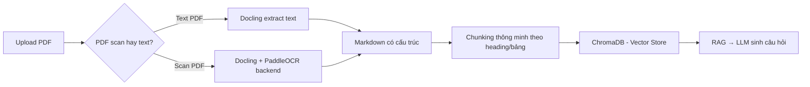

# 🔍 Nghiên cứu công cụ OCR hỗ trợ tiếng Việt cho tài liệu kỹ thuật

> **Bối cảnh:** Dự án QBankCTU cần OCR tài liệu giáo trình "Cấu trúc dữ liệu" (tiếng Việt) — bao gồm **văn bản**, **bảng**, **pseudocode/code**, **sơ đồ thuật toán**, và **công thức toán**. Hiện đang dùng EasyOCR.

---

## 1. Tổng quan các công cụ

### So sánh tổng thể

| Công cụ | Loại | Tiếng Việt | Bảng | Công thức | Code/Pseudo | VRAM | License | Docker sẵn |
|:---|:---|:---:|:---:|:---:|:---:|:---|:---|:---:|
| **EasyOCR** (hiện tại) | CNN+LSTM | ✅ Tốt | ❌ | ❌ | ❌ | 1-2 GB | Apache 2.0 | ❌ |
| **VietOCR** | Transformer | ✅ **Rất tốt** | ❌ | ❌ | ❌ | 1-2 GB | MIT | ❌ |
| **PaddleOCR PP-OCRv6** | Pipeline | ✅ Tốt (cần dict) | ⚠️ Add-on | ❌ | ❌ | 2-4 GB | Apache 2.0 | ✅ |
| **PaddleOCR-VL 1.6** | VLM | ✅ Tốt (109 lang) | ✅ | ✅ | ⚠️ | 8-16 GB | Apache 2.0 | ✅ |
| **Docling** (IBM) | Pipeline+AI | ⚠️ Cần tuning | ✅ | ✅ | ✅ | 2-8 GB | **MIT** | ✅ |
| **Marker v2** (Datalab) | VLM (Surya) | ✅ Tốt (90+ lang) | ✅ | ✅ LaTeX | ✅ | 4-8 GB | GPL-3.0 | ✅ |
| **MinerU** (OpenDataLab) | Pipeline+VLM | ⚠️ Chưa ổn định | ✅ **Rất tốt** | ✅ LaTeX | ✅ | 8+ GB | Apache 2.0* | ✅ |
| **Surya OCR 2** | VLM | ✅ Tốt (90+ lang) | ✅ | ✅ KaTeX | ✅ | 3-6 GB | GPL-3.0 | ❌ |
| **Tesseract 5** | LSTM | ✅ Cơ bản (~70%) | ❌ | ❌ | ❌ | CPU only | Apache 2.0 | ✅ |
| **GOT-OCR2.0** | VLM | ⚠️ Cần test | ✅ | ✅ | ⚠️ | 8+ GB | MIT | ❌ |
| **Unlimited-OCR** (Baidu) | VLM 7B | ⚠️ Chủ yếu CN/EN | ✅ | ✅ | ✅ | 16-24 GB | MIT | ✅ |

> **Ghi chú:** ✅ = Tốt, ⚠️ = Hạn chế/cần tuning, ❌ = Không hỗ trợ

---

## 2. Phân tích chi tiết từng công cụ

---

### 🥇 PaddleOCR Detection + VietOCR Recognition (Hybrid)

> [!TIP]
> **Đây là phương án được cộng đồng Việt Nam khuyên dùng nhất cho OCR tiếng Việt chuyên sâu.**

**Ý tưởng:** Dùng PaddleOCR (mạnh về **phát hiện vùng text** trong layout phức tạp) kết hợp VietOCR (mạnh về **nhận dạng ký tự tiếng Việt** với dấu thanh).

| Ưu điểm | Nhược điểm |
|:---|:---|
| Chính xác nhất cho tiếng Việt có dấu | Chỉ output text thuần, không giữ cấu trúc (bảng, heading) |
| PaddleOCR detect rất tốt text xoay, nghiêng | Cần tự ghép 2 engine → phức tạp hơn |
| VRAM thấp (2-4 GB), chạy được CPU | Không nhận diện công thức toán/code |
| Open source, cộng đồng Việt lớn | Cần bổ sung module layout analysis riêng |

**Phù hợp cho:** Tài liệu text thuần, slide đơn giản, không có nhiều bảng/công thức.

**Docker:** Cần tự build, không có image sẵn cho combo này.

```python
# Ví dụ pipeline hybrid
from paddleocr import PaddleOCR  # Detection
from vietocr.tool.predictor import Predictor  # Recognition

paddle = PaddleOCR(use_angle_cls=True, lang='vi', rec=False)  # chỉ detect
vietocr = Predictor(config)  # recognize tiếng Việt

boxes = paddle.ocr(image, rec=False)  # detect vùng text
for box in boxes:
    cropped = crop_image(image, box)
    text = vietocr.predict(cropped)  # nhận dạng tiếng Việt
```

---

### 🥈 Docling (IBM) — Document Intelligence

> [!IMPORTANT]
> **Phù hợp nhất cho dự án QBankCTU** vì: MIT license, Docker sẵn, giữ cấu trúc tài liệu, và tích hợp tốt vào RAG pipeline.

**Là gì:** Framework chuyển đổi tài liệu (PDF, ảnh, DOCX) thành Markdown/JSON có cấu trúc, thiết kế cho RAG.

| Ưu điểm | Nhược điểm |
|:---|:---|
| **MIT License** — tự do sử dụng thương mại | Tiếng Việt cần config OCR backend (PaddleOCR) |
| Giữ nguyên cấu trúc: heading, bảng, công thức | Accuracy không bằng MinerU cho bảng cực phức tạp |
| Docker image sẵn: `quay.io/docling-project/docling-serve` | Cần GPU cho mode nâng cao |
| REST API (FastAPI) — dễ tích hợp vào backend | |
| Tích hợp sẵn với LlamaIndex, LangChain | |
| Chạy được CPU (mode cơ bản) | |

**Docker deployment:**
```yaml
# Thêm vào docker-compose.yml
docling:
  image: quay.io/docling-project/docling-serve
  container_name: nckh-docling
  ports:
    - "5001:5001"
  # volumes cho cached models
  volumes:
    - docling_cache:/root/.cache
  restart: unless-stopped
```

**Gọi API từ backend:**
```python
import requests

def ocr_with_docling(file_path: str) -> dict:
    with open(file_path, 'rb') as f:
        response = requests.post(
            "http://docling:5001/v1/convert",
            files={"file": f},
            data={"output_format": "markdown"}
        )
    return response.json()
```

---

### 🥉 Marker v2 (Datalab/Surya)

**Là gì:** Chuyển đổi PDF/ảnh thành Markdown có cấu trúc, dùng Surya OCR (VLM ~3B params).

| Ưu điểm | Nhược điểm |
|:---|:---|
| Rất nhanh (~120 pages/sec trên H100) | **GPL-3.0** — hạn chế thương mại |
| Nhận diện tốt bảng, công thức (LaTeX), code | Cần GPU cho hiệu suất tốt |
| Hỗ trợ 90+ ngôn ngữ, bao gồm tiếng Việt | License phức tạp (GPL + RAIL-M) |
| Có thể kết hợp LLM để tăng accuracy | |
| Tích hợp code block detection | |

**Cài đặt:**
```bash
pip install marker-pdf[full]
```

---

### 🏅 MinerU (OpenDataLab)

**Là gì:** Engine parsing tài liệu mạnh nhất về accuracy, đặc biệt cho bảng phức tạp và công thức.

| Ưu điểm | Nhược điểm |
|:---|:---|
| **Accuracy cao nhất** (top OmniDocBench) | Tiếng Việt chưa ổn định (dấu thanh) |
| Xuất sắc với bảng, công thức LaTeX | Cần GPU 8GB+ VRAM |
| Hỗ trợ 109 ngôn ngữ (dùng PP-OCRv6) | Docker setup phức tạp hơn |
| Chuyển đổi formula → LaTeX tốt nhất | |

---

### ⚡ PaddleOCR-VL 1.6 (VLM mới)

**Là gì:** Vision-Language Model mới nhất của PaddlePaddle, xử lý document trong 1 forward pass duy nhất.

| Ưu điểm | Nhược điểm |
|:---|:---|
| 109 ngôn ngữ, bao gồm tiếng Việt | Cần 8-16 GB VRAM |
| Hiểu layout, bảng, công thức trong 1 model | Mới, cộng đồng chưa nhiều |
| Có LoRA fine-tune cho tiếng Việt | Nặng hơn pipeline truyền thống |
| Apache 2.0 License | |

```python
from paddleocr import PaddleOCRVL
pipeline = PaddleOCRVL(pipeline_version="v1")
output = pipeline.predict("vietnamese_document.png")
```

---

## 3. Đặc thù tài liệu "Cấu trúc dữ liệu" — Yêu cầu OCR

Giáo trình Cấu trúc dữ liệu thường chứa:

| Thành phần | Độ khó OCR | Công cụ xử lý tốt |
|:---|:---:|:---|
| **Văn bản tiếng Việt** (có dấu thanh) | ⭐⭐ | VietOCR, PaddleOCR |
| **Bảng** (so sánh thuật toán, Big-O) | ⭐⭐⭐ | MinerU, Docling, Marker |
| **Pseudocode / Code** (C, Python) | ⭐⭐⭐ | Marker, Docling, MinerU |
| **Công thức toán** (O(n log n), Σ) | ⭐⭐⭐⭐ | MinerU, Marker (LaTeX), Surya |
| **Sơ đồ cây/đồ thị** (binary tree, graph) | ⭐⭐⭐⭐⭐ | ❌ Không công cụ nào OCR tốt |
| **Hình minh họa** (stack, queue, linked list) | ⭐⭐⭐⭐⭐ | ❌ Cần VLM mô tả |

> [!WARNING]
> **Sơ đồ và hình minh họa** (cây nhị phân, đồ thị, minh họa stack/queue) **không thể OCR** bằng bất kỳ công cụ nào. Chúng cần được xử lý bằng VLM (Vision Language Model) để mô tả bằng text, hoặc bỏ qua trong pipeline OCR.

---

## 4. Đề xuất cho dự án QBankCTU

### Phương án A: **Docling** (⭐ Đề xuất chính)

```
Upload PDF → Docling (Docker) → Markdown có cấu trúc → Chunking → ChromaDB → RAG
```

**Lý do:**
- ✅ MIT License — phù hợp đề tài NCKH
- ✅ Docker image sẵn — dễ tích hợp vào `docker-compose.yml`
- ✅ REST API — backend FastAPI gọi trực tiếp
- ✅ Output Markdown — chunking tốt hơn text thuần
- ✅ Giữ cấu trúc bảng, heading, code block
- ✅ Chạy được CPU (mode cơ bản)
- ⚠️ Cần config PaddleOCR backend cho tiếng Việt tốt hơn

### Phương án B: **PaddleOCR + VietOCR** (Hybrid)

```
Upload PDF → pdf2image → PaddleOCR (detect) → VietOCR (recognize) → Text → Chunking
```

**Lý do:**
- ✅ Chính xác nhất cho tiếng Việt có dấu
- ✅ VRAM thấp, chạy được CPU
- ❌ Mất cấu trúc tài liệu (bảng, heading)
- ❌ Không nhận diện code/công thức
- ❌ Cần tự build Docker image

### Phương án C: **Marker v2** (Nếu có GPU)

```
Upload PDF → Marker (Surya OCR) → Markdown + LaTeX → Chunking → RAG
```

**Lý do:**
- ✅ Nhận diện tốt bảng + code + công thức
- ✅ Output Markdown chất lượng cao
- ⚠️ GPL-3.0 — cần cân nhắc license
- ⚠️ Cần GPU 4-8 GB VRAM

### Phương án D: **Giữ EasyOCR + nâng cấp post-processing**

```
Upload PDF → EasyOCR (hiện tại) → Text + LLM post-process → Chunking
```

**Lý do:**
- ✅ Không cần thay đổi gì
- ✅ Đã hoạt động ổn định
- ❌ Mất cấu trúc, không nhận diện bảng/code/công thức
- 💡 Có thể dùng LLM (Gemini/Qwen) để "sửa" output OCR

---

## 5. Ma trận quyết định

| Tiêu chí | Trọng số | EasyOCR | VietOCR+Paddle | Docling | Marker | MinerU |
|:---|:---:|:---:|:---:|:---:|:---:|:---:|
| Tiếng Việt chính xác | 30% | 7/10 | **9/10** | 6/10 | 7/10 | 6/10 |
| Giữ cấu trúc tài liệu | 25% | 2/10 | 3/10 | **8/10** | **9/10** | **9/10** |
| Dễ Docker hóa | 15% | 5/10 | 4/10 | **9/10** | 7/10 | 6/10 |
| VRAM / Hardware | 15% | **9/10** | **8/10** | 7/10 | 5/10 | 4/10 |
| License phù hợp | 10% | **10/10** | **10/10** | **10/10** | 4/10 | 8/10 |
| Tích hợp RAG | 5% | 3/10 | 3/10 | **9/10** | 7/10 | 6/10 |
| **Tổng điểm** | | **5.8** | **6.5** | **7.6** | **7.0** | **6.5** |

> [!IMPORTANT]
> **Docling đạt tổng điểm cao nhất** nhờ cân bằng giữa cấu trúc, Docker hóa, license, và khả năng tích hợp RAG. Tuy nhiên, nếu **tiếng Việt chính xác** là ưu tiên số 1 và tài liệu chủ yếu là text thuần, thì **VietOCR + PaddleOCR** là lựa chọn tốt hơn.

---

## 6. Chiến lược kết hợp (khuyến nghị cuối cùng)

> [!TIP]
> **Phương án tối ưu: Docling + PaddleOCR backend cho tiếng Việt**



Docling cho phép thay đổi OCR backend — cấu hình dùng PaddleOCR thay Tesseract mặc định sẽ cải thiện đáng kể accuracy tiếng Việt, đồng thời giữ được khả năng parse cấu trúc tài liệu.
